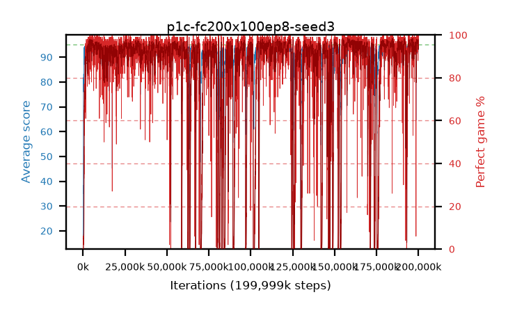

# p1c-fc200x100ep8-seed3

step **199,999,488** · 12207 evals · trailing **94.34** · peak **94.62** @158,236,672 · sef **83.4** · best30 **97.6** @158,023,680

## Config

| | |
|---|---|
| algo | ppo |
| collect_envs | 128 |
| discount | 0.99 |
| eval_interval | 16384 |
| eval_queue | True |
| eval_queue_depth | 16 |
| eval_workers | 8 |
| fc_layers | (200, 100) |
| graph_eval_episodes | 100 |
| max_steps | 199999488 |
| min_checkpoint_score | 40.0 |
| ppo_adam_epsilon | 1e-07 |
| ppo_clip | 0.2 |
| ppo_entropy_coef | 0.01 |
| ppo_entropy_coef_final | None |
| ppo_epochs | 8 |
| ppo_gae_lambda | 0.98 |
| ppo_gradient_clipping | 0.5 |
| ppo_horizon | 33.6 |
| ppo_learning_rate | 0.0003 |
| ppo_minibatch | 256 |
| ppo_normalize_adv | True |
| ppo_rollout | 128 |
| ppo_target_kl | 0.0 |
| ppo_transitions_per_rollout | 16384 |
| ppo_value_loss | huber |
| ppo_vf_coef | 0.5 |
| seed | 3 |
| torch_threads | 1 |

## Evals

| step | avg score | trailing avg | min score | max score | avg reward | perfect % | epsilon |
|---|---|---|---|---|---|---|---|
| 16384 | 16.57 | 16.57 | 0.0 | 38.0 | 12.335 | 0.0 |  |
| 32768 | 20.92 | 18.75 | 4.0 | 38.0 | 16.01 | 0.0 |  |
| 49152 | 21.99 | 19.83 | 5.0 | 38.0 | 16.99 | 0.0 |  |
| ... | ... | ... | ... | ... | ... | ... | ... |
| 199819264 | 93.11 | 94.18 | 7.0 | 95.0 | 186.955 | 95.0 |  |
| 199835648 | 93.95 | 94.17 | 28.0 | 95.0 | 186.71 | 94.0 |  |
| 199852032 | 94.68 | 94.18 | 81.0 | 95.0 | 189.565 | 96.0 |  |
| 199868416 | 95.0 | 94.32 | 95.0 | 95.0 | 194.0 | 100.0 |  |
| 199884800 | 94.28 | 94.18 | 30.0 | 95.0 | 190.205 | 97.0 |  |
| 199901184 | 94.95 | 94.19 | 90.0 | 95.0 | 192.955 | 99.0 |  |
| 199917568 | 94.21 | 94.18 | 32.0 | 95.0 | 190.135 | 97.0 |  |
| 199933952 | 94.8 | 94.27 | 78.0 | 95.0 | 191.765 | 98.0 |  |
| 199950336 | 94.3 | 94.2 | 69.0 | 95.0 | 187.285 | 94.0 |  |
| 199966720 | 94.8 | 94.19 | 75.0 | 95.0 | 192.805 | 99.0 |  |
| 199983104 | 95.0 | 94.36 | 95.0 | 95.0 | 194.0 | 100.0 |  |
| 199999488 | 94.83 | 94.34 | 78.0 | 95.0 | 192.835 | 99.0 |  |
