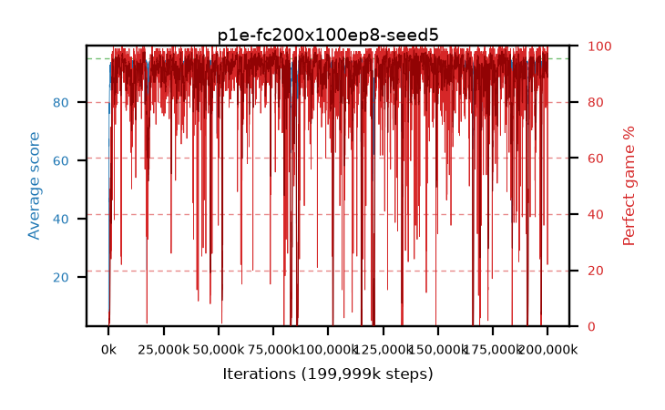

# p1e-fc200x100ep8-seed5

step **199,999,488** · 12207 evals · trailing **94.22** · peak **94.62** @196,313,088 · sef **87.8** · best30 **97.2** @126,681,088

## Config

| | |
|---|---|
| algo | ppo |
| collect_envs | 128 |
| discount | 0.99 |
| eval_interval | 16384 |
| eval_queue | True |
| eval_queue_depth | 16 |
| eval_workers | 8 |
| fc_layers | (200, 100) |
| graph_eval_episodes | 100 |
| max_steps | 199999488 |
| min_checkpoint_score | 40.0 |
| ppo_adam_epsilon | 1e-07 |
| ppo_clip | 0.2 |
| ppo_entropy_coef | 0.01 |
| ppo_entropy_coef_final | None |
| ppo_epochs | 8 |
| ppo_gae_lambda | 0.98 |
| ppo_gradient_clipping | 0.5 |
| ppo_horizon | 33.6 |
| ppo_learning_rate | 0.0003 |
| ppo_minibatch | 256 |
| ppo_normalize_adv | True |
| ppo_rollout | 128 |
| ppo_target_kl | 0.0 |
| ppo_transitions_per_rollout | 16384 |
| ppo_value_loss | huber |
| ppo_vf_coef | 0.5 |
| seed | 5 |
| torch_threads | 1 |

## Evals

| step | avg score | trailing avg | min score | max score | avg reward | perfect % | epsilon |
|---|---|---|---|---|---|---|---|
| 16384 | 7.49 | 7.49 | 0.0 | 20.0 | 3.975 | 0.0 |  |
| 32768 | 35.68 | 29.12 | 2.0 | 67.0 | 30.905 | 0.0 |  |
| 49152 | 34.05 | 20.77 | 11.0 | 62.0 | 29.05 | 0.0 |  |
| ... | ... | ... | ... | ... | ... | ... | ... |
| 199819264 | 93.74 | 94.14 | 13.0 | 95.0 | 189.62 | 97.0 |  |
| 199835648 | 94.63 | 94.23 | 70.0 | 95.0 | 189.47 | 96.0 |  |
| 199852032 | 94.96 | 94.28 | 91.0 | 95.0 | 192.92 | 99.0 |  |
| 199868416 | 94.22 | 94.18 | 94.0 | 95.0 | 112.1 | 22.0 |  |
| 199884800 | 94.24 | 94.22 | 19.0 | 95.0 | 192.2 | 99.0 |  |
| 199901184 | 95.0 | 94.26 | 95.0 | 95.0 | 194.0 | 100.0 |  |
| 199917568 | 94.47 | 94.18 | 66.0 | 95.0 | 189.31 | 96.0 |  |
| 199933952 | 93.97 | 94.21 | 20.0 | 95.0 | 188.81 | 96.0 |  |
| 199950336 | 94.61 | 94.2 | 71.0 | 95.0 | 190.535 | 97.0 |  |
| 199966720 | 94.86 | 94.22 | 86.0 | 95.0 | 191.78 | 98.0 |  |
| 199983104 | 93.2 | 94.19 | 19.0 | 95.0 | 188.085 | 96.0 |  |
| 199999488 | 92.68 | 94.22 | 17.0 | 95.0 | 184.4 | 93.0 |  |
