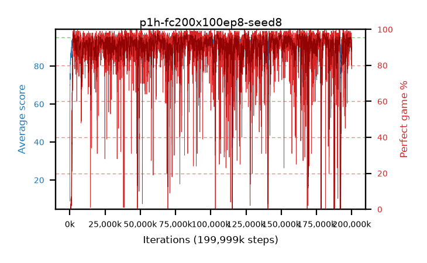

# p1h-fc200x100ep8-seed8

step **199,999,488** · 12207 evals · trailing **92.52** · peak **94.54** @176,406,528 · sef **89.5** · best30 **97.0** @124,305,408

## Config

| | |
|---|---|
| algo | ppo |
| collect_envs | 128 |
| discount | 0.99 |
| eval_interval | 16384 |
| eval_queue | True |
| eval_queue_depth | 16 |
| eval_workers | 8 |
| fc_layers | (200, 100) |
| graph_eval_episodes | 100 |
| max_steps | 199999488 |
| min_checkpoint_score | 40.0 |
| ppo_adam_epsilon | 1e-07 |
| ppo_clip | 0.2 |
| ppo_entropy_coef | 0.01 |
| ppo_entropy_coef_final | None |
| ppo_epochs | 8 |
| ppo_gae_lambda | 0.98 |
| ppo_gradient_clipping | 0.5 |
| ppo_horizon | 33.6 |
| ppo_learning_rate | 0.0003 |
| ppo_minibatch | 256 |
| ppo_normalize_adv | True |
| ppo_rollout | 128 |
| ppo_target_kl | 0.0 |
| ppo_transitions_per_rollout | 16384 |
| ppo_value_loss | huber |
| ppo_vf_coef | 0.5 |
| seed | 8 |
| torch_threads | 1 |

## Evals

| step | avg score | trailing avg | min score | max score | avg reward | perfect % | epsilon |
|---|---|---|---|---|---|---|---|
| 16384 | 8.91 | 23.23 | 0.0 | 37.0 | 6.34 | 0.0 |  |
| 32768 | 37.7 | 28.05 | 8.0 | 70.0 | 32.88 | 0.0 |  |
| 49152 | 37.54 | 37.54 | 12.0 | 68.0 | 32.54 | 0.0 |  |
| ... | ... | ... | ... | ... | ... | ... | ... |
| 199819264 | 94.37 | 93.81 | 80.0 | 95.0 | 184.01 | 91.0 |  |
| 199835648 | 92.5 | 93.73 | 1.0 | 95.0 | 174.905 | 84.0 |  |
| 199852032 | 94.48 | 93.74 | 78.0 | 95.0 | 185.16 | 92.0 |  |
| 199868416 | 93.73 | 93.6 | 38.0 | 95.0 | 183.37 | 91.0 |  |
| 199884800 | 90.84 | 93.61 | 6.0 | 95.0 | 179.44 | 90.0 |  |
| 199901184 | 92.44 | 93.52 | 19.0 | 95.0 | 183.12 | 92.0 |  |
| 199917568 | 89.1 | 93.35 | 17.0 | 95.0 | 175.665 | 88.0 |  |
| 199933952 | 84.34 | 92.96 | 3.0 | 95.0 | 162.54 | 80.0 |  |
| 199950336 | 93.5 | 93.32 | 15.0 | 95.0 | 185.22 | 93.0 |  |
| 199966720 | 83.66 | 92.6 | 9.0 | 95.0 | 159.78 | 78.0 |  |
| 199983104 | 91.85 | 92.54 | 7.0 | 95.0 | 181.535 | 91.0 |  |
| 199999488 | 93.76 | 92.52 | 77.0 | 95.0 | 174.04 | 82.0 |  |
