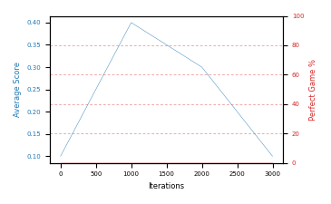

# smoke

Blue is average score (food eaten) on the left axis, red is perfect-game percentage on the right.

Latest eval: step 3000, avg score 0.1, perfect games 0%.

## Config

| setting | value |
|---|---|
| policy_name | smoke |
| seed | unseeded |
| zeroed_observations | none |
| learning_rate | 1e-05 |
| batch_size | 128 |
| discount | 0.99 |
| target_update_period | 8 |
| target_update_tau | 1.0 |
| gradient_clipping | none |
| n_step_update | 1 |
| initial_epsilon | 0.4 |
| min_epsilon | 0.002 |
| epsilon_schedule | bootstrap on avg_reward [2, 5, 10, 15, 20] then geometric to floor by 80% trailing-30 perfect |
| guided_fraction | 0.8 |
| forking | off |
| exploration_shield | 80% of refinement-phase episodes draw the epsilon move from non-fatal actions; greedy moves never shielded |
| fc_layer_params | (50, 100, 50) |
| replay_buffer | cpprb prioritized, capacity 100000 |
| priority_exponent (alpha) | 0.6 |
| priority_signal | td_error |
| importance_sampling_beta | 0.4 -> 1.0 over 300000 steps |
| max_steps | 3000 |
| initial_populate_steps | 1000 |
| eval | 10 episodes every 1000 steps |
| grid | 9x9, max possible score 95 |
| DEATH_REWARD | -5.0 |
| FOOD_REWARD | 1.0 |
| FOOD_DISTANCE_REWARD | 0.001 |
| eval_only | False |
| min_checkpoint_score | 0.0 |

## Evals

4 evals so far. Full series in [`smoke_evals.json`](smoke_evals.json).

| step | avg score | trailing avg | min score | max score | avg reward | perfect % | epsilon |
|---|---|---|---|---|---|---|---|
| 0 | 0.1 | 0.1 | 0 | 1/95 | -4.903 | 0 | 0.4 |
| 1000 | 0.4 | 0.4 | 0 | 2/95 | -0.152 | 0 | 0.4 |
| 2000 | 0.3 | 0.35 | 0 | 1/95 | -0.25 | 0 | 0.4 |
| 3000 | 0.1 | 0.27 | 0 | 1/95 | -0.45 | 0 | 0.4 |
