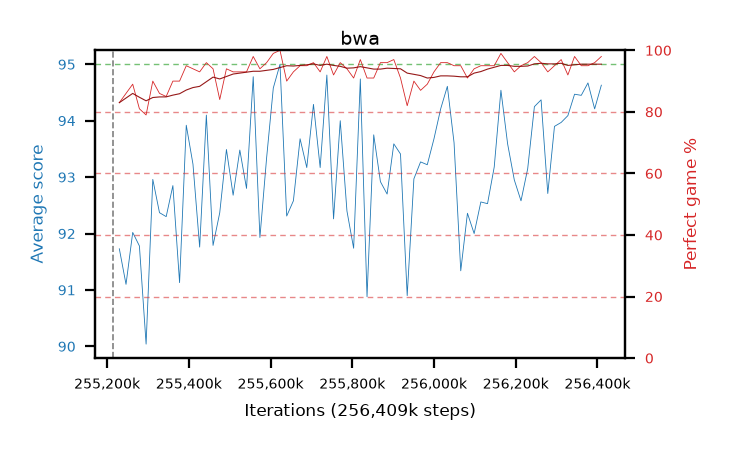

# bwa

step **256,409,600** · 73 evals · trailing **93.24** · peak **93.45** @256,262,144 · sef **98.6** · best30 **94.3** @255,901,696

## Config

| | |
|---|---|
| algo | ppo |
| collect_envs | 128 |
| discount | 0.99 |
| eval_interval | 16384 |
| eval_queue | True |
| eval_queue_depth | 16 |
| eval_workers | 4 |
| fc_layers | (320,) |
| graph_eval_episodes | 100 |
| max_steps | 256409600 |
| min_checkpoint_score | 0.0 |
| ppo_adam_epsilon | 1e-07 |
| ppo_clip | 0.2 |
| ppo_entropy_coef | 0.01 |
| ppo_entropy_coef_final | None |
| ppo_epochs | 8 |
| ppo_gae_lambda | 0.98 |
| ppo_gradient_clipping | 0.5 |
| ppo_horizon | 33.6 |
| ppo_learning_rate | 0.0003 |
| ppo_minibatch | 256 |
| ppo_normalize_adv | True |
| ppo_rollout | 128 |
| ppo_target_kl | 0.0 |
| ppo_transitions_per_rollout | 16384 |
| ppo_value_loss | huber |
| ppo_vf_coef | 0.5 |
| seed | 8 |
| torch_threads | 1 |

## Resumes

Resumed at 255,213,568

## Evals

| step | avg score | trailing avg | min score | max score | avg reward | perfect % | epsilon |
|---|---|---|---|---|---|---|---|
| 255229952 | 91.73 | 91.41 | 3.0 | 95.0 | 173.5 | 83.0 |  |
| 255246336 | 91.1 | 91.1 | 23.0 | 95.0 | 175.72 | 86.0 |  |
| 255262720 | 92.02 | 91.62 | 8.0 | 95.0 | 179.76 | 89.0 |  |
| ... | ... | ... | ... | ... | ... | ... | ... |
| 256229376 | 93.15 | 93.35 | 16.0 | 95.0 | 187.99 | 96.0 |  |
| 256245760 | 94.25 | 93.39 | 32.0 | 95.0 | 191.215 | 98.0 |  |
| 256262144 | 94.37 | 93.45 | 51.0 | 95.0 | 189.21 | 96.0 |  |
| 256278528 | 92.71 | 93.42 | 32.0 | 95.0 | 184.61 | 93.0 |  |
| 256294912 | 93.9 | 93.43 | 32.0 | 95.0 | 187.745 | 95.0 |  |
| 256311296 | 93.97 | 93.07 | 32.0 | 95.0 | 189.895 | 97.0 |  |
| 256327680 | 94.09 | 93.11 | 42.0 | 95.0 | 184.995 | 92.0 |  |
| 256344064 | 94.47 | 93.11 | 47.0 | 95.0 | 191.435 | 98.0 |  |
| 256360448 | 94.45 | 93.31 | 61.0 | 95.0 | 188.43 | 95.0 |  |
| 256376832 | 94.67 | 93.22 | 83.0 | 95.0 | 188.515 | 95.0 |  |
| 256393216 | 94.21 | 93.15 | 46.0 | 95.0 | 189.14 | 96.0 |  |
| 256409600 | 94.63 | 93.24 | 66.0 | 95.0 | 191.55 | 98.0 |  |
