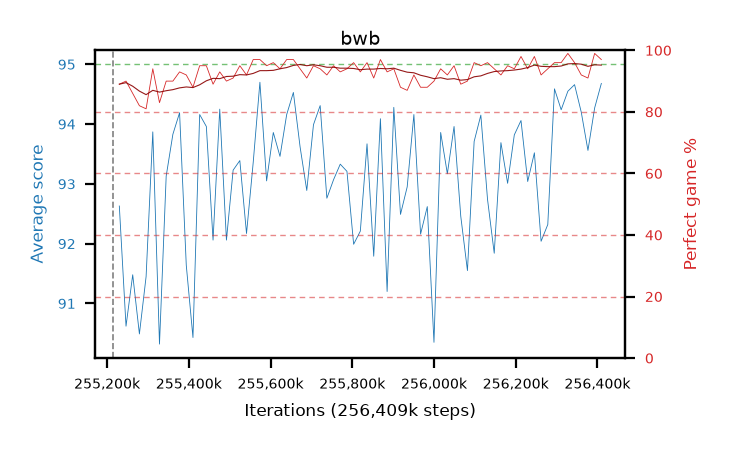

# bwb

step **256,409,600** · 73 evals · trailing **93.22** · peak **93.37** @256,229,376 · sef **100.0** · best30 **94.0** @255,901,696

## Config

| | |
|---|---|
| algo | ppo |
| collect_envs | 128 |
| discount | 0.99 |
| eval_interval | 16384 |
| eval_queue | True |
| eval_queue_depth | 16 |
| eval_workers | 4 |
| fc_layers | (320,) |
| graph_eval_episodes | 100 |
| max_steps | 256409600 |
| min_checkpoint_score | 0.0 |
| ppo_adam_epsilon | 1e-07 |
| ppo_clip | 0.2 |
| ppo_entropy_coef | 0.01 |
| ppo_entropy_coef_final | None |
| ppo_epochs | 8 |
| ppo_gae_lambda | 0.98 |
| ppo_gradient_clipping | 0.5 |
| ppo_horizon | 33.6 |
| ppo_learning_rate | 0.0003 |
| ppo_minibatch | 256 |
| ppo_normalize_adv | True |
| ppo_rollout | 128 |
| ppo_target_kl | 0.0 |
| ppo_transitions_per_rollout | 16384 |
| ppo_value_loss | huber |
| ppo_vf_coef | 0.5 |
| seed | 8 |
| torch_threads | 1 |

## Resumes

Resumed at 255,213,568

## Evals

| step | avg score | trailing avg | min score | max score | avg reward | perfect % | epsilon |
|---|---|---|---|---|---|---|---|
| 255229952 | 92.63 | 91.31 | 30.0 | 95.0 | 180.46 | 89.0 |  |
| 255246336 | 90.62 | 90.62 | 23.0 | 95.0 | 179.265 | 90.0 |  |
| 255262720 | 91.48 | 91.05 | 34.0 | 95.0 | 176.145 | 86.0 |  |
| ... | ... | ... | ... | ... | ... | ... | ... |
| 256229376 | 93.04 | 93.37 | 15.0 | 95.0 | 185.845 | 94.0 |  |
| 256245760 | 93.52 | 93.35 | 16.0 | 95.0 | 190.44 | 98.0 |  |
| 256262144 | 92.04 | 93.33 | 28.0 | 95.0 | 182.855 | 92.0 |  |
| 256278528 | 92.32 | 93.06 | 7.0 | 95.0 | 185.215 | 94.0 |  |
| 256294912 | 94.59 | 93.08 | 72.0 | 95.0 | 189.52 | 96.0 |  |
| 256311296 | 94.24 | 93.13 | 55.0 | 95.0 | 189.17 | 96.0 |  |
| 256327680 | 94.55 | 93.08 | 50.0 | 95.0 | 192.51 | 99.0 |  |
| 256344064 | 94.66 | 93.05 | 81.0 | 95.0 | 189.635 | 96.0 |  |
| 256360448 | 94.2 | 93.08 | 73.0 | 95.0 | 185.15 | 92.0 |  |
| 256376832 | 93.56 | 93.06 | 15.0 | 95.0 | 183.425 | 91.0 |  |
| 256393216 | 94.27 | 93.09 | 22.0 | 95.0 | 192.23 | 99.0 |  |
| 256409600 | 94.68 | 93.22 | 82.0 | 95.0 | 190.65 | 97.0 |  |
