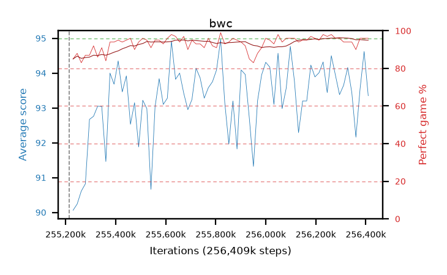

# bwc

step **256,409,600** · 73 evals · trailing **93.42** · peak **93.59** @256,049,152 · sef **100.0** · best30 **94.4** @256,294,912

## Config

| | |
|---|---|
| algo | ppo |
| collect_envs | 128 |
| discount | 0.99 |
| eval_interval | 16384 |
| eval_queue | True |
| eval_queue_depth | 16 |
| eval_workers | 4 |
| fc_layers | (320,) |
| graph_eval_episodes | 100 |
| max_steps | 256409600 |
| min_checkpoint_score | 0.0 |
| ppo_adam_epsilon | 1e-07 |
| ppo_clip | 0.2 |
| ppo_entropy_coef | 0.01 |
| ppo_entropy_coef_final | None |
| ppo_epochs | 8 |
| ppo_gae_lambda | 0.98 |
| ppo_gradient_clipping | 0.5 |
| ppo_horizon | 33.6 |
| ppo_learning_rate | 0.0003 |
| ppo_minibatch | 256 |
| ppo_normalize_adv | True |
| ppo_rollout | 128 |
| ppo_target_kl | 0.0 |
| ppo_transitions_per_rollout | 16384 |
| ppo_value_loss | huber |
| ppo_vf_coef | 0.5 |
| seed | 8 |
| torch_threads | 1 |

## Resumes

Resumed at 255,213,568

## Evals

| step | avg score | trailing avg | min score | max score | avg reward | perfect % | epsilon |
|---|---|---|---|---|---|---|---|
| 255229952 | 90.06 | 90.06 | 22.0 | 95.0 | 173.685 | 85.0 |  |
| 255246336 | 90.24 | 90.15 | 12.0 | 95.0 | 176.805 | 88.0 |  |
| 255262720 | 90.61 | 90.3 | 16.0 | 95.0 | 172.29 | 83.0 |  |
| ... | ... | ... | ... | ... | ... | ... | ... |
| 256229376 | 94.32 | 93.59 | 56.0 | 95.0 | 191.285 | 98.0 |  |
| 256245760 | 93.44 | 93.57 | 14.0 | 95.0 | 189.41 | 97.0 |  |
| 256262144 | 94.5 | 93.59 | 51.0 | 95.0 | 191.465 | 98.0 |  |
| 256278528 | 93.94 | 93.47 | 16.0 | 95.0 | 188.87 | 96.0 |  |
| 256294912 | 93.38 | 93.45 | 23.0 | 95.0 | 188.265 | 96.0 |  |
| 256311296 | 93.65 | 93.42 | 13.0 | 95.0 | 186.5 | 94.0 |  |
| 256327680 | 94.16 | 93.42 | 55.0 | 95.0 | 187.055 | 94.0 |  |
| 256344064 | 93.44 | 93.42 | 8.0 | 95.0 | 186.38 | 94.0 |  |
| 256360448 | 92.16 | 93.44 | 6.0 | 95.0 | 180.85 | 90.0 |  |
| 256376832 | 93.53 | 93.43 | 16.0 | 95.0 | 188.37 | 96.0 |  |
| 256393216 | 94.62 | 93.41 | 73.0 | 95.0 | 189.505 | 96.0 |  |
| 256409600 | 93.35 | 93.42 | 32.0 | 95.0 | 188.19 | 96.0 |  |
