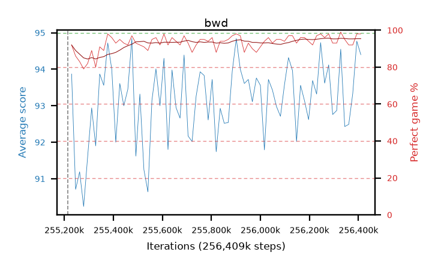

# bwd

step **256,409,600** · 73 evals · trailing **93.56** · peak **93.56** @256,409,600 · sef **98.6** · best30 **94.6** @256,344,064

## Config

| | |
|---|---|
| algo | ppo |
| collect_envs | 128 |
| discount | 0.99 |
| eval_interval | 16384 |
| eval_queue | True |
| eval_queue_depth | 16 |
| eval_workers | 4 |
| fc_layers | (320,) |
| graph_eval_episodes | 100 |
| max_steps | 256409600 |
| min_checkpoint_score | 0.0 |
| ppo_adam_epsilon | 1e-07 |
| ppo_clip | 0.2 |
| ppo_entropy_coef | 0.01 |
| ppo_entropy_coef_final | None |
| ppo_epochs | 8 |
| ppo_gae_lambda | 0.98 |
| ppo_gradient_clipping | 0.5 |
| ppo_horizon | 33.6 |
| ppo_learning_rate | 0.0003 |
| ppo_minibatch | 256 |
| ppo_normalize_adv | True |
| ppo_rollout | 128 |
| ppo_target_kl | 0.0 |
| ppo_transitions_per_rollout | 16384 |
| ppo_value_loss | huber |
| ppo_vf_coef | 0.5 |
| seed | 8 |
| torch_threads | 1 |

## Resumes

Resumed at 255,213,568

## Evals

| step | avg score | trailing avg | min score | max score | avg reward | perfect % | epsilon |
|---|---|---|---|---|---|---|---|
| 255229952 | 93.87 | 92.74 | 72.0 | 95.0 | 184.685 | 92.0 |  |
| 255246336 | 90.71 | 92.06 | 15.0 | 95.0 | 175.33 | 86.0 |  |
| 255262720 | 91.19 | 91.84 | 24.0 | 95.0 | 172.78 | 83.0 |  |
| ... | ... | ... | ... | ... | ... | ... | ... |
| 256229376 | 93.32 | 93.23 | 14.0 | 95.0 | 189.29 | 97.0 |  |
| 256245760 | 94.73 | 93.33 | 81.0 | 95.0 | 191.74 | 98.0 |  |
| 256262144 | 93.62 | 93.4 | 32.0 | 95.0 | 188.55 | 96.0 |  |
| 256278528 | 94.12 | 93.49 | 14.0 | 95.0 | 191.04 | 98.0 |  |
| 256294912 | 92.76 | 93.23 | 26.0 | 95.0 | 184.615 | 93.0 |  |
| 256311296 | 92.87 | 93.24 | 8.0 | 95.0 | 184.725 | 93.0 |  |
| 256327680 | 94.55 | 93.33 | 50.0 | 95.0 | 192.51 | 99.0 |  |
| 256344064 | 92.43 | 93.17 | 29.0 | 95.0 | 186.275 | 95.0 |  |
| 256360448 | 92.49 | 93.3 | 6.0 | 95.0 | 183.305 | 92.0 |  |
| 256376832 | 93.34 | 93.45 | 34.0 | 95.0 | 184.11 | 92.0 |  |
| 256393216 | 94.77 | 93.4 | 75.0 | 95.0 | 191.69 | 98.0 |  |
| 256409600 | 94.4 | 93.56 | 42.0 | 95.0 | 191.365 | 98.0 |  |
