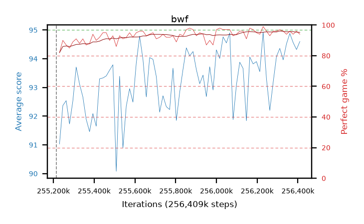

# bwf

step **256,409,600** · 73 evals · trailing **93.71** · peak **93.83** @256,163,840 · sef **100.0** · best30 **95.0** @256,327,680

## Config

| | |
|---|---|
| algo | ppo |
| collect_envs | 128 |
| discount | 0.99 |
| eval_interval | 16384 |
| eval_queue | True |
| eval_queue_depth | 16 |
| eval_workers | 4 |
| fc_layers | (320,) |
| graph_eval_episodes | 100 |
| max_steps | 256409600 |
| min_checkpoint_score | 0.0 |
| ppo_adam_epsilon | 1e-07 |
| ppo_clip | 0.2 |
| ppo_entropy_coef | 0.01 |
| ppo_entropy_coef_final | None |
| ppo_epochs | 8 |
| ppo_gae_lambda | 0.98 |
| ppo_gradient_clipping | 0.5 |
| ppo_horizon | 33.6 |
| ppo_learning_rate | 0.0003 |
| ppo_minibatch | 256 |
| ppo_normalize_adv | True |
| ppo_rollout | 128 |
| ppo_target_kl | 0.0 |
| ppo_transitions_per_rollout | 16384 |
| ppo_value_loss | huber |
| ppo_vf_coef | 0.5 |
| seed | 8 |
| torch_threads | 1 |

## Resumes

Resumed at 255,213,568

## Evals

| step | avg score | trailing avg | min score | max score | avg reward | perfect % | epsilon |
|---|---|---|---|---|---|---|---|
| 255229952 | 91.03 | 92.12 | 27.0 | 95.0 | 171.67 | 82.0 |  |
| 255246336 | 92.37 | 92.45 | 24.0 | 95.0 | 181.24 | 90.0 |  |
| 255262720 | 92.54 | 92.48 | 56.0 | 95.0 | 178.38 | 87.0 |  |
| ... | ... | ... | ... | ... | ... | ... | ... |
| 256229376 | 94.93 | 93.44 | 88.0 | 95.0 | 192.89 | 99.0 |  |
| 256245760 | 93.3 | 93.47 | 18.0 | 95.0 | 188.185 | 96.0 |  |
| 256262144 | 92.2 | 93.74 | 27.0 | 95.0 | 183.92 | 93.0 |  |
| 256278528 | 93.17 | 93.79 | 10.0 | 95.0 | 188.01 | 96.0 |  |
| 256294912 | 94.08 | 93.77 | 20.0 | 95.0 | 189.055 | 96.0 |  |
| 256311296 | 94.36 | 93.49 | 42.0 | 95.0 | 190.285 | 97.0 |  |
| 256327680 | 93.96 | 93.51 | 36.0 | 95.0 | 188.89 | 96.0 |  |
| 256344064 | 94.52 | 93.63 | 83.0 | 95.0 | 187.415 | 94.0 |  |
| 256360448 | 94.88 | 93.81 | 90.0 | 95.0 | 189.765 | 96.0 |  |
| 256376832 | 94.56 | 93.59 | 74.0 | 95.0 | 187.5 | 94.0 |  |
| 256393216 | 94.32 | 93.73 | 40.0 | 95.0 | 189.205 | 96.0 |  |
| 256409600 | 94.6 | 93.71 | 83.0 | 95.0 | 187.495 | 94.0 |  |
