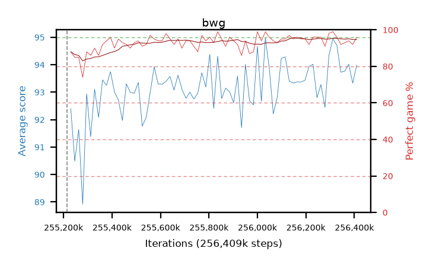

# bwg

step **256,409,600** · 73 evals · trailing **93.51** · peak **93.57** @256,180,224 · sef **98.6** · best30 **94.4** @256,311,296

## Config

| | |
|---|---|
| algo | ppo |
| collect_envs | 128 |
| discount | 0.99 |
| eval_interval | 16384 |
| eval_queue | True |
| eval_queue_depth | 16 |
| eval_workers | 4 |
| fc_layers | (320,) |
| graph_eval_episodes | 100 |
| max_steps | 256409600 |
| min_checkpoint_score | 0.0 |
| ppo_adam_epsilon | 1e-07 |
| ppo_clip | 0.2 |
| ppo_entropy_coef | 0.01 |
| ppo_entropy_coef_final | None |
| ppo_epochs | 8 |
| ppo_gae_lambda | 0.98 |
| ppo_gradient_clipping | 0.5 |
| ppo_horizon | 33.6 |
| ppo_learning_rate | 0.0003 |
| ppo_minibatch | 256 |
| ppo_normalize_adv | True |
| ppo_rollout | 128 |
| ppo_target_kl | 0.0 |
| ppo_transitions_per_rollout | 16384 |
| ppo_value_loss | huber |
| ppo_vf_coef | 0.5 |
| seed | 8 |
| torch_threads | 1 |

## Resumes

Resumed at 255,213,568

## Evals

| step | avg score | trailing avg | min score | max score | avg reward | perfect % | epsilon |
|---|---|---|---|---|---|---|---|
| 255229952 | 92.4 | 91.51 | 3.0 | 95.0 | 179.28 | 88.0 |  |
| 255246336 | 90.49 | 90.49 | 36.0 | 95.0 | 174.07 | 85.0 |  |
| 255262720 | 91.64 | 91.06 | 28.0 | 95.0 | 175.31 | 85.0 |  |
| ... | ... | ... | ... | ... | ... | ... | ... |
| 256229376 | 94.02 | 93.34 | 18.0 | 95.0 | 188.905 | 96.0 |  |
| 256245760 | 92.8 | 93.47 | 13.0 | 95.0 | 187.685 | 96.0 |  |
| 256262144 | 93.28 | 93.53 | 7.0 | 95.0 | 188.12 | 96.0 |  |
| 256278528 | 92.45 | 93.3 | 19.0 | 95.0 | 182.225 | 91.0 |  |
| 256294912 | 94.34 | 93.3 | 37.0 | 95.0 | 191.305 | 98.0 |  |
| 256311296 | 94.95 | 93.36 | 90.0 | 95.0 | 192.91 | 99.0 |  |
| 256327680 | 94.72 | 93.52 | 86.0 | 95.0 | 189.695 | 96.0 |  |
| 256344064 | 93.73 | 93.47 | 10.0 | 95.0 | 184.68 | 92.0 |  |
| 256360448 | 93.77 | 93.43 | 50.0 | 95.0 | 185.67 | 93.0 |  |
| 256376832 | 94.02 | 93.5 | 30.0 | 95.0 | 186.915 | 94.0 |  |
| 256393216 | 93.33 | 93.52 | 10.0 | 95.0 | 184.145 | 92.0 |  |
| 256409600 | 93.99 | 93.51 | 9.0 | 95.0 | 188.92 | 96.0 |  |
