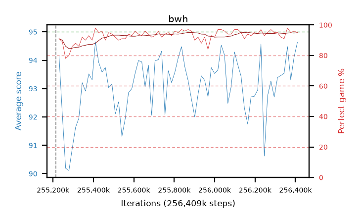

# bwh

step **256,409,600** · 73 evals · trailing **93.49** · peak **93.5** @256,114,688 · sef **98.6** · best30 **94.1** @255,885,312

## Config

| | |
|---|---|
| algo | ppo |
| collect_envs | 128 |
| discount | 0.99 |
| eval_interval | 16384 |
| eval_queue | True |
| eval_queue_depth | 16 |
| eval_workers | 4 |
| fc_layers | (320,) |
| graph_eval_episodes | 100 |
| max_steps | 256409600 |
| min_checkpoint_score | 0.0 |
| ppo_adam_epsilon | 1e-07 |
| ppo_clip | 0.2 |
| ppo_entropy_coef | 0.01 |
| ppo_entropy_coef_final | None |
| ppo_epochs | 8 |
| ppo_gae_lambda | 0.98 |
| ppo_gradient_clipping | 0.5 |
| ppo_horizon | 33.6 |
| ppo_learning_rate | 0.0003 |
| ppo_minibatch | 256 |
| ppo_normalize_adv | True |
| ppo_rollout | 128 |
| ppo_target_kl | 0.0 |
| ppo_transitions_per_rollout | 16384 |
| ppo_value_loss | huber |
| ppo_vf_coef | 0.5 |
| seed | 8 |
| torch_threads | 1 |

## Resumes

Resumed at 255,213,568

## Evals

| step | avg score | trailing avg | min score | max score | avg reward | perfect % | epsilon |
|---|---|---|---|---|---|---|---|
| 255229952 | 94.17 | 92.14 | 73.0 | 95.0 | 184.035 | 91.0 |  |
| 255246336 | 92.09 | 91.64 | 12.0 | 95.0 | 179.875 | 89.0 |  |
| 255262720 | 90.19 | 91.49 | 18.0 | 95.0 | 166.76 | 78.0 |  |
| ... | ... | ... | ... | ... | ... | ... | ... |
| 256229376 | 94.57 | 93.43 | 59.0 | 95.0 | 190.45 | 97.0 |  |
| 256245760 | 90.62 | 93.37 | 18.0 | 95.0 | 182.385 | 93.0 |  |
| 256262144 | 92.74 | 93.33 | 26.0 | 95.0 | 186.585 | 95.0 |  |
| 256278528 | 93.27 | 93.38 | 12.0 | 95.0 | 189.195 | 97.0 |  |
| 256294912 | 92.7 | 93.34 | 13.0 | 95.0 | 186.59 | 95.0 |  |
| 256311296 | 93.39 | 93.35 | 8.0 | 95.0 | 187.235 | 95.0 |  |
| 256327680 | 93.46 | 93.4 | 52.0 | 95.0 | 184.23 | 92.0 |  |
| 256344064 | 93.54 | 93.45 | 18.0 | 95.0 | 183.45 | 91.0 |  |
| 256360448 | 94.48 | 93.41 | 55.0 | 95.0 | 191.445 | 98.0 |  |
| 256376832 | 93.31 | 93.44 | 28.0 | 95.0 | 187.155 | 95.0 |  |
| 256393216 | 94.11 | 93.5 | 20.0 | 95.0 | 189.04 | 96.0 |  |
| 256409600 | 94.63 | 93.49 | 74.0 | 95.0 | 188.52 | 95.0 |  |
