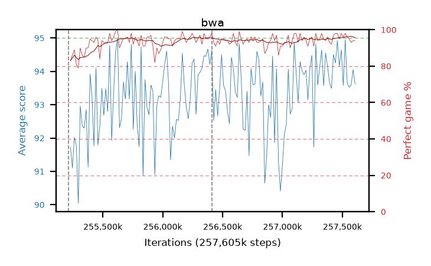

# bwa

step **257,605,632** · 146 evals · trailing **93.87** · peak **93.98** @257,474,560 · sef **99.3** · best30 **95.5** @257,556,480

## Config

| | |
|---|---|
| algo | ppo |
| collect_envs | 128 |
| discount | 0.99 |
| eval_interval | 16384 |
| eval_queue | True |
| eval_queue_depth | 16 |
| eval_workers | 6 |
| fc_layers | (320,) |
| graph_eval_episodes | 100 |
| max_steps | 257605632 |
| min_checkpoint_score | 0.0 |
| ppo_adam_epsilon | 1e-07 |
| ppo_clip | 0.2 |
| ppo_entropy_coef | 0.01 |
| ppo_entropy_coef_final | None |
| ppo_epochs | 8 |
| ppo_gae_lambda | 0.98 |
| ppo_gradient_clipping | 0.5 |
| ppo_horizon | 33.6 |
| ppo_learning_rate | 0.0003 |
| ppo_minibatch | 256 |
| ppo_normalize_adv | True |
| ppo_rollout | 128 |
| ppo_target_kl | 0.0 |
| ppo_transitions_per_rollout | 16384 |
| ppo_value_loss | huber |
| ppo_vf_coef | 0.5 |
| seed | 8 |
| torch_threads | 1 |

## Resumes

Resumed at 255,213,568, 256,409,600

## Evals

| step | avg score | trailing avg | min score | max score | avg reward | perfect % | epsilon |
|---|---|---|---|---|---|---|---|
| 255229952 | 91.73 | 91.41 | 3.0 | 95.0 | 173.5 | 83.0 |  |
| 255246336 | 91.1 | 91.1 | 23.0 | 95.0 | 175.72 | 86.0 |  |
| 255262720 | 92.02 | 91.62 | 8.0 | 95.0 | 179.76 | 89.0 |  |
| ... | ... | ... | ... | ... | ... | ... | ... |
| 257425408 | 94.51 | 93.42 | 60.0 | 95.0 | 190.435 | 97.0 |  |
| 257441792 | 94.25 | 93.74 | 34.0 | 95.0 | 191.17 | 98.0 |  |
| 257458176 | 94.92 | 93.94 | 90.0 | 95.0 | 191.885 | 98.0 |  |
| 257474560 | 94.16 | 93.98 | 42.0 | 95.0 | 188.05 | 95.0 |  |
| 257490944 | 94.64 | 93.97 | 64.0 | 95.0 | 191.605 | 98.0 |  |
| 257507328 | 93.58 | 93.96 | 32.0 | 95.0 | 188.42 | 96.0 |  |
| 257523712 | 94.95 | 93.42 | 92.0 | 95.0 | 191.87 | 98.0 |  |
| 257540096 | 93.66 | 93.54 | 22.0 | 95.0 | 188.545 | 96.0 |  |
| 257556480 | 93.52 | 93.48 | 38.0 | 95.0 | 187.365 | 95.0 |  |
| 257572864 | 93.59 | 93.34 | 22.0 | 95.0 | 185.4 | 93.0 |  |
| 257589248 | 94.05 | 93.87 | 54.0 | 95.0 | 186.9 | 94.0 |  |
| 257605632 | 93.62 | 93.87 | 27.0 | 95.0 | 186.47 | 94.0 |  |
