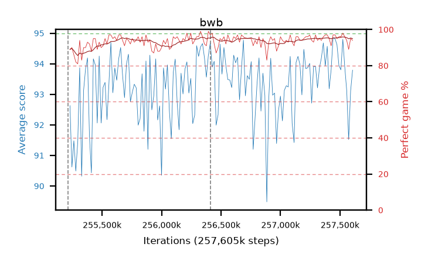

# bwb

step **257,605,632** · 146 evals · trailing **93.7** · peak **93.85** @257,523,712 · sef **100.0** · best30 **95.2** @257,556,480

## Config

| | |
|---|---|
| algo | ppo |
| collect_envs | 128 |
| discount | 0.99 |
| eval_interval | 16384 |
| eval_queue | True |
| eval_queue_depth | 16 |
| eval_workers | 6 |
| fc_layers | (320,) |
| graph_eval_episodes | 100 |
| max_steps | 257605632 |
| min_checkpoint_score | 0.0 |
| ppo_adam_epsilon | 1e-07 |
| ppo_clip | 0.2 |
| ppo_entropy_coef | 0.01 |
| ppo_entropy_coef_final | None |
| ppo_epochs | 8 |
| ppo_gae_lambda | 0.98 |
| ppo_gradient_clipping | 0.5 |
| ppo_horizon | 33.6 |
| ppo_learning_rate | 0.0003 |
| ppo_minibatch | 256 |
| ppo_normalize_adv | True |
| ppo_rollout | 128 |
| ppo_target_kl | 0.0 |
| ppo_transitions_per_rollout | 16384 |
| ppo_value_loss | huber |
| ppo_vf_coef | 0.5 |
| seed | 8 |
| torch_threads | 1 |

## Resumes

Resumed at 255,213,568, 256,409,600

## Evals

| step | avg score | trailing avg | min score | max score | avg reward | perfect % | epsilon |
|---|---|---|---|---|---|---|---|
| 255229952 | 92.63 | 91.31 | 30.0 | 95.0 | 180.46 | 89.0 |  |
| 255246336 | 90.62 | 90.62 | 23.0 | 95.0 | 179.265 | 90.0 |  |
| 255262720 | 91.48 | 91.05 | 34.0 | 95.0 | 176.145 | 86.0 |  |
| ... | ... | ... | ... | ... | ... | ... | ... |
| 257425408 | 93.8 | 93.21 | 53.0 | 95.0 | 183.665 | 91.0 |  |
| 257441792 | 94.85 | 93.54 | 88.0 | 95.0 | 190.775 | 97.0 |  |
| 257458176 | 94.82 | 93.65 | 82.0 | 95.0 | 190.7 | 97.0 |  |
| 257474560 | 94.62 | 93.68 | 82.0 | 95.0 | 188.6 | 95.0 |  |
| 257490944 | 93.94 | 93.68 | 4.0 | 95.0 | 188.87 | 96.0 |  |
| 257507328 | 93.8 | 93.74 | 26.0 | 95.0 | 188.64 | 96.0 |  |
| 257523712 | 94.8 | 93.85 | 83.0 | 95.0 | 191.765 | 98.0 |  |
| 257540096 | 93.89 | 93.59 | 22.0 | 95.0 | 188.91 | 96.0 |  |
| 257556480 | 93.12 | 93.43 | 34.0 | 95.0 | 185.97 | 94.0 |  |
| 257572864 | 91.52 | 93.63 | 23.0 | 95.0 | 179.26 | 89.0 |  |
| 257589248 | 93.11 | 93.69 | 8.0 | 95.0 | 187.045 | 95.0 |  |
| 257605632 | 93.79 | 93.7 | 15.0 | 95.0 | 186.685 | 94.0 |  |
