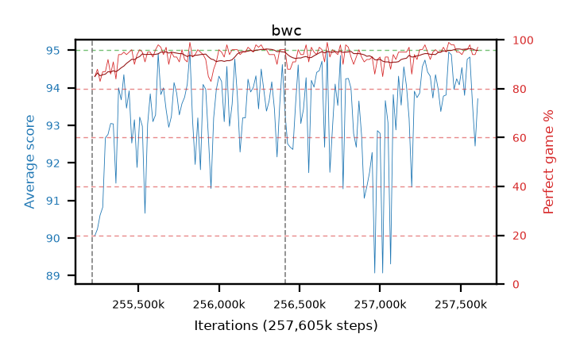

# bwc

step **257,605,632** · 146 evals · trailing **93.51** · peak **93.99** @257,556,480 · sef **100.0** · best30 **95.3** @257,605,632

## Config

| | |
|---|---|
| algo | ppo |
| collect_envs | 128 |
| discount | 0.99 |
| eval_interval | 16384 |
| eval_queue | True |
| eval_queue_depth | 16 |
| eval_workers | 6 |
| fc_layers | (320,) |
| graph_eval_episodes | 100 |
| max_steps | 257605632 |
| min_checkpoint_score | 0.0 |
| ppo_adam_epsilon | 1e-07 |
| ppo_clip | 0.2 |
| ppo_entropy_coef | 0.01 |
| ppo_entropy_coef_final | None |
| ppo_epochs | 8 |
| ppo_gae_lambda | 0.98 |
| ppo_gradient_clipping | 0.5 |
| ppo_horizon | 33.6 |
| ppo_learning_rate | 0.0003 |
| ppo_minibatch | 256 |
| ppo_normalize_adv | True |
| ppo_rollout | 128 |
| ppo_target_kl | 0.0 |
| ppo_transitions_per_rollout | 16384 |
| ppo_value_loss | huber |
| ppo_vf_coef | 0.5 |
| seed | 8 |
| torch_threads | 1 |

## Resumes

Resumed at 255,213,568, 256,409,600

## Evals

| step | avg score | trailing avg | min score | max score | avg reward | perfect % | epsilon |
|---|---|---|---|---|---|---|---|
| 255229952 | 90.06 | 90.06 | 22.0 | 95.0 | 173.685 | 85.0 |  |
| 255246336 | 90.24 | 90.15 | 12.0 | 95.0 | 176.805 | 88.0 |  |
| 255262720 | 90.61 | 90.3 | 16.0 | 95.0 | 172.29 | 83.0 |  |
| ... | ... | ... | ... | ... | ... | ... | ... |
| 257425408 | 94.95 | 93.48 | 90.0 | 95.0 | 192.955 | 99.0 |  |
| 257441792 | 94.88 | 93.75 | 89.0 | 95.0 | 191.845 | 98.0 |  |
| 257458176 | 93.96 | 93.15 | 13.0 | 95.0 | 190.97 | 98.0 |  |
| 257474560 | 94.24 | 92.93 | 60.0 | 95.0 | 188.13 | 95.0 |  |
| 257490944 | 94.08 | 93.06 | 55.0 | 95.0 | 187.925 | 95.0 |  |
| 257507328 | 94.54 | 93.69 | 78.0 | 95.0 | 187.48 | 94.0 |  |
| 257523712 | 93.8 | 93.9 | 10.0 | 95.0 | 188.775 | 96.0 |  |
| 257540096 | 94.76 | 93.93 | 86.0 | 95.0 | 189.645 | 96.0 |  |
| 257556480 | 94.82 | 93.99 | 83.0 | 95.0 | 191.785 | 98.0 |  |
| 257572864 | 93.57 | 93.97 | 24.0 | 95.0 | 186.51 | 94.0 |  |
| 257589248 | 92.45 | 93.5 | 10.0 | 95.0 | 185.255 | 94.0 |  |
| 257605632 | 93.71 | 93.51 | 31.0 | 95.0 | 189.635 | 97.0 |  |
