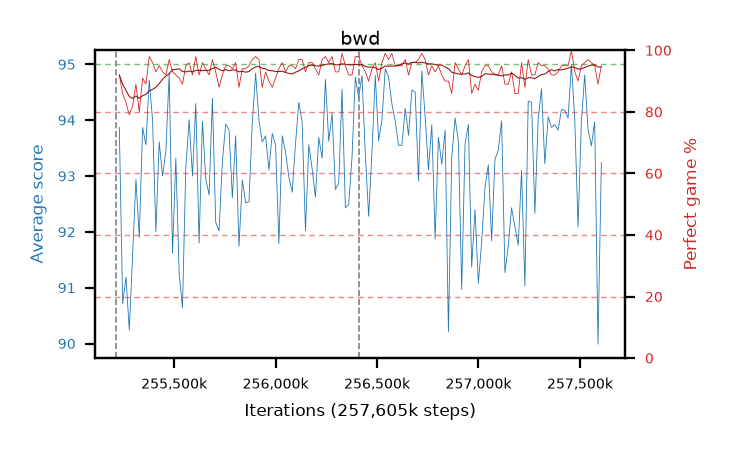

# bwd

step **257,605,632** · 146 evals · trailing **93.14** · peak **93.88** @256,557,056 · sef **99.3** · best30 **95.4** @256,720,896

## Config

| | |
|---|---|
| algo | ppo |
| collect_envs | 128 |
| discount | 0.99 |
| eval_interval | 16384 |
| eval_queue | True |
| eval_queue_depth | 16 |
| eval_workers | 6 |
| fc_layers | (320,) |
| graph_eval_episodes | 100 |
| max_steps | 257605632 |
| min_checkpoint_score | 0.0 |
| ppo_adam_epsilon | 1e-07 |
| ppo_clip | 0.2 |
| ppo_entropy_coef | 0.01 |
| ppo_entropy_coef_final | None |
| ppo_epochs | 8 |
| ppo_gae_lambda | 0.98 |
| ppo_gradient_clipping | 0.5 |
| ppo_horizon | 33.6 |
| ppo_learning_rate | 0.0003 |
| ppo_minibatch | 256 |
| ppo_normalize_adv | True |
| ppo_rollout | 128 |
| ppo_target_kl | 0.0 |
| ppo_transitions_per_rollout | 16384 |
| ppo_value_loss | huber |
| ppo_vf_coef | 0.5 |
| seed | 8 |
| torch_threads | 1 |

## Resumes

Resumed at 255,213,568, 256,409,600

## Evals

| step | avg score | trailing avg | min score | max score | avg reward | perfect % | epsilon |
|---|---|---|---|---|---|---|---|
| 255229952 | 93.87 | 92.74 | 72.0 | 95.0 | 184.685 | 92.0 |  |
| 255246336 | 90.71 | 92.06 | 15.0 | 95.0 | 175.33 | 86.0 |  |
| 255262720 | 91.19 | 91.84 | 24.0 | 95.0 | 172.78 | 83.0 |  |
| ... | ... | ... | ... | ... | ... | ... | ... |
| 257425408 | 94.18 | 93.16 | 34.0 | 95.0 | 187.98 | 95.0 |  |
| 257441792 | 94.04 | 93.25 | 30.0 | 95.0 | 187.93 | 95.0 |  |
| 257458176 | 95.0 | 92.89 | 95.0 | 95.0 | 194.0 | 100.0 |  |
| 257474560 | 94.02 | 92.92 | 67.0 | 95.0 | 185.83 | 93.0 |  |
| 257490944 | 92.09 | 93.07 | 6.0 | 95.0 | 180.87 | 90.0 |  |
| 257507328 | 93.98 | 93.23 | 51.0 | 95.0 | 187.87 | 95.0 |  |
| 257523712 | 94.81 | 93.3 | 89.0 | 95.0 | 189.695 | 96.0 |  |
| 257540096 | 93.83 | 93.29 | 14.0 | 95.0 | 189.71 | 97.0 |  |
| 257556480 | 93.54 | 93.02 | 38.0 | 95.0 | 188.425 | 96.0 |  |
| 257572864 | 93.97 | 93.03 | 24.0 | 95.0 | 187.905 | 95.0 |  |
| 257589248 | 89.99 | 93.08 | 10.0 | 95.0 | 177.685 | 89.0 |  |
| 257605632 | 93.24 | 93.14 | 13.0 | 95.0 | 187.13 | 95.0 |  |
