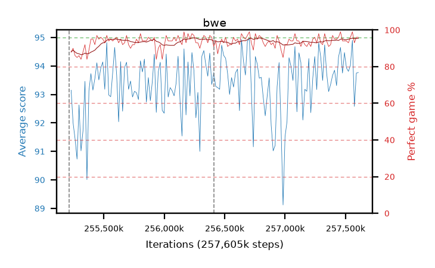

# bwe

step **257,605,632** · 146 evals · trailing **93.34** · peak **93.79** @256,786,432 · sef **100.0** · best30 **94.4** @256,491,520

## Config

| | |
|---|---|
| algo | ppo |
| collect_envs | 128 |
| discount | 0.99 |
| eval_interval | 16384 |
| eval_queue | True |
| eval_queue_depth | 16 |
| eval_workers | 6 |
| fc_layers | (320,) |
| graph_eval_episodes | 100 |
| max_steps | 257605632 |
| min_checkpoint_score | 0.0 |
| ppo_adam_epsilon | 1e-07 |
| ppo_clip | 0.2 |
| ppo_entropy_coef | 0.01 |
| ppo_entropy_coef_final | None |
| ppo_epochs | 8 |
| ppo_gae_lambda | 0.98 |
| ppo_gradient_clipping | 0.5 |
| ppo_horizon | 33.6 |
| ppo_learning_rate | 0.0003 |
| ppo_minibatch | 256 |
| ppo_normalize_adv | True |
| ppo_rollout | 128 |
| ppo_target_kl | 0.0 |
| ppo_transitions_per_rollout | 16384 |
| ppo_value_loss | huber |
| ppo_vf_coef | 0.5 |
| seed | 8 |
| torch_threads | 1 |

## Resumes

Resumed at 255,213,568, 256,409,600

## Evals

| step | avg score | trailing avg | min score | max score | avg reward | perfect % | epsilon |
|---|---|---|---|---|---|---|---|
| 255229952 | 93.15 | 92.41 | 60.0 | 95.0 | 179.985 | 88.0 |  |
| 255246336 | 92.0 | 91.99 | 22.0 | 95.0 | 180.735 | 90.0 |  |
| 255262720 | 91.44 | 92.03 | 24.0 | 95.0 | 176.285 | 86.0 |  |
| ... | ... | ... | ... | ... | ... | ... | ... |
| 257425408 | 93.31 | 93.04 | 40.0 | 95.0 | 187.2 | 95.0 |  |
| 257441792 | 94.31 | 93.08 | 59.0 | 95.0 | 189.195 | 96.0 |  |
| 257458176 | 94.65 | 93.64 | 60.0 | 95.0 | 192.61 | 99.0 |  |
| 257474560 | 93.75 | 93.68 | 28.0 | 95.0 | 186.735 | 94.0 |  |
| 257490944 | 94.47 | 93.7 | 81.0 | 95.0 | 187.365 | 94.0 |  |
| 257507328 | 93.93 | 93.71 | 14.0 | 95.0 | 186.735 | 94.0 |  |
| 257523712 | 93.81 | 93.68 | 30.0 | 95.0 | 185.665 | 93.0 |  |
| 257540096 | 94.02 | 93.75 | 26.0 | 95.0 | 188.995 | 96.0 |  |
| 257556480 | 94.9 | 93.77 | 85.0 | 95.0 | 192.905 | 99.0 |  |
| 257572864 | 92.58 | 93.3 | 20.0 | 95.0 | 184.435 | 93.0 |  |
| 257589248 | 93.75 | 93.31 | 26.0 | 95.0 | 188.68 | 96.0 |  |
| 257605632 | 93.77 | 93.34 | 25.0 | 95.0 | 188.61 | 96.0 |  |
