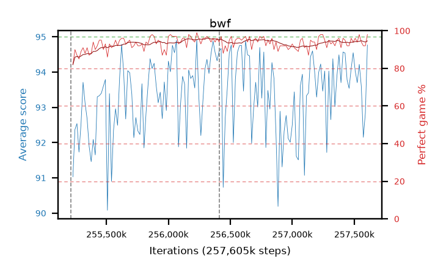

# bwf

step **257,605,632** · 146 evals · trailing **93.51** · peak **93.84** @256,425,984 · sef **100.0** · best30 **95.1** @256,475,136

## Config

| | |
|---|---|
| algo | ppo |
| collect_envs | 128 |
| discount | 0.99 |
| eval_interval | 16384 |
| eval_queue | True |
| eval_queue_depth | 16 |
| eval_workers | 6 |
| fc_layers | (320,) |
| graph_eval_episodes | 100 |
| max_steps | 257605632 |
| min_checkpoint_score | 0.0 |
| ppo_adam_epsilon | 1e-07 |
| ppo_clip | 0.2 |
| ppo_entropy_coef | 0.01 |
| ppo_entropy_coef_final | None |
| ppo_epochs | 8 |
| ppo_gae_lambda | 0.98 |
| ppo_gradient_clipping | 0.5 |
| ppo_horizon | 33.6 |
| ppo_learning_rate | 0.0003 |
| ppo_minibatch | 256 |
| ppo_normalize_adv | True |
| ppo_rollout | 128 |
| ppo_target_kl | 0.0 |
| ppo_transitions_per_rollout | 16384 |
| ppo_value_loss | huber |
| ppo_vf_coef | 0.5 |
| seed | 8 |
| torch_threads | 1 |

## Resumes

Resumed at 255,213,568, 256,409,600

## Evals

| step | avg score | trailing avg | min score | max score | avg reward | perfect % | epsilon |
|---|---|---|---|---|---|---|---|
| 255229952 | 91.03 | 92.12 | 27.0 | 95.0 | 171.67 | 82.0 |  |
| 255246336 | 92.37 | 92.45 | 24.0 | 95.0 | 181.24 | 90.0 |  |
| 255262720 | 92.54 | 92.48 | 56.0 | 95.0 | 178.38 | 87.0 |  |
| ... | ... | ... | ... | ... | ... | ... | ... |
| 257425408 | 94.54 | 92.99 | 83.0 | 95.0 | 188.475 | 95.0 |  |
| 257441792 | 93.78 | 93.34 | 30.0 | 95.0 | 184.55 | 92.0 |  |
| 257458176 | 93.54 | 93.65 | 32.0 | 95.0 | 184.31 | 92.0 |  |
| 257474560 | 94.1 | 93.65 | 47.0 | 95.0 | 189.03 | 96.0 |  |
| 257490944 | 94.55 | 93.77 | 69.0 | 95.0 | 187.4 | 94.0 |  |
| 257507328 | 94.03 | 93.79 | 16.0 | 95.0 | 188.96 | 96.0 |  |
| 257523712 | 93.7 | 93.27 | 34.0 | 95.0 | 186.55 | 94.0 |  |
| 257540096 | 94.22 | 93.41 | 30.0 | 95.0 | 191.185 | 98.0 |  |
| 257556480 | 93.6 | 93.31 | 32.0 | 95.0 | 186.54 | 94.0 |  |
| 257572864 | 92.15 | 93.47 | 24.0 | 95.0 | 182.965 | 92.0 |  |
| 257589248 | 92.84 | 93.52 | 15.0 | 95.0 | 183.7 | 92.0 |  |
| 257605632 | 94.77 | 93.51 | 81.0 | 95.0 | 191.78 | 98.0 |  |
