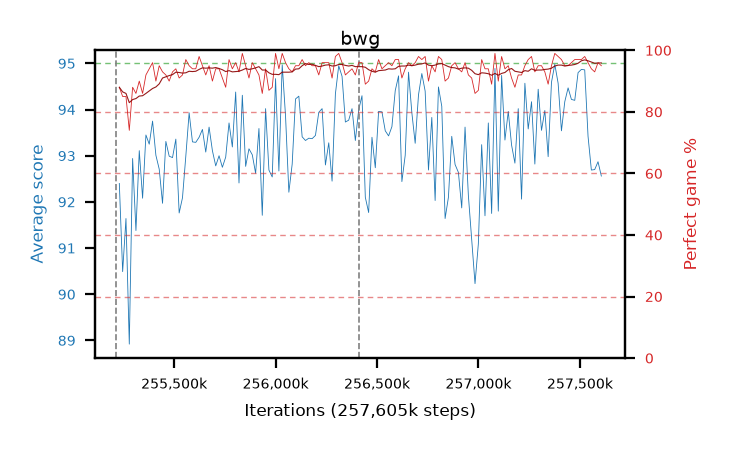

# bwg

step **257,605,632** · 146 evals · trailing **93.46** · peak **93.81** @257,523,712 · sef **99.3** · best30 **94.9** @257,556,480

## Config

| | |
|---|---|
| algo | ppo |
| collect_envs | 128 |
| discount | 0.99 |
| eval_interval | 16384 |
| eval_queue | True |
| eval_queue_depth | 16 |
| eval_workers | 6 |
| fc_layers | (320,) |
| graph_eval_episodes | 100 |
| max_steps | 257605632 |
| min_checkpoint_score | 0.0 |
| ppo_adam_epsilon | 1e-07 |
| ppo_clip | 0.2 |
| ppo_entropy_coef | 0.01 |
| ppo_entropy_coef_final | None |
| ppo_epochs | 8 |
| ppo_gae_lambda | 0.98 |
| ppo_gradient_clipping | 0.5 |
| ppo_horizon | 33.6 |
| ppo_learning_rate | 0.0003 |
| ppo_minibatch | 256 |
| ppo_normalize_adv | True |
| ppo_rollout | 128 |
| ppo_target_kl | 0.0 |
| ppo_transitions_per_rollout | 16384 |
| ppo_value_loss | huber |
| ppo_vf_coef | 0.5 |
| seed | 8 |
| torch_threads | 1 |

## Resumes

Resumed at 255,213,568, 256,409,600

## Evals

| step | avg score | trailing avg | min score | max score | avg reward | perfect % | epsilon |
|---|---|---|---|---|---|---|---|
| 255229952 | 92.4 | 91.51 | 3.0 | 95.0 | 179.28 | 88.0 |  |
| 255246336 | 90.49 | 90.49 | 36.0 | 95.0 | 174.07 | 85.0 |  |
| 255262720 | 91.64 | 91.06 | 28.0 | 95.0 | 175.31 | 85.0 |  |
| ... | ... | ... | ... | ... | ... | ... | ... |
| 257425408 | 94.17 | 93.04 | 44.0 | 95.0 | 188.06 | 95.0 |  |
| 257441792 | 94.47 | 92.97 | 79.0 | 95.0 | 188.36 | 95.0 |  |
| 257458176 | 94.22 | 93.07 | 49.0 | 95.0 | 189.105 | 96.0 |  |
| 257474560 | 94.2 | 93.32 | 26.0 | 95.0 | 190.215 | 97.0 |  |
| 257490944 | 94.8 | 93.65 | 82.0 | 95.0 | 190.725 | 97.0 |  |
| 257507328 | 94.87 | 93.71 | 90.0 | 95.0 | 190.795 | 97.0 |  |
| 257523712 | 94.86 | 93.81 | 87.0 | 95.0 | 191.825 | 98.0 |  |
| 257540096 | 93.42 | 93.77 | 8.0 | 95.0 | 188.395 | 96.0 |  |
| 257556480 | 92.69 | 93.2 | 16.0 | 95.0 | 185.495 | 94.0 |  |
| 257572864 | 92.7 | 93.22 | 18.0 | 95.0 | 184.6 | 93.0 |  |
| 257589248 | 92.87 | 93.41 | 16.0 | 95.0 | 187.71 | 96.0 |  |
| 257605632 | 92.56 | 93.46 | 14.0 | 95.0 | 186.405 | 95.0 |  |
