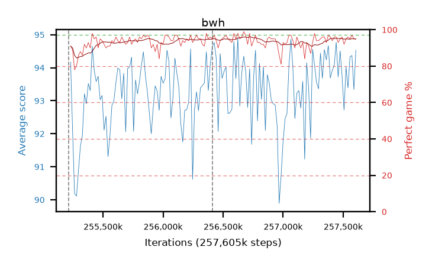

# bwh

step **257,605,632** · 146 evals · trailing **93.45** · peak **93.75** @257,441,792 · sef **99.3** · best30 **95.2** @256,688,128

## Config

| | |
|---|---|
| algo | ppo |
| collect_envs | 128 |
| discount | 0.99 |
| eval_interval | 16384 |
| eval_queue | True |
| eval_queue_depth | 16 |
| eval_workers | 6 |
| fc_layers | (320,) |
| graph_eval_episodes | 100 |
| max_steps | 257605632 |
| min_checkpoint_score | 0.0 |
| ppo_adam_epsilon | 1e-07 |
| ppo_clip | 0.2 |
| ppo_entropy_coef | 0.01 |
| ppo_entropy_coef_final | None |
| ppo_epochs | 8 |
| ppo_gae_lambda | 0.98 |
| ppo_gradient_clipping | 0.5 |
| ppo_horizon | 33.6 |
| ppo_learning_rate | 0.0003 |
| ppo_minibatch | 256 |
| ppo_normalize_adv | True |
| ppo_rollout | 128 |
| ppo_target_kl | 0.0 |
| ppo_transitions_per_rollout | 16384 |
| ppo_value_loss | huber |
| ppo_vf_coef | 0.5 |
| seed | 8 |
| torch_threads | 1 |

## Resumes

Resumed at 255,213,568, 256,409,600

## Evals

| step | avg score | trailing avg | min score | max score | avg reward | perfect % | epsilon |
|---|---|---|---|---|---|---|---|
| 255229952 | 94.17 | 92.14 | 73.0 | 95.0 | 184.035 | 91.0 |  |
| 255246336 | 92.09 | 91.64 | 12.0 | 95.0 | 179.875 | 89.0 |  |
| 255262720 | 90.19 | 91.49 | 18.0 | 95.0 | 166.76 | 78.0 |  |
| ... | ... | ... | ... | ... | ... | ... | ... |
| 257425408 | 94.07 | 93.73 | 32.0 | 95.0 | 189.0 | 96.0 |  |
| 257441792 | 94.77 | 93.75 | 88.0 | 95.0 | 189.61 | 96.0 |  |
| 257458176 | 93.72 | 93.13 | 33.0 | 95.0 | 185.53 | 93.0 |  |
| 257474560 | 94.51 | 93.17 | 74.0 | 95.0 | 188.355 | 95.0 |  |
| 257490944 | 93.73 | 93.63 | 30.0 | 95.0 | 188.615 | 96.0 |  |
| 257507328 | 92.72 | 93.68 | 35.0 | 95.0 | 183.49 | 92.0 |  |
| 257523712 | 94.02 | 93.68 | 31.0 | 95.0 | 187.955 | 95.0 |  |
| 257540096 | 93.39 | 93.71 | 13.0 | 95.0 | 188.275 | 96.0 |  |
| 257556480 | 94.33 | 93.75 | 67.0 | 95.0 | 188.265 | 95.0 |  |
| 257572864 | 94.37 | 93.57 | 45.0 | 95.0 | 190.34 | 97.0 |  |
| 257589248 | 93.34 | 93.29 | 21.0 | 95.0 | 187.23 | 95.0 |  |
| 257605632 | 94.53 | 93.45 | 75.0 | 95.0 | 188.51 | 95.0 |  |
