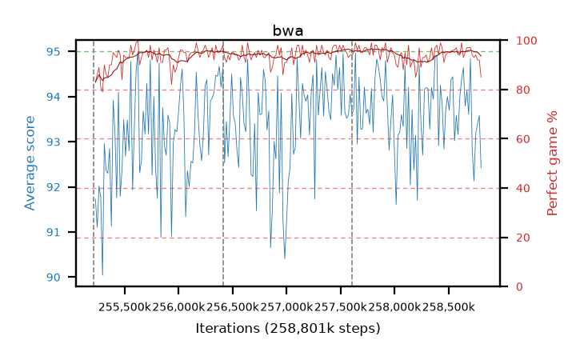

# bwa

step **258,801,664** · 219 evals · trailing **93.85** · peak **94.12** @257,867,776 · sef **99.5** · best30 **96.2** @257,916,928

## Config

| | |
|---|---|
| algo | ppo |
| collect_envs | 128 |
| discount | 0.99 |
| eval_interval | 16384 |
| eval_queue | True |
| eval_queue_depth | 16 |
| eval_workers | 8 |
| fc_layers | (320,) |
| graph_eval_episodes | 100 |
| max_steps | 258801664 |
| min_checkpoint_score | 0.0 |
| ppo_adam_epsilon | 1e-07 |
| ppo_clip | 0.2 |
| ppo_entropy_coef | 0.01 |
| ppo_entropy_coef_final | None |
| ppo_epochs | 8 |
| ppo_gae_lambda | 0.98 |
| ppo_gradient_clipping | 0.5 |
| ppo_horizon | 33.6 |
| ppo_learning_rate | 0.0003 |
| ppo_minibatch | 256 |
| ppo_normalize_adv | True |
| ppo_rollout | 128 |
| ppo_target_kl | 0.0 |
| ppo_transitions_per_rollout | 16384 |
| ppo_value_loss | huber |
| ppo_vf_coef | 0.5 |
| seed | 8 |
| torch_threads | 1 |

## Resumes

Resumed at 255,213,568, 256,409,600, 257,605,632

## Evals

| step | avg score | trailing avg | min score | max score | avg reward | perfect % | epsilon |
|---|---|---|---|---|---|---|---|
| 255229952 | 91.73 | 91.41 | 3.0 | 95.0 | 173.5 | 83.0 |  |
| 255246336 | 91.1 | 91.1 | 23.0 | 95.0 | 175.72 | 86.0 |  |
| 255262720 | 92.02 | 91.62 | 8.0 | 95.0 | 179.76 | 89.0 |  |
| ... | ... | ... | ... | ... | ... | ... | ... |
| 258621440 | 94.39 | 93.67 | 34.0 | 95.0 | 192.35 | 99.0 |  |
| 258637824 | 94.64 | 93.68 | 85.0 | 95.0 | 186.36 | 93.0 |  |
| 258654208 | 93.79 | 93.67 | 14.0 | 95.0 | 187.635 | 95.0 |  |
| 258670592 | 94.13 | 93.75 | 25.0 | 95.0 | 190.01 | 97.0 |  |
| 258686976 | 93.61 | 93.82 | 32.0 | 95.0 | 189.535 | 97.0 |  |
| 258703360 | 94.84 | 93.88 | 84.0 | 95.0 | 190.72 | 97.0 |  |
| 258719744 | 92.83 | 93.83 | 36.0 | 95.0 | 185.68 | 94.0 |  |
| 258736128 | 92.13 | 93.76 | 23.0 | 95.0 | 183.94 | 93.0 |  |
| 258752512 | 93.19 | 93.73 | 37.0 | 95.0 | 185.95 | 94.0 |  |
| 258768896 | 93.39 | 93.88 | 19.0 | 95.0 | 184.205 | 92.0 |  |
| 258785280 | 93.58 | 93.88 | 23.0 | 95.0 | 184.26 | 92.0 |  |
| 258801664 | 92.42 | 93.85 | 51.0 | 95.0 | 175.82 | 85.0 |  |
