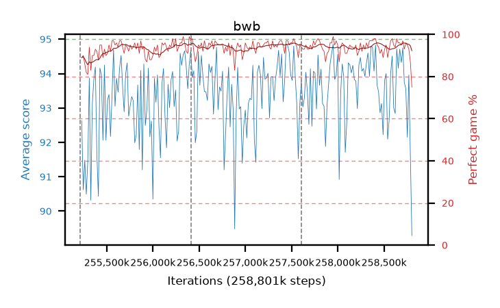

# bwb

step **258,801,664** · 219 evals · trailing **93.54** · peak **93.95** @258,392,064 · sef **99.5** · best30 **95.2** @257,556,480

## Config

| | |
|---|---|
| algo | ppo |
| collect_envs | 128 |
| discount | 0.99 |
| eval_interval | 16384 |
| eval_queue | True |
| eval_queue_depth | 16 |
| eval_workers | 8 |
| fc_layers | (320,) |
| graph_eval_episodes | 100 |
| max_steps | 258801664 |
| min_checkpoint_score | 0.0 |
| ppo_adam_epsilon | 1e-07 |
| ppo_clip | 0.2 |
| ppo_entropy_coef | 0.01 |
| ppo_entropy_coef_final | None |
| ppo_epochs | 8 |
| ppo_gae_lambda | 0.98 |
| ppo_gradient_clipping | 0.5 |
| ppo_horizon | 33.6 |
| ppo_learning_rate | 0.0003 |
| ppo_minibatch | 256 |
| ppo_normalize_adv | True |
| ppo_rollout | 128 |
| ppo_target_kl | 0.0 |
| ppo_transitions_per_rollout | 16384 |
| ppo_value_loss | huber |
| ppo_vf_coef | 0.5 |
| seed | 8 |
| torch_threads | 1 |

## Resumes

Resumed at 255,213,568, 256,409,600, 257,605,632

## Evals

| step | avg score | trailing avg | min score | max score | avg reward | perfect % | epsilon |
|---|---|---|---|---|---|---|---|
| 255229952 | 92.63 | 91.31 | 30.0 | 95.0 | 180.46 | 89.0 |  |
| 255246336 | 90.62 | 90.62 | 23.0 | 95.0 | 179.265 | 90.0 |  |
| 255262720 | 91.48 | 91.05 | 34.0 | 95.0 | 176.145 | 86.0 |  |
| ... | ... | ... | ... | ... | ... | ... | ... |
| 258621440 | 92.84 | 93.71 | 12.0 | 95.0 | 185.69 | 94.0 |  |
| 258637824 | 94.72 | 93.89 | 70.0 | 95.0 | 191.685 | 98.0 |  |
| 258654208 | 94.16 | 93.89 | 46.0 | 95.0 | 189.0 | 96.0 |  |
| 258670592 | 94.71 | 93.84 | 84.0 | 95.0 | 189.55 | 96.0 |  |
| 258686976 | 94.32 | 93.89 | 38.0 | 95.0 | 188.12 | 95.0 |  |
| 258703360 | 94.75 | 93.84 | 82.0 | 95.0 | 190.675 | 97.0 |  |
| 258719744 | 93.74 | 93.71 | 34.0 | 95.0 | 185.505 | 93.0 |  |
| 258736128 | 93.56 | 93.81 | 27.0 | 95.0 | 188.4 | 96.0 |  |
| 258752512 | 92.15 | 93.82 | 6.0 | 95.0 | 185.995 | 95.0 |  |
| 258768896 | 93.96 | 93.87 | 18.0 | 95.0 | 185.68 | 93.0 |  |
| 258785280 | 91.58 | 93.76 | 23.0 | 95.0 | 177.06 | 87.0 |  |
| 258801664 | 89.29 | 93.54 | 17.0 | 95.0 | 162.29 | 75.0 |  |
