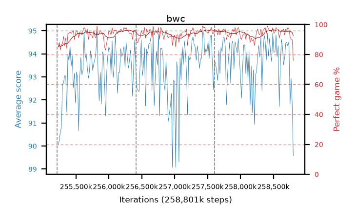

# bwc

step **258,801,664** · 219 evals · trailing **93.75** · peak **94.03** @258,686,976 · sef **99.5** · best30 **95.8** @258,736,128

## Config

| | |
|---|---|
| algo | ppo |
| collect_envs | 128 |
| discount | 0.99 |
| eval_interval | 16384 |
| eval_queue | True |
| eval_queue_depth | 16 |
| eval_workers | 8 |
| fc_layers | (320,) |
| graph_eval_episodes | 100 |
| max_steps | 258801664 |
| min_checkpoint_score | 0.0 |
| ppo_adam_epsilon | 1e-07 |
| ppo_clip | 0.2 |
| ppo_entropy_coef | 0.01 |
| ppo_entropy_coef_final | None |
| ppo_epochs | 8 |
| ppo_gae_lambda | 0.98 |
| ppo_gradient_clipping | 0.5 |
| ppo_horizon | 33.6 |
| ppo_learning_rate | 0.0003 |
| ppo_minibatch | 256 |
| ppo_normalize_adv | True |
| ppo_rollout | 128 |
| ppo_target_kl | 0.0 |
| ppo_transitions_per_rollout | 16384 |
| ppo_value_loss | huber |
| ppo_vf_coef | 0.5 |
| seed | 8 |
| torch_threads | 1 |

## Resumes

Resumed at 255,213,568, 256,409,600, 257,605,632

## Evals

| step | avg score | trailing avg | min score | max score | avg reward | perfect % | epsilon |
|---|---|---|---|---|---|---|---|
| 255229952 | 90.06 | 90.06 | 22.0 | 95.0 | 173.685 | 85.0 |  |
| 255246336 | 90.24 | 90.15 | 12.0 | 95.0 | 176.805 | 88.0 |  |
| 255262720 | 90.61 | 90.3 | 16.0 | 95.0 | 172.29 | 83.0 |  |
| ... | ... | ... | ... | ... | ... | ... | ... |
| 258621440 | 94.64 | 93.71 | 80.0 | 95.0 | 189.525 | 96.0 |  |
| 258637824 | 94.31 | 93.78 | 40.0 | 95.0 | 189.15 | 96.0 |  |
| 258654208 | 93.53 | 93.97 | 25.0 | 95.0 | 189.41 | 97.0 |  |
| 258670592 | 93.83 | 94.01 | 42.0 | 95.0 | 185.64 | 93.0 |  |
| 258686976 | 94.47 | 94.03 | 50.0 | 95.0 | 190.395 | 97.0 |  |
| 258703360 | 94.5 | 93.9 | 59.0 | 95.0 | 189.34 | 96.0 |  |
| 258719744 | 94.33 | 93.86 | 32.0 | 95.0 | 191.25 | 98.0 |  |
| 258736128 | 94.53 | 94.03 | 69.0 | 95.0 | 190.455 | 97.0 |  |
| 258752512 | 91.82 | 93.99 | 14.0 | 95.0 | 182.59 | 92.0 |  |
| 258768896 | 92.93 | 93.98 | 48.0 | 95.0 | 181.755 | 90.0 |  |
| 258785280 | 91.87 | 93.92 | 22.0 | 95.0 | 180.47 | 90.0 |  |
| 258801664 | 89.59 | 93.75 | 31.0 | 95.0 | 163.675 | 76.0 |  |
