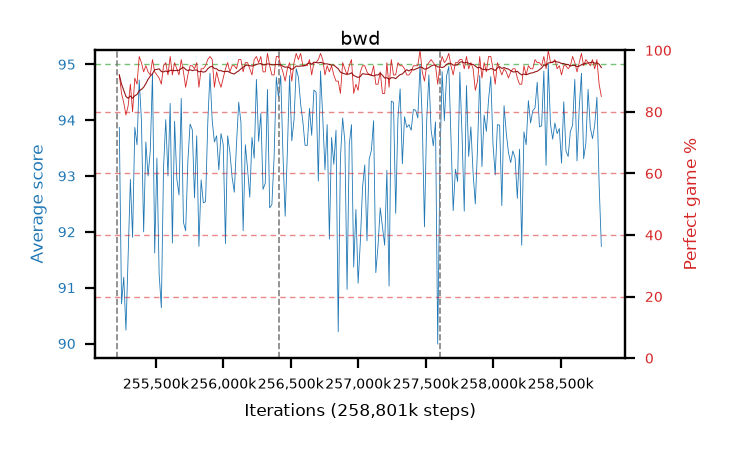

# bwd

step **258,801,664** · 219 evals · trailing **93.89** · peak **94.01** @258,768,896 · sef **99.5** · best30 **95.7** @258,768,896

## Config

| | |
|---|---|
| algo | ppo |
| collect_envs | 128 |
| discount | 0.99 |
| eval_interval | 16384 |
| eval_queue | True |
| eval_queue_depth | 16 |
| eval_workers | 8 |
| fc_layers | (320,) |
| graph_eval_episodes | 100 |
| max_steps | 258801664 |
| min_checkpoint_score | 0.0 |
| ppo_adam_epsilon | 1e-07 |
| ppo_clip | 0.2 |
| ppo_entropy_coef | 0.01 |
| ppo_entropy_coef_final | None |
| ppo_epochs | 8 |
| ppo_gae_lambda | 0.98 |
| ppo_gradient_clipping | 0.5 |
| ppo_horizon | 33.6 |
| ppo_learning_rate | 0.0003 |
| ppo_minibatch | 256 |
| ppo_normalize_adv | True |
| ppo_rollout | 128 |
| ppo_target_kl | 0.0 |
| ppo_transitions_per_rollout | 16384 |
| ppo_value_loss | huber |
| ppo_vf_coef | 0.5 |
| seed | 8 |
| torch_threads | 1 |

## Resumes

Resumed at 255,213,568, 256,409,600, 257,605,632

## Evals

| step | avg score | trailing avg | min score | max score | avg reward | perfect % | epsilon |
|---|---|---|---|---|---|---|---|
| 255229952 | 93.87 | 92.74 | 72.0 | 95.0 | 184.685 | 92.0 |  |
| 255246336 | 90.71 | 92.06 | 15.0 | 95.0 | 175.33 | 86.0 |  |
| 255262720 | 91.19 | 91.84 | 24.0 | 95.0 | 172.78 | 83.0 |  |
| ... | ... | ... | ... | ... | ... | ... | ... |
| 258621440 | 93.27 | 93.76 | 25.0 | 95.0 | 184.99 | 93.0 |  |
| 258637824 | 94.22 | 93.86 | 50.0 | 95.0 | 189.06 | 96.0 |  |
| 258654208 | 94.84 | 94.0 | 79.0 | 95.0 | 192.8 | 99.0 |  |
| 258670592 | 93.31 | 93.86 | 14.0 | 95.0 | 187.155 | 95.0 |  |
| 258686976 | 93.59 | 93.77 | 1.0 | 95.0 | 189.515 | 97.0 |  |
| 258703360 | 94.55 | 93.89 | 73.0 | 95.0 | 189.48 | 96.0 |  |
| 258719744 | 93.87 | 93.96 | 53.0 | 95.0 | 187.715 | 95.0 |  |
| 258736128 | 93.67 | 93.96 | 21.0 | 95.0 | 189.595 | 97.0 |  |
| 258752512 | 93.91 | 93.8 | 59.0 | 95.0 | 186.805 | 94.0 |  |
| 258768896 | 94.41 | 94.01 | 67.0 | 95.0 | 190.335 | 97.0 |  |
| 258785280 | 92.85 | 93.97 | 46.0 | 95.0 | 180.41 | 89.0 |  |
| 258801664 | 91.74 | 93.89 | 13.0 | 95.0 | 175.23 | 85.0 |  |
