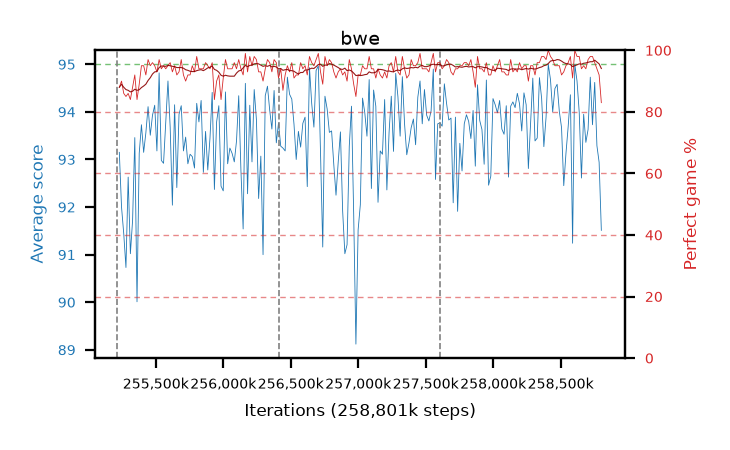

# bwe

step **258,801,664** · 219 evals · trailing **93.75** · peak **94.02** @258,441,216 · sef **100.0** · best30 **96.0** @258,752,512

## Config

| | |
|---|---|
| algo | ppo |
| collect_envs | 128 |
| discount | 0.99 |
| eval_interval | 16384 |
| eval_queue | True |
| eval_queue_depth | 16 |
| eval_workers | 8 |
| fc_layers | (320,) |
| graph_eval_episodes | 100 |
| max_steps | 258801664 |
| min_checkpoint_score | 0.0 |
| ppo_adam_epsilon | 1e-07 |
| ppo_clip | 0.2 |
| ppo_entropy_coef | 0.01 |
| ppo_entropy_coef_final | None |
| ppo_epochs | 8 |
| ppo_gae_lambda | 0.98 |
| ppo_gradient_clipping | 0.5 |
| ppo_horizon | 33.6 |
| ppo_learning_rate | 0.0003 |
| ppo_minibatch | 256 |
| ppo_normalize_adv | True |
| ppo_rollout | 128 |
| ppo_target_kl | 0.0 |
| ppo_transitions_per_rollout | 16384 |
| ppo_value_loss | huber |
| ppo_vf_coef | 0.5 |
| seed | 8 |
| torch_threads | 1 |

## Resumes

Resumed at 255,213,568, 256,409,600, 257,605,632

## Evals

| step | avg score | trailing avg | min score | max score | avg reward | perfect % | epsilon |
|---|---|---|---|---|---|---|---|
| 255229952 | 93.15 | 92.41 | 60.0 | 95.0 | 179.985 | 88.0 |  |
| 255246336 | 92.0 | 91.99 | 22.0 | 95.0 | 180.735 | 90.0 |  |
| 255262720 | 91.44 | 92.03 | 24.0 | 95.0 | 176.285 | 86.0 |  |
| ... | ... | ... | ... | ... | ... | ... | ... |
| 258621440 | 94.65 | 93.93 | 63.0 | 95.0 | 191.57 | 98.0 |  |
| 258637824 | 93.99 | 93.89 | 35.0 | 95.0 | 190.91 | 98.0 |  |
| 258654208 | 92.61 | 93.96 | 18.0 | 95.0 | 185.37 | 94.0 |  |
| 258670592 | 93.95 | 93.97 | 23.0 | 95.0 | 187.795 | 95.0 |  |
| 258686976 | 93.36 | 93.86 | 1.0 | 95.0 | 186.21 | 94.0 |  |
| 258703360 | 93.63 | 93.84 | 28.0 | 95.0 | 189.51 | 97.0 |  |
| 258719744 | 94.73 | 93.75 | 74.0 | 95.0 | 191.65 | 98.0 |  |
| 258736128 | 93.73 | 93.76 | 12.0 | 95.0 | 190.65 | 98.0 |  |
| 258752512 | 94.62 | 93.87 | 67.0 | 95.0 | 189.505 | 96.0 |  |
| 258768896 | 93.29 | 93.86 | 20.0 | 95.0 | 186.185 | 94.0 |  |
| 258785280 | 92.94 | 93.83 | 10.0 | 95.0 | 183.62 | 92.0 |  |
| 258801664 | 91.51 | 93.75 | 29.0 | 95.0 | 172.875 | 83.0 |  |
