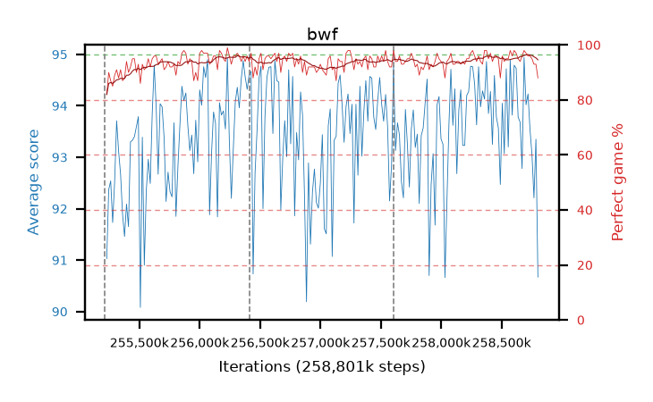

# bwf

step **258,801,664** · 219 evals · trailing **93.82** · peak **94.06** @258,621,440 · sef **100.0** · best30 **95.7** @258,719,744

## Config

| | |
|---|---|
| algo | ppo |
| collect_envs | 128 |
| discount | 0.99 |
| eval_interval | 16384 |
| eval_queue | True |
| eval_queue_depth | 16 |
| eval_workers | 8 |
| fc_layers | (320,) |
| graph_eval_episodes | 100 |
| max_steps | 258801664 |
| min_checkpoint_score | 0.0 |
| ppo_adam_epsilon | 1e-07 |
| ppo_clip | 0.2 |
| ppo_entropy_coef | 0.01 |
| ppo_entropy_coef_final | None |
| ppo_epochs | 8 |
| ppo_gae_lambda | 0.98 |
| ppo_gradient_clipping | 0.5 |
| ppo_horizon | 33.6 |
| ppo_learning_rate | 0.0003 |
| ppo_minibatch | 256 |
| ppo_normalize_adv | True |
| ppo_rollout | 128 |
| ppo_target_kl | 0.0 |
| ppo_transitions_per_rollout | 16384 |
| ppo_value_loss | huber |
| ppo_vf_coef | 0.5 |
| seed | 8 |
| torch_threads | 1 |

## Resumes

Resumed at 255,213,568, 256,409,600, 257,605,632

## Evals

| step | avg score | trailing avg | min score | max score | avg reward | perfect % | epsilon |
|---|---|---|---|---|---|---|---|
| 255229952 | 91.03 | 92.12 | 27.0 | 95.0 | 171.67 | 82.0 |  |
| 255246336 | 92.37 | 92.45 | 24.0 | 95.0 | 181.24 | 90.0 |  |
| 255262720 | 92.54 | 92.48 | 56.0 | 95.0 | 178.38 | 87.0 |  |
| ... | ... | ... | ... | ... | ... | ... | ... |
| 258621440 | 94.73 | 94.06 | 81.0 | 95.0 | 190.655 | 97.0 |  |
| 258637824 | 93.78 | 93.94 | 32.0 | 95.0 | 187.625 | 95.0 |  |
| 258654208 | 93.68 | 93.88 | 27.0 | 95.0 | 186.575 | 94.0 |  |
| 258670592 | 92.78 | 93.93 | 21.0 | 95.0 | 187.71 | 96.0 |  |
| 258686976 | 94.94 | 94.0 | 91.0 | 95.0 | 191.86 | 98.0 |  |
| 258703360 | 94.02 | 94.0 | 19.0 | 95.0 | 189.9 | 97.0 |  |
| 258719744 | 94.23 | 94.03 | 48.0 | 95.0 | 189.16 | 96.0 |  |
| 258736128 | 93.54 | 93.97 | 34.0 | 95.0 | 188.425 | 96.0 |  |
| 258752512 | 93.05 | 93.8 | 27.0 | 95.0 | 186.895 | 95.0 |  |
| 258768896 | 92.21 | 93.98 | 19.0 | 95.0 | 184.02 | 93.0 |  |
| 258785280 | 93.35 | 93.75 | 18.0 | 95.0 | 185.115 | 93.0 |  |
| 258801664 | 90.67 | 93.82 | 9.0 | 95.0 | 177.19 | 88.0 |  |
