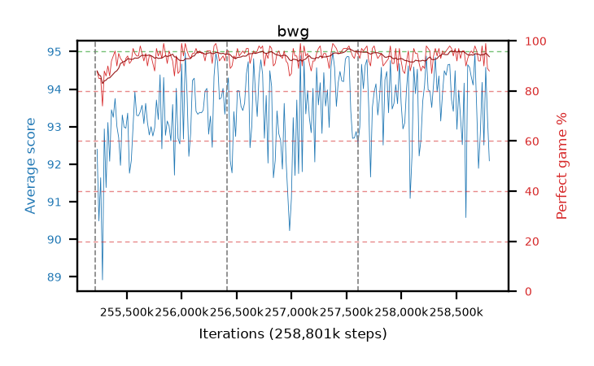

# bwg

step **258,801,664** · 219 evals · trailing **93.72** · peak **93.97** @257,982,464 · sef **99.5** · best30 **95.5** @257,687,552

## Config

| | |
|---|---|
| algo | ppo |
| collect_envs | 128 |
| discount | 0.99 |
| eval_interval | 16384 |
| eval_queue | True |
| eval_queue_depth | 16 |
| eval_workers | 8 |
| fc_layers | (320,) |
| graph_eval_episodes | 100 |
| max_steps | 258801664 |
| min_checkpoint_score | 0.0 |
| ppo_adam_epsilon | 1e-07 |
| ppo_clip | 0.2 |
| ppo_entropy_coef | 0.01 |
| ppo_entropy_coef_final | None |
| ppo_epochs | 8 |
| ppo_gae_lambda | 0.98 |
| ppo_gradient_clipping | 0.5 |
| ppo_horizon | 33.6 |
| ppo_learning_rate | 0.0003 |
| ppo_minibatch | 256 |
| ppo_normalize_adv | True |
| ppo_rollout | 128 |
| ppo_target_kl | 0.0 |
| ppo_transitions_per_rollout | 16384 |
| ppo_value_loss | huber |
| ppo_vf_coef | 0.5 |
| seed | 8 |
| torch_threads | 1 |

## Resumes

Resumed at 255,213,568, 256,409,600, 257,605,632

## Evals

| step | avg score | trailing avg | min score | max score | avg reward | perfect % | epsilon |
|---|---|---|---|---|---|---|---|
| 255229952 | 92.4 | 91.51 | 3.0 | 95.0 | 179.28 | 88.0 |  |
| 255246336 | 90.49 | 90.49 | 36.0 | 95.0 | 174.07 | 85.0 |  |
| 255262720 | 91.64 | 91.06 | 28.0 | 95.0 | 175.31 | 85.0 |  |
| ... | ... | ... | ... | ... | ... | ... | ... |
| 258621440 | 94.58 | 93.77 | 83.0 | 95.0 | 188.38 | 95.0 |  |
| 258637824 | 94.32 | 93.86 | 52.0 | 95.0 | 189.205 | 96.0 |  |
| 258654208 | 94.11 | 93.78 | 25.0 | 95.0 | 187.91 | 95.0 |  |
| 258670592 | 94.94 | 93.82 | 91.0 | 95.0 | 191.86 | 98.0 |  |
| 258686976 | 93.47 | 93.82 | 20.0 | 95.0 | 188.31 | 96.0 |  |
| 258703360 | 91.89 | 93.69 | 3.0 | 95.0 | 182.615 | 92.0 |  |
| 258719744 | 92.81 | 93.77 | 28.0 | 95.0 | 183.58 | 92.0 |  |
| 258736128 | 94.18 | 93.81 | 52.0 | 95.0 | 191.1 | 98.0 |  |
| 258752512 | 92.51 | 93.76 | 28.0 | 95.0 | 181.155 | 90.0 |  |
| 258768896 | 94.58 | 93.81 | 53.0 | 95.0 | 192.54 | 99.0 |  |
| 258785280 | 93.22 | 93.66 | 23.0 | 95.0 | 180.78 | 89.0 |  |
| 258801664 | 92.09 | 93.72 | 20.0 | 95.0 | 178.7 | 88.0 |  |
