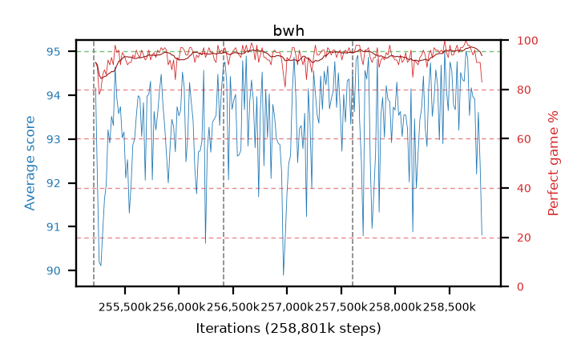

# bwh

step **258,801,664** · 219 evals · trailing **93.97** · peak **94.06** @258,686,976 · sef **99.5** · best30 **95.8** @258,736,128

## Config

| | |
|---|---|
| algo | ppo |
| collect_envs | 128 |
| discount | 0.99 |
| eval_interval | 16384 |
| eval_queue | True |
| eval_queue_depth | 16 |
| eval_workers | 8 |
| fc_layers | (320,) |
| graph_eval_episodes | 100 |
| max_steps | 258801664 |
| min_checkpoint_score | 0.0 |
| ppo_adam_epsilon | 1e-07 |
| ppo_clip | 0.2 |
| ppo_entropy_coef | 0.01 |
| ppo_entropy_coef_final | None |
| ppo_epochs | 8 |
| ppo_gae_lambda | 0.98 |
| ppo_gradient_clipping | 0.5 |
| ppo_horizon | 33.6 |
| ppo_learning_rate | 0.0003 |
| ppo_minibatch | 256 |
| ppo_normalize_adv | True |
| ppo_rollout | 128 |
| ppo_target_kl | 0.0 |
| ppo_transitions_per_rollout | 16384 |
| ppo_value_loss | huber |
| ppo_vf_coef | 0.5 |
| seed | 8 |
| torch_threads | 1 |

## Resumes

Resumed at 255,213,568, 256,409,600, 257,605,632

## Evals

| step | avg score | trailing avg | min score | max score | avg reward | perfect % | epsilon |
|---|---|---|---|---|---|---|---|
| 255229952 | 94.17 | 92.14 | 73.0 | 95.0 | 184.035 | 91.0 |  |
| 255246336 | 92.09 | 91.64 | 12.0 | 95.0 | 179.875 | 89.0 |  |
| 255262720 | 90.19 | 91.49 | 18.0 | 95.0 | 166.76 | 78.0 |  |
| ... | ... | ... | ... | ... | ... | ... | ... |
| 258621440 | 94.36 | 93.64 | 40.0 | 95.0 | 190.24 | 97.0 |  |
| 258637824 | 94.32 | 93.92 | 40.0 | 95.0 | 191.285 | 98.0 |  |
| 258654208 | 95.0 | 93.81 | 95.0 | 95.0 | 194.0 | 100.0 |  |
| 258670592 | 94.85 | 93.71 | 86.0 | 95.0 | 191.77 | 98.0 |  |
| 258686976 | 93.54 | 94.06 | 22.0 | 95.0 | 190.46 | 98.0 |  |
| 258703360 | 94.17 | 93.66 | 41.0 | 95.0 | 189.055 | 96.0 |  |
| 258719744 | 93.95 | 93.81 | 54.0 | 95.0 | 186.845 | 94.0 |  |
| 258736128 | 93.92 | 94.03 | 23.0 | 95.0 | 188.85 | 96.0 |  |
| 258752512 | 92.2 | 93.95 | 24.0 | 95.0 | 181.93 | 91.0 |  |
| 258768896 | 93.61 | 93.97 | 18.0 | 95.0 | 183.25 | 91.0 |  |
| 258785280 | 92.43 | 93.89 | 18.0 | 95.0 | 182.07 | 91.0 |  |
| 258801664 | 90.81 | 93.97 | 45.0 | 95.0 | 172.175 | 83.0 |  |
