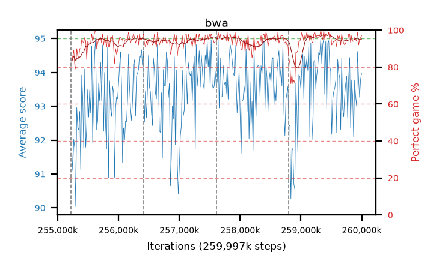

# bwa

step **259,997,696** · 292 evals · trailing **93.53** · peak **94.12** @257,867,776 · sef **97.9** · best30 **96.9** @259,489,792

## Config

| | |
|---|---|
| algo | ppo |
| collect_envs | 128 |
| discount | 0.99 |
| eval_interval | 16384 |
| eval_queue | True |
| eval_queue_depth | 16 |
| eval_workers | 10 |
| fc_layers | (320,) |
| graph_eval_episodes | 100 |
| max_steps | 259997696 |
| min_checkpoint_score | 0.0 |
| ppo_adam_epsilon | 1e-07 |
| ppo_clip | 0.2 |
| ppo_entropy_coef | 0.01 |
| ppo_entropy_coef_final | None |
| ppo_epochs | 8 |
| ppo_gae_lambda | 0.98 |
| ppo_gradient_clipping | 0.5 |
| ppo_horizon | 33.6 |
| ppo_learning_rate | 0.0003 |
| ppo_minibatch | 256 |
| ppo_normalize_adv | True |
| ppo_rollout | 128 |
| ppo_target_kl | 0.0 |
| ppo_transitions_per_rollout | 16384 |
| ppo_value_loss | huber |
| ppo_vf_coef | 0.5 |
| seed | 8 |
| torch_threads | 1 |

## Resumes

Resumed at 255,213,568, 256,409,600, 257,605,632, 258,801,664

## Evals

| step | avg score | trailing avg | min score | max score | avg reward | perfect % | epsilon |
|---|---|---|---|---|---|---|---|
| 255229952 | 91.73 | 91.41 | 3.0 | 95.0 | 173.5 | 83.0 |  |
| 255246336 | 91.1 | 91.1 | 23.0 | 95.0 | 175.72 | 86.0 |  |
| 255262720 | 92.02 | 91.62 | 8.0 | 95.0 | 179.76 | 89.0 |  |
| ... | ... | ... | ... | ... | ... | ... | ... |
| 259817472 | 92.36 | 93.85 | 7.0 | 95.0 | 184.305 | 93.0 |  |
| 259833856 | 93.78 | 93.84 | 14.0 | 95.0 | 189.66 | 97.0 |  |
| 259850240 | 93.32 | 93.81 | 42.0 | 95.0 | 186.125 | 94.0 |  |
| 259866624 | 92.1 | 93.72 | 14.0 | 95.0 | 184.86 | 94.0 |  |
| 259883008 | 93.76 | 93.54 | 7.0 | 95.0 | 188.69 | 96.0 |  |
| 259899392 | 93.3 | 93.63 | 38.0 | 95.0 | 187.145 | 95.0 |  |
| 259915776 | 93.0 | 93.67 | 11.0 | 95.0 | 185.895 | 94.0 |  |
| 259932160 | 94.62 | 93.66 | 57.0 | 95.0 | 192.58 | 99.0 |  |
| 259948544 | 93.78 | 93.49 | 50.0 | 95.0 | 184.505 | 92.0 |  |
| 259964928 | 93.26 | 93.49 | 13.0 | 95.0 | 187.195 | 95.0 |  |
| 259981312 | 93.8 | 93.45 | 32.0 | 95.0 | 188.64 | 96.0 |  |
| 259997696 | 93.98 | 93.53 | 9.0 | 95.0 | 189.905 | 97.0 |  |
