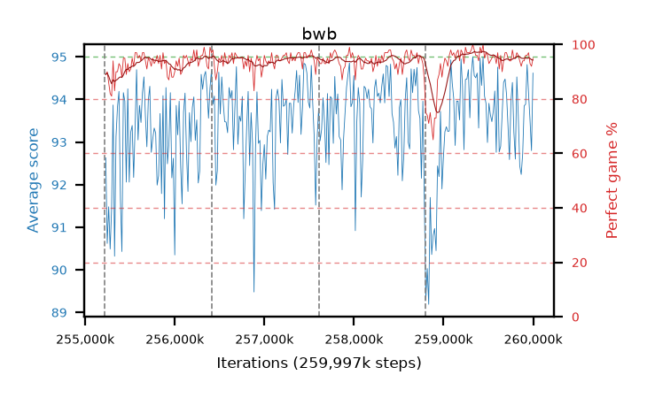

# bwb

step **259,997,696** · 292 evals · trailing **93.6** · peak **94.09** @259,473,408 · sef **97.3** · best30 **96.6** @259,538,944

## Config

| | |
|---|---|
| algo | ppo |
| collect_envs | 128 |
| discount | 0.99 |
| eval_interval | 16384 |
| eval_queue | True |
| eval_queue_depth | 16 |
| eval_workers | 10 |
| fc_layers | (320,) |
| graph_eval_episodes | 100 |
| max_steps | 259997696 |
| min_checkpoint_score | 0.0 |
| ppo_adam_epsilon | 1e-07 |
| ppo_clip | 0.2 |
| ppo_entropy_coef | 0.01 |
| ppo_entropy_coef_final | None |
| ppo_epochs | 8 |
| ppo_gae_lambda | 0.98 |
| ppo_gradient_clipping | 0.5 |
| ppo_horizon | 33.6 |
| ppo_learning_rate | 0.0003 |
| ppo_minibatch | 256 |
| ppo_normalize_adv | True |
| ppo_rollout | 128 |
| ppo_target_kl | 0.0 |
| ppo_transitions_per_rollout | 16384 |
| ppo_value_loss | huber |
| ppo_vf_coef | 0.5 |
| seed | 8 |
| torch_threads | 1 |

## Resumes

Resumed at 255,213,568, 256,409,600, 257,605,632, 258,801,664

## Evals

| step | avg score | trailing avg | min score | max score | avg reward | perfect % | epsilon |
|---|---|---|---|---|---|---|---|
| 255229952 | 92.63 | 91.31 | 30.0 | 95.0 | 180.46 | 89.0 |  |
| 255246336 | 90.62 | 90.62 | 23.0 | 95.0 | 179.265 | 90.0 |  |
| 255262720 | 91.48 | 91.05 | 34.0 | 95.0 | 176.145 | 86.0 |  |
| ... | ... | ... | ... | ... | ... | ... | ... |
| 259817472 | 94.53 | 93.95 | 64.0 | 95.0 | 190.5 | 97.0 |  |
| 259833856 | 93.62 | 93.92 | 32.0 | 95.0 | 188.46 | 96.0 |  |
| 259850240 | 92.44 | 93.76 | 10.0 | 95.0 | 185.245 | 94.0 |  |
| 259866624 | 92.24 | 93.84 | 9.0 | 95.0 | 183.055 | 92.0 |  |
| 259883008 | 92.73 | 93.69 | 10.0 | 95.0 | 185.535 | 94.0 |  |
| 259899392 | 93.85 | 93.66 | 47.0 | 95.0 | 186.655 | 94.0 |  |
| 259915776 | 93.89 | 93.64 | 14.0 | 95.0 | 188.775 | 96.0 |  |
| 259932160 | 94.82 | 93.66 | 88.0 | 95.0 | 189.705 | 96.0 |  |
| 259948544 | 94.14 | 93.68 | 17.0 | 95.0 | 190.11 | 97.0 |  |
| 259964928 | 93.51 | 93.65 | 46.0 | 95.0 | 185.365 | 93.0 |  |
| 259981312 | 92.8 | 93.54 | 7.0 | 95.0 | 183.66 | 92.0 |  |
| 259997696 | 94.62 | 93.6 | 85.0 | 95.0 | 188.465 | 95.0 |  |
