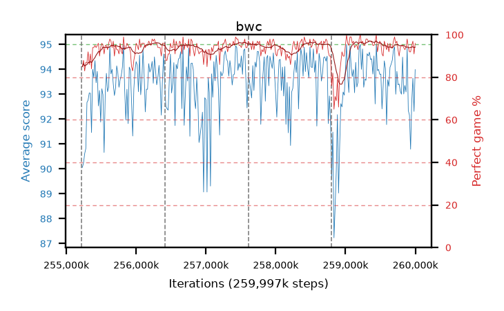

# bwc

step **259,997,696** · 292 evals · trailing **93.52** · peak **94.04** @259,686,400 · sef **97.9** · best30 **96.5** @259,489,792

## Config

| | |
|---|---|
| algo | ppo |
| collect_envs | 128 |
| discount | 0.99 |
| eval_interval | 16384 |
| eval_queue | True |
| eval_queue_depth | 16 |
| eval_workers | 10 |
| fc_layers | (320,) |
| graph_eval_episodes | 100 |
| max_steps | 259997696 |
| min_checkpoint_score | 0.0 |
| ppo_adam_epsilon | 1e-07 |
| ppo_clip | 0.2 |
| ppo_entropy_coef | 0.01 |
| ppo_entropy_coef_final | None |
| ppo_epochs | 8 |
| ppo_gae_lambda | 0.98 |
| ppo_gradient_clipping | 0.5 |
| ppo_horizon | 33.6 |
| ppo_learning_rate | 0.0003 |
| ppo_minibatch | 256 |
| ppo_normalize_adv | True |
| ppo_rollout | 128 |
| ppo_target_kl | 0.0 |
| ppo_transitions_per_rollout | 16384 |
| ppo_value_loss | huber |
| ppo_vf_coef | 0.5 |
| seed | 8 |
| torch_threads | 1 |

## Resumes

Resumed at 255,213,568, 256,409,600, 257,605,632, 258,801,664

## Evals

| step | avg score | trailing avg | min score | max score | avg reward | perfect % | epsilon |
|---|---|---|---|---|---|---|---|
| 255229952 | 90.06 | 90.06 | 22.0 | 95.0 | 173.685 | 85.0 |  |
| 255246336 | 90.24 | 90.15 | 12.0 | 95.0 | 176.805 | 88.0 |  |
| 255262720 | 90.61 | 90.3 | 16.0 | 95.0 | 172.29 | 83.0 |  |
| ... | ... | ... | ... | ... | ... | ... | ... |
| 259817472 | 94.49 | 93.89 | 76.0 | 95.0 | 188.47 | 95.0 |  |
| 259833856 | 93.01 | 93.83 | 18.0 | 95.0 | 185.86 | 94.0 |  |
| 259850240 | 93.35 | 93.58 | 9.0 | 95.0 | 185.16 | 93.0 |  |
| 259866624 | 93.09 | 93.54 | 13.0 | 95.0 | 185.895 | 94.0 |  |
| 259883008 | 94.85 | 93.44 | 86.0 | 95.0 | 191.86 | 98.0 |  |
| 259899392 | 92.34 | 93.43 | 16.0 | 95.0 | 185.145 | 94.0 |  |
| 259915776 | 92.16 | 93.75 | 12.0 | 95.0 | 182.93 | 92.0 |  |
| 259932160 | 90.79 | 93.62 | 3.0 | 95.0 | 181.74 | 92.0 |  |
| 259948544 | 92.69 | 93.43 | 11.0 | 95.0 | 186.58 | 95.0 |  |
| 259964928 | 93.64 | 93.39 | 5.0 | 95.0 | 189.565 | 97.0 |  |
| 259981312 | 92.31 | 93.39 | 7.0 | 95.0 | 182.175 | 91.0 |  |
| 259997696 | 93.99 | 93.52 | 13.0 | 95.0 | 188.92 | 96.0 |  |
