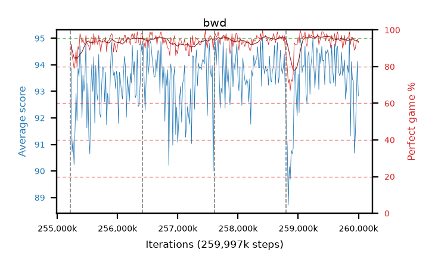

# bwd

step **259,997,696** · 292 evals · trailing **93.51** · peak **94.04** @258,998,272 · sef **97.6** · best30 **96.4** @259,506,176

## Config

| | |
|---|---|
| algo | ppo |
| collect_envs | 128 |
| discount | 0.99 |
| eval_interval | 16384 |
| eval_queue | True |
| eval_queue_depth | 16 |
| eval_workers | 10 |
| fc_layers | (320,) |
| graph_eval_episodes | 100 |
| max_steps | 259997696 |
| min_checkpoint_score | 0.0 |
| ppo_adam_epsilon | 1e-07 |
| ppo_clip | 0.2 |
| ppo_entropy_coef | 0.01 |
| ppo_entropy_coef_final | None |
| ppo_epochs | 8 |
| ppo_gae_lambda | 0.98 |
| ppo_gradient_clipping | 0.5 |
| ppo_horizon | 33.6 |
| ppo_learning_rate | 0.0003 |
| ppo_minibatch | 256 |
| ppo_normalize_adv | True |
| ppo_rollout | 128 |
| ppo_target_kl | 0.0 |
| ppo_transitions_per_rollout | 16384 |
| ppo_value_loss | huber |
| ppo_vf_coef | 0.5 |
| seed | 8 |
| torch_threads | 1 |

## Resumes

Resumed at 255,213,568, 256,409,600, 257,605,632, 258,801,664

## Evals

| step | avg score | trailing avg | min score | max score | avg reward | perfect % | epsilon |
|---|---|---|---|---|---|---|---|
| 255229952 | 93.87 | 92.74 | 72.0 | 95.0 | 184.685 | 92.0 |  |
| 255246336 | 90.71 | 92.06 | 15.0 | 95.0 | 175.33 | 86.0 |  |
| 255262720 | 91.19 | 91.84 | 24.0 | 95.0 | 172.78 | 83.0 |  |
| ... | ... | ... | ... | ... | ... | ... | ... |
| 259817472 | 93.99 | 93.96 | 14.0 | 95.0 | 188.92 | 96.0 |  |
| 259833856 | 93.71 | 93.93 | 14.0 | 95.0 | 188.64 | 96.0 |  |
| 259850240 | 94.97 | 94.01 | 92.0 | 95.0 | 192.93 | 99.0 |  |
| 259866624 | 91.32 | 93.9 | 7.0 | 95.0 | 182.18 | 92.0 |  |
| 259883008 | 94.12 | 93.91 | 27.0 | 95.0 | 189.005 | 96.0 |  |
| 259899392 | 93.45 | 93.77 | 9.0 | 95.0 | 188.335 | 96.0 |  |
| 259915776 | 93.39 | 93.64 | 11.0 | 95.0 | 185.29 | 93.0 |  |
| 259932160 | 90.67 | 93.67 | 7.0 | 95.0 | 178.365 | 89.0 |  |
| 259948544 | 91.38 | 93.79 | 7.0 | 95.0 | 180.115 | 90.0 |  |
| 259964928 | 92.76 | 93.58 | 5.0 | 95.0 | 185.655 | 94.0 |  |
| 259981312 | 94.13 | 93.57 | 50.0 | 95.0 | 187.975 | 95.0 |  |
| 259997696 | 92.83 | 93.51 | 10.0 | 95.0 | 184.82 | 93.0 |  |
