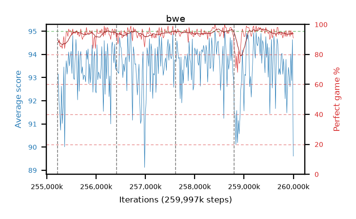

# bwe

step **259,997,696** · 292 evals · trailing **93.25** · peak **94.09** @259,604,480 · sef **98.3** · best30 **96.3** @259,506,176

## Config

| | |
|---|---|
| algo | ppo |
| collect_envs | 128 |
| discount | 0.99 |
| eval_interval | 16384 |
| eval_queue | True |
| eval_queue_depth | 16 |
| eval_workers | 10 |
| fc_layers | (320,) |
| graph_eval_episodes | 100 |
| max_steps | 259997696 |
| min_checkpoint_score | 0.0 |
| ppo_adam_epsilon | 1e-07 |
| ppo_clip | 0.2 |
| ppo_entropy_coef | 0.01 |
| ppo_entropy_coef_final | None |
| ppo_epochs | 8 |
| ppo_gae_lambda | 0.98 |
| ppo_gradient_clipping | 0.5 |
| ppo_horizon | 33.6 |
| ppo_learning_rate | 0.0003 |
| ppo_minibatch | 256 |
| ppo_normalize_adv | True |
| ppo_rollout | 128 |
| ppo_target_kl | 0.0 |
| ppo_transitions_per_rollout | 16384 |
| ppo_value_loss | huber |
| ppo_vf_coef | 0.5 |
| seed | 8 |
| torch_threads | 1 |

## Resumes

Resumed at 255,213,568, 256,409,600, 257,605,632, 258,801,664

## Evals

| step | avg score | trailing avg | min score | max score | avg reward | perfect % | epsilon |
|---|---|---|---|---|---|---|---|
| 255229952 | 93.15 | 92.41 | 60.0 | 95.0 | 179.985 | 88.0 |  |
| 255246336 | 92.0 | 91.99 | 22.0 | 95.0 | 180.735 | 90.0 |  |
| 255262720 | 91.44 | 92.03 | 24.0 | 95.0 | 176.285 | 86.0 |  |
| ... | ... | ... | ... | ... | ... | ... | ... |
| 259817472 | 93.15 | 93.88 | 26.0 | 95.0 | 187.04 | 95.0 |  |
| 259833856 | 92.09 | 93.8 | 7.0 | 95.0 | 182.95 | 92.0 |  |
| 259850240 | 93.79 | 93.75 | 52.0 | 95.0 | 188.63 | 96.0 |  |
| 259866624 | 91.48 | 93.63 | 1.0 | 95.0 | 182.295 | 92.0 |  |
| 259883008 | 92.58 | 93.55 | 13.0 | 95.0 | 184.48 | 93.0 |  |
| 259899392 | 93.44 | 93.47 | 29.0 | 95.0 | 187.33 | 95.0 |  |
| 259915776 | 93.08 | 93.48 | 11.0 | 95.0 | 187.965 | 96.0 |  |
| 259932160 | 92.61 | 93.52 | 29.0 | 95.0 | 183.335 | 92.0 |  |
| 259948544 | 94.02 | 93.5 | 11.0 | 95.0 | 188.95 | 96.0 |  |
| 259964928 | 92.87 | 93.42 | 9.0 | 95.0 | 184.68 | 93.0 |  |
| 259981312 | 94.64 | 93.4 | 81.0 | 95.0 | 188.575 | 95.0 |  |
| 259997696 | 89.61 | 93.25 | 2.0 | 95.0 | 179.475 | 91.0 |  |
