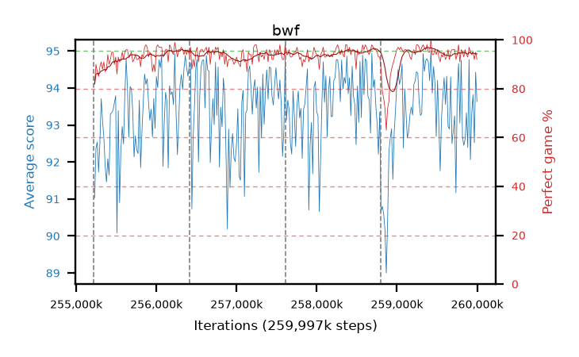

# bwf

step **259,997,696** · 292 evals · trailing **93.4** · peak **94.06** @258,621,440 · sef **97.9** · best30 **95.9** @259,473,408

## Config

| | |
|---|---|
| algo | ppo |
| collect_envs | 128 |
| discount | 0.99 |
| eval_interval | 16384 |
| eval_queue | True |
| eval_queue_depth | 16 |
| eval_workers | 10 |
| fc_layers | (320,) |
| graph_eval_episodes | 100 |
| max_steps | 259997696 |
| min_checkpoint_score | 0.0 |
| ppo_adam_epsilon | 1e-07 |
| ppo_clip | 0.2 |
| ppo_entropy_coef | 0.01 |
| ppo_entropy_coef_final | None |
| ppo_epochs | 8 |
| ppo_gae_lambda | 0.98 |
| ppo_gradient_clipping | 0.5 |
| ppo_horizon | 33.6 |
| ppo_learning_rate | 0.0003 |
| ppo_minibatch | 256 |
| ppo_normalize_adv | True |
| ppo_rollout | 128 |
| ppo_target_kl | 0.0 |
| ppo_transitions_per_rollout | 16384 |
| ppo_value_loss | huber |
| ppo_vf_coef | 0.5 |
| seed | 8 |
| torch_threads | 1 |

## Resumes

Resumed at 255,213,568, 256,409,600, 257,605,632, 258,801,664

## Evals

| step | avg score | trailing avg | min score | max score | avg reward | perfect % | epsilon |
|---|---|---|---|---|---|---|---|
| 255229952 | 91.03 | 92.12 | 27.0 | 95.0 | 171.67 | 82.0 |  |
| 255246336 | 92.37 | 92.45 | 24.0 | 95.0 | 181.24 | 90.0 |  |
| 255262720 | 92.54 | 92.48 | 56.0 | 95.0 | 178.38 | 87.0 |  |
| ... | ... | ... | ... | ... | ... | ... | ... |
| 259817472 | 92.67 | 93.83 | 22.0 | 95.0 | 186.515 | 95.0 |  |
| 259833856 | 92.45 | 93.73 | 6.0 | 95.0 | 184.26 | 93.0 |  |
| 259850240 | 92.62 | 93.77 | 7.0 | 95.0 | 187.55 | 96.0 |  |
| 259866624 | 93.33 | 93.73 | 15.0 | 95.0 | 186.18 | 94.0 |  |
| 259883008 | 92.39 | 93.45 | 3.0 | 95.0 | 184.245 | 93.0 |  |
| 259899392 | 94.77 | 93.39 | 83.0 | 95.0 | 190.74 | 97.0 |  |
| 259915776 | 92.06 | 93.28 | 3.0 | 95.0 | 185.95 | 95.0 |  |
| 259932160 | 93.31 | 93.53 | 11.0 | 95.0 | 186.295 | 94.0 |  |
| 259948544 | 93.82 | 93.42 | 22.0 | 95.0 | 187.665 | 95.0 |  |
| 259964928 | 92.52 | 93.27 | 14.0 | 95.0 | 183.38 | 92.0 |  |
| 259981312 | 94.43 | 93.27 | 72.0 | 95.0 | 188.365 | 95.0 |  |
| 259997696 | 93.63 | 93.4 | 42.0 | 95.0 | 184.49 | 92.0 |  |
