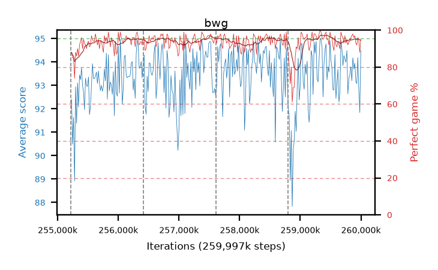

# bwg

step **259,997,696** · 292 evals · trailing **93.69** · peak **93.97** @257,982,464 · sef **98.3** · best30 **96.2** @259,489,792

## Config

| | |
|---|---|
| algo | ppo |
| collect_envs | 128 |
| discount | 0.99 |
| eval_interval | 16384 |
| eval_queue | True |
| eval_queue_depth | 16 |
| eval_workers | 10 |
| fc_layers | (320,) |
| graph_eval_episodes | 100 |
| max_steps | 259997696 |
| min_checkpoint_score | 0.0 |
| ppo_adam_epsilon | 1e-07 |
| ppo_clip | 0.2 |
| ppo_entropy_coef | 0.01 |
| ppo_entropy_coef_final | None |
| ppo_epochs | 8 |
| ppo_gae_lambda | 0.98 |
| ppo_gradient_clipping | 0.5 |
| ppo_horizon | 33.6 |
| ppo_learning_rate | 0.0003 |
| ppo_minibatch | 256 |
| ppo_normalize_adv | True |
| ppo_rollout | 128 |
| ppo_target_kl | 0.0 |
| ppo_transitions_per_rollout | 16384 |
| ppo_value_loss | huber |
| ppo_vf_coef | 0.5 |
| seed | 8 |
| torch_threads | 1 |

## Resumes

Resumed at 255,213,568, 256,409,600, 257,605,632, 258,801,664

## Evals

| step | avg score | trailing avg | min score | max score | avg reward | perfect % | epsilon |
|---|---|---|---|---|---|---|---|
| 255229952 | 92.4 | 91.51 | 3.0 | 95.0 | 179.28 | 88.0 |  |
| 255246336 | 90.49 | 90.49 | 36.0 | 95.0 | 174.07 | 85.0 |  |
| 255262720 | 91.64 | 91.06 | 28.0 | 95.0 | 175.31 | 85.0 |  |
| ... | ... | ... | ... | ... | ... | ... | ... |
| 259817472 | 93.47 | 93.88 | 9.0 | 95.0 | 186.41 | 94.0 |  |
| 259833856 | 93.8 | 93.87 | 12.0 | 95.0 | 188.73 | 96.0 |  |
| 259850240 | 93.2 | 93.88 | 5.0 | 95.0 | 189.17 | 97.0 |  |
| 259866624 | 94.18 | 93.77 | 18.0 | 95.0 | 191.145 | 98.0 |  |
| 259883008 | 93.7 | 93.7 | 11.0 | 95.0 | 188.63 | 96.0 |  |
| 259899392 | 93.95 | 93.75 | 16.0 | 95.0 | 189.92 | 97.0 |  |
| 259915776 | 93.16 | 93.77 | 50.0 | 95.0 | 185.015 | 93.0 |  |
| 259932160 | 93.08 | 93.65 | 44.0 | 95.0 | 183.805 | 92.0 |  |
| 259948544 | 94.19 | 93.68 | 45.0 | 95.0 | 189.12 | 96.0 |  |
| 259964928 | 92.8 | 93.61 | 7.0 | 95.0 | 185.695 | 94.0 |  |
| 259981312 | 91.84 | 93.53 | 3.0 | 95.0 | 178.63 | 88.0 |  |
| 259997696 | 94.49 | 93.69 | 76.0 | 95.0 | 188.38 | 95.0 |  |
