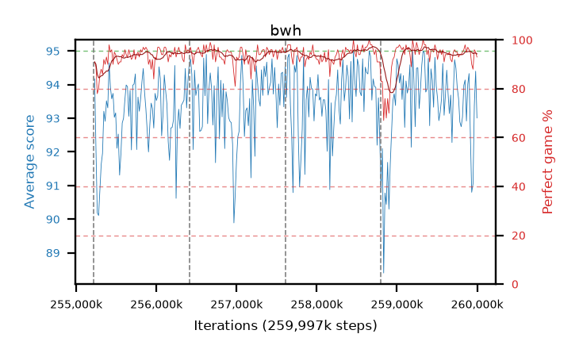

# bwh

step **259,997,696** · 292 evals · trailing **93.71** · peak **94.06** @258,686,976 · sef **97.9** · best30 **96.2** @259,473,408

## Config

| | |
|---|---|
| algo | ppo |
| collect_envs | 128 |
| discount | 0.99 |
| eval_interval | 16384 |
| eval_queue | True |
| eval_queue_depth | 16 |
| eval_workers | 10 |
| fc_layers | (320,) |
| graph_eval_episodes | 100 |
| max_steps | 259997696 |
| min_checkpoint_score | 0.0 |
| ppo_adam_epsilon | 1e-07 |
| ppo_clip | 0.2 |
| ppo_entropy_coef | 0.01 |
| ppo_entropy_coef_final | None |
| ppo_epochs | 8 |
| ppo_gae_lambda | 0.98 |
| ppo_gradient_clipping | 0.5 |
| ppo_horizon | 33.6 |
| ppo_learning_rate | 0.0003 |
| ppo_minibatch | 256 |
| ppo_normalize_adv | True |
| ppo_rollout | 128 |
| ppo_target_kl | 0.0 |
| ppo_transitions_per_rollout | 16384 |
| ppo_value_loss | huber |
| ppo_vf_coef | 0.5 |
| seed | 8 |
| torch_threads | 1 |

## Resumes

Resumed at 255,213,568, 256,409,600, 257,605,632, 258,801,664

## Evals

| step | avg score | trailing avg | min score | max score | avg reward | perfect % | epsilon |
|---|---|---|---|---|---|---|---|
| 255229952 | 94.17 | 92.14 | 73.0 | 95.0 | 184.035 | 91.0 |  |
| 255246336 | 92.09 | 91.64 | 12.0 | 95.0 | 179.875 | 89.0 |  |
| 255262720 | 90.19 | 91.49 | 18.0 | 95.0 | 166.76 | 78.0 |  |
| ... | ... | ... | ... | ... | ... | ... | ... |
| 259817472 | 93.04 | 93.78 | 5.0 | 95.0 | 186.93 | 95.0 |  |
| 259833856 | 93.98 | 93.75 | 42.0 | 95.0 | 188.91 | 96.0 |  |
| 259850240 | 94.14 | 93.71 | 19.0 | 95.0 | 191.15 | 98.0 |  |
| 259866624 | 92.92 | 93.64 | 7.0 | 95.0 | 186.855 | 95.0 |  |
| 259883008 | 94.01 | 93.7 | 34.0 | 95.0 | 189.89 | 97.0 |  |
| 259899392 | 94.33 | 93.67 | 44.0 | 95.0 | 189.215 | 96.0 |  |
| 259915776 | 92.47 | 93.59 | 13.0 | 95.0 | 186.315 | 95.0 |  |
| 259932160 | 90.8 | 93.49 | 5.0 | 95.0 | 179.445 | 90.0 |  |
| 259948544 | 91.05 | 93.4 | 11.0 | 95.0 | 177.705 | 88.0 |  |
| 259964928 | 93.38 | 93.68 | 15.0 | 95.0 | 188.265 | 96.0 |  |
| 259981312 | 94.4 | 93.73 | 52.0 | 95.0 | 188.245 | 95.0 |  |
| 259997696 | 93.01 | 93.71 | 21.0 | 95.0 | 184.865 | 93.0 |  |
