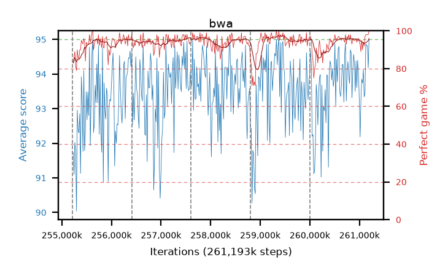

# bwa

step **261,193,728** · 365 evals · trailing **94.02** · peak **94.12** @257,867,776 · sef **98.1** · best30 **96.9** @259,489,792

## Config

| | |
|---|---|
| algo | ppo |
| collect_envs | 128 |
| discount | 0.99 |
| eval_interval | 16384 |
| eval_queue | True |
| eval_queue_depth | 16 |
| eval_workers | 12 |
| fc_layers | (320,) |
| graph_eval_episodes | 100 |
| max_steps | 261193728 |
| min_checkpoint_score | 0.0 |
| ppo_adam_epsilon | 1e-07 |
| ppo_clip | 0.2 |
| ppo_entropy_coef | 0.01 |
| ppo_entropy_coef_final | None |
| ppo_epochs | 8 |
| ppo_gae_lambda | 0.98 |
| ppo_gradient_clipping | 0.5 |
| ppo_horizon | 33.6 |
| ppo_learning_rate | 0.0003 |
| ppo_minibatch | 256 |
| ppo_normalize_adv | True |
| ppo_rollout | 128 |
| ppo_target_kl | 0.0 |
| ppo_transitions_per_rollout | 16384 |
| ppo_value_loss | huber |
| ppo_vf_coef | 0.5 |
| seed | 8 |
| torch_threads | 1 |

## Resumes

Resumed at 255,213,568, 256,409,600, 257,605,632, 258,801,664, 259,997,696

## Evals

| step | avg score | trailing avg | min score | max score | avg reward | perfect % | epsilon |
|---|---|---|---|---|---|---|---|
| 255229952 | 91.73 | 91.41 | 3.0 | 95.0 | 173.5 | 83.0 |  |
| 255246336 | 91.1 | 91.1 | 23.0 | 95.0 | 175.72 | 86.0 |  |
| 255262720 | 92.02 | 91.62 | 8.0 | 95.0 | 179.76 | 89.0 |  |
| ... | ... | ... | ... | ... | ... | ... | ... |
| 261013504 | 92.18 | 93.9 | 8.0 | 95.0 | 184.035 | 93.0 |  |
| 261029888 | 93.23 | 94.02 | 39.0 | 95.0 | 180.97 | 89.0 |  |
| 261046272 | 93.85 | 94.05 | 16.0 | 95.0 | 187.74 | 95.0 |  |
| 261062656 | 93.74 | 93.99 | 57.0 | 95.0 | 182.34 | 90.0 |  |
| 261079040 | 94.13 | 94.04 | 41.0 | 95.0 | 186.935 | 94.0 |  |
| 261095424 | 93.34 | 93.94 | 12.0 | 95.0 | 184.02 | 92.0 |  |
| 261111808 | 93.44 | 93.94 | 26.0 | 95.0 | 189.32 | 97.0 |  |
| 261128192 | 94.88 | 93.94 | 86.0 | 95.0 | 191.845 | 98.0 |  |
| 261144576 | 94.81 | 93.95 | 81.0 | 95.0 | 191.775 | 98.0 |  |
| 261160960 | 94.81 | 93.97 | 81.0 | 95.0 | 191.82 | 98.0 |  |
| 261177344 | 94.18 | 94.01 | 20.0 | 95.0 | 191.145 | 98.0 |  |
| 261193728 | 95.0 | 94.02 | 95.0 | 95.0 | 194.0 | 100.0 |  |
