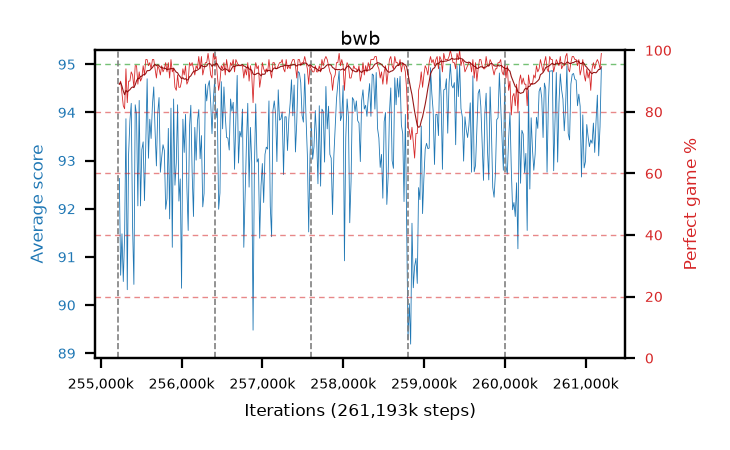

# bwb

step **261,193,728** · 365 evals · trailing **94.02** · peak **94.24** @260,882,432 · sef **97.5** · best30 **96.6** @259,538,944

## Config

| | |
|---|---|
| algo | ppo |
| collect_envs | 128 |
| discount | 0.99 |
| eval_interval | 16384 |
| eval_queue | True |
| eval_queue_depth | 16 |
| eval_workers | 12 |
| fc_layers | (320,) |
| graph_eval_episodes | 100 |
| max_steps | 261193728 |
| min_checkpoint_score | 0.0 |
| ppo_adam_epsilon | 1e-07 |
| ppo_clip | 0.2 |
| ppo_entropy_coef | 0.01 |
| ppo_entropy_coef_final | None |
| ppo_epochs | 8 |
| ppo_gae_lambda | 0.98 |
| ppo_gradient_clipping | 0.5 |
| ppo_horizon | 33.6 |
| ppo_learning_rate | 0.0003 |
| ppo_minibatch | 256 |
| ppo_normalize_adv | True |
| ppo_rollout | 128 |
| ppo_target_kl | 0.0 |
| ppo_transitions_per_rollout | 16384 |
| ppo_value_loss | huber |
| ppo_vf_coef | 0.5 |
| seed | 8 |
| torch_threads | 1 |

## Resumes

Resumed at 255,213,568, 256,409,600, 257,605,632, 258,801,664, 259,997,696

## Evals

| step | avg score | trailing avg | min score | max score | avg reward | perfect % | epsilon |
|---|---|---|---|---|---|---|---|
| 255229952 | 92.63 | 91.31 | 30.0 | 95.0 | 180.46 | 89.0 |  |
| 255246336 | 90.62 | 90.62 | 23.0 | 95.0 | 179.265 | 90.0 |  |
| 255262720 | 91.48 | 91.05 | 34.0 | 95.0 | 176.145 | 86.0 |  |
| ... | ... | ... | ... | ... | ... | ... | ... |
| 261013504 | 93.75 | 94.08 | 24.0 | 95.0 | 186.645 | 94.0 |  |
| 261029888 | 93.5 | 94.09 | 15.0 | 95.0 | 183.23 | 91.0 |  |
| 261046272 | 93.29 | 94.02 | 14.0 | 95.0 | 185.055 | 93.0 |  |
| 261062656 | 93.43 | 94.01 | 15.0 | 95.0 | 178.955 | 87.0 |  |
| 261079040 | 93.36 | 93.98 | 11.0 | 95.0 | 186.12 | 94.0 |  |
| 261095424 | 93.78 | 93.97 | 6.0 | 95.0 | 188.71 | 96.0 |  |
| 261111808 | 93.17 | 93.91 | 22.0 | 95.0 | 185.975 | 94.0 |  |
| 261128192 | 93.82 | 93.89 | 12.0 | 95.0 | 188.705 | 96.0 |  |
| 261144576 | 94.36 | 94.01 | 63.0 | 95.0 | 190.24 | 97.0 |  |
| 261160960 | 93.1 | 93.95 | 6.0 | 95.0 | 188.03 | 96.0 |  |
| 261177344 | 93.7 | 93.97 | 20.0 | 95.0 | 186.55 | 94.0 |  |
| 261193728 | 94.92 | 94.02 | 87.0 | 95.0 | 192.88 | 99.0 |  |
