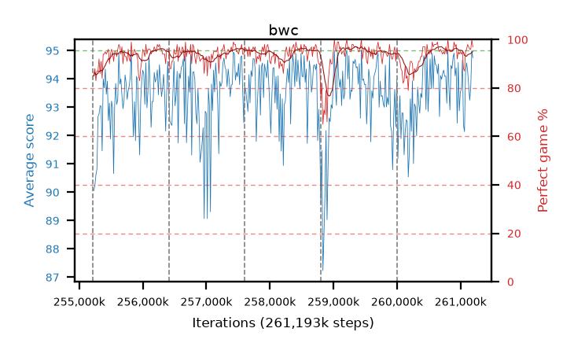

# bwc

step **261,193,728** · 365 evals · trailing **93.97** · peak **94.14** @260,898,816 · sef **98.1** · best30 **96.5** @259,489,792

## Config

| | |
|---|---|
| algo | ppo |
| collect_envs | 128 |
| discount | 0.99 |
| eval_interval | 16384 |
| eval_queue | True |
| eval_queue_depth | 16 |
| eval_workers | 12 |
| fc_layers | (320,) |
| graph_eval_episodes | 100 |
| max_steps | 261193728 |
| min_checkpoint_score | 0.0 |
| ppo_adam_epsilon | 1e-07 |
| ppo_clip | 0.2 |
| ppo_entropy_coef | 0.01 |
| ppo_entropy_coef_final | None |
| ppo_epochs | 8 |
| ppo_gae_lambda | 0.98 |
| ppo_gradient_clipping | 0.5 |
| ppo_horizon | 33.6 |
| ppo_learning_rate | 0.0003 |
| ppo_minibatch | 256 |
| ppo_normalize_adv | True |
| ppo_rollout | 128 |
| ppo_target_kl | 0.0 |
| ppo_transitions_per_rollout | 16384 |
| ppo_value_loss | huber |
| ppo_vf_coef | 0.5 |
| seed | 8 |
| torch_threads | 1 |

## Resumes

Resumed at 255,213,568, 256,409,600, 257,605,632, 258,801,664, 259,997,696

## Evals

| step | avg score | trailing avg | min score | max score | avg reward | perfect % | epsilon |
|---|---|---|---|---|---|---|---|
| 255229952 | 90.06 | 90.06 | 22.0 | 95.0 | 173.685 | 85.0 |  |
| 255246336 | 90.24 | 90.15 | 12.0 | 95.0 | 176.805 | 88.0 |  |
| 255262720 | 90.61 | 90.3 | 16.0 | 95.0 | 172.29 | 83.0 |  |
| ... | ... | ... | ... | ... | ... | ... | ... |
| 261013504 | 93.64 | 94.08 | 34.0 | 95.0 | 186.49 | 94.0 |  |
| 261029888 | 94.67 | 94.13 | 81.0 | 95.0 | 188.515 | 95.0 |  |
| 261046272 | 92.38 | 94.01 | 27.0 | 95.0 | 178.9 | 88.0 |  |
| 261062656 | 92.14 | 94.09 | 24.0 | 95.0 | 177.62 | 87.0 |  |
| 261079040 | 94.25 | 93.97 | 71.0 | 95.0 | 188.095 | 95.0 |  |
| 261095424 | 94.57 | 93.92 | 75.0 | 95.0 | 189.455 | 96.0 |  |
| 261111808 | 94.29 | 93.98 | 30.0 | 95.0 | 191.21 | 98.0 |  |
| 261128192 | 93.78 | 93.97 | 19.0 | 95.0 | 189.66 | 97.0 |  |
| 261144576 | 93.25 | 93.94 | 9.0 | 95.0 | 188.09 | 96.0 |  |
| 261160960 | 93.71 | 94.01 | 18.0 | 95.0 | 188.595 | 96.0 |  |
| 261177344 | 95.0 | 93.98 | 95.0 | 95.0 | 194.0 | 100.0 |  |
| 261193728 | 94.75 | 93.97 | 83.0 | 95.0 | 190.72 | 97.0 |  |
