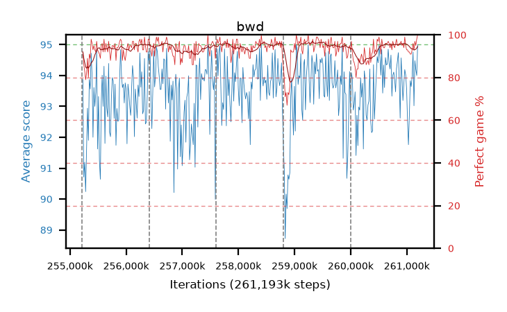

# bwd

step **261,193,728** · 365 evals · trailing **93.9** · peak **94.15** @260,210,688 · sef **98.1** · best30 **96.4** @259,506,176

## Config

| | |
|---|---|
| algo | ppo |
| collect_envs | 128 |
| discount | 0.99 |
| eval_interval | 16384 |
| eval_queue | True |
| eval_queue_depth | 16 |
| eval_workers | 12 |
| fc_layers | (320,) |
| graph_eval_episodes | 100 |
| max_steps | 261193728 |
| min_checkpoint_score | 0.0 |
| ppo_adam_epsilon | 1e-07 |
| ppo_clip | 0.2 |
| ppo_entropy_coef | 0.01 |
| ppo_entropy_coef_final | None |
| ppo_epochs | 8 |
| ppo_gae_lambda | 0.98 |
| ppo_gradient_clipping | 0.5 |
| ppo_horizon | 33.6 |
| ppo_learning_rate | 0.0003 |
| ppo_minibatch | 256 |
| ppo_normalize_adv | True |
| ppo_rollout | 128 |
| ppo_target_kl | 0.0 |
| ppo_transitions_per_rollout | 16384 |
| ppo_value_loss | huber |
| ppo_vf_coef | 0.5 |
| seed | 8 |
| torch_threads | 1 |

## Resumes

Resumed at 255,213,568, 256,409,600, 257,605,632, 258,801,664, 259,997,696

## Evals

| step | avg score | trailing avg | min score | max score | avg reward | perfect % | epsilon |
|---|---|---|---|---|---|---|---|
| 255229952 | 93.87 | 92.74 | 72.0 | 95.0 | 184.685 | 92.0 |  |
| 255246336 | 90.71 | 92.06 | 15.0 | 95.0 | 175.33 | 86.0 |  |
| 255262720 | 91.19 | 91.84 | 24.0 | 95.0 | 172.78 | 83.0 |  |
| ... | ... | ... | ... | ... | ... | ... | ... |
| 261013504 | 92.54 | 94.02 | 12.0 | 95.0 | 184.305 | 93.0 |  |
| 261029888 | 91.76 | 93.84 | 9.0 | 95.0 | 182.575 | 92.0 |  |
| 261046272 | 92.71 | 93.95 | 7.0 | 95.0 | 183.435 | 92.0 |  |
| 261062656 | 93.83 | 93.95 | 30.0 | 95.0 | 183.47 | 91.0 |  |
| 261079040 | 93.64 | 93.87 | 63.0 | 95.0 | 183.325 | 91.0 |  |
| 261095424 | 93.97 | 93.86 | 49.0 | 95.0 | 185.69 | 93.0 |  |
| 261111808 | 94.76 | 93.87 | 81.0 | 95.0 | 189.6 | 96.0 |  |
| 261128192 | 93.02 | 93.82 | 20.0 | 95.0 | 184.785 | 93.0 |  |
| 261144576 | 94.48 | 93.88 | 53.0 | 95.0 | 190.36 | 97.0 |  |
| 261160960 | 94.2 | 93.89 | 39.0 | 95.0 | 188.045 | 95.0 |  |
| 261177344 | 94.0 | 93.87 | 6.0 | 95.0 | 191.01 | 98.0 |  |
| 261193728 | 95.0 | 93.9 | 95.0 | 95.0 | 194.0 | 100.0 |  |
