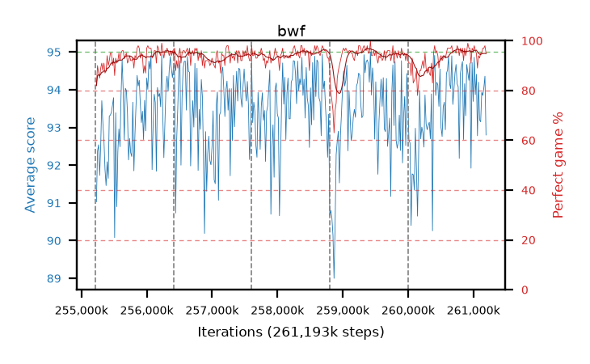

# bwf

step **261,193,728** · 365 evals · trailing **94.02** · peak **94.06** @258,621,440 · sef **98.1** · best30 **96.0** @261,046,272

## Config

| | |
|---|---|
| algo | ppo |
| collect_envs | 128 |
| discount | 0.99 |
| eval_interval | 16384 |
| eval_queue | True |
| eval_queue_depth | 16 |
| eval_workers | 12 |
| fc_layers | (320,) |
| graph_eval_episodes | 100 |
| max_steps | 261193728 |
| min_checkpoint_score | 0.0 |
| ppo_adam_epsilon | 1e-07 |
| ppo_clip | 0.2 |
| ppo_entropy_coef | 0.01 |
| ppo_entropy_coef_final | None |
| ppo_epochs | 8 |
| ppo_gae_lambda | 0.98 |
| ppo_gradient_clipping | 0.5 |
| ppo_horizon | 33.6 |
| ppo_learning_rate | 0.0003 |
| ppo_minibatch | 256 |
| ppo_normalize_adv | True |
| ppo_rollout | 128 |
| ppo_target_kl | 0.0 |
| ppo_transitions_per_rollout | 16384 |
| ppo_value_loss | huber |
| ppo_vf_coef | 0.5 |
| seed | 8 |
| torch_threads | 1 |

## Resumes

Resumed at 255,213,568, 256,409,600, 257,605,632, 258,801,664, 259,997,696

## Evals

| step | avg score | trailing avg | min score | max score | avg reward | perfect % | epsilon |
|---|---|---|---|---|---|---|---|
| 255229952 | 91.03 | 92.12 | 27.0 | 95.0 | 171.67 | 82.0 |  |
| 255246336 | 92.37 | 92.45 | 24.0 | 95.0 | 181.24 | 90.0 |  |
| 255262720 | 92.54 | 92.48 | 56.0 | 95.0 | 178.38 | 87.0 |  |
| ... | ... | ... | ... | ... | ... | ... | ... |
| 261013504 | 94.86 | 93.92 | 87.0 | 95.0 | 191.78 | 98.0 |  |
| 261029888 | 93.87 | 93.97 | 36.0 | 95.0 | 188.71 | 96.0 |  |
| 261046272 | 94.41 | 94.0 | 69.0 | 95.0 | 188.255 | 95.0 |  |
| 261062656 | 92.78 | 94.0 | 12.0 | 95.0 | 180.385 | 89.0 |  |
| 261079040 | 94.2 | 94.02 | 73.0 | 95.0 | 187.005 | 94.0 |  |
| 261095424 | 93.2 | 94.02 | 41.0 | 95.0 | 184.92 | 93.0 |  |
| 261111808 | 93.15 | 94.03 | 38.0 | 95.0 | 186.95 | 95.0 |  |
| 261128192 | 93.93 | 93.91 | 41.0 | 95.0 | 187.775 | 95.0 |  |
| 261144576 | 93.85 | 93.88 | 19.0 | 95.0 | 189.775 | 97.0 |  |
| 261160960 | 94.06 | 93.9 | 20.0 | 95.0 | 189.985 | 97.0 |  |
| 261177344 | 94.36 | 93.91 | 44.0 | 95.0 | 191.28 | 98.0 |  |
| 261193728 | 92.8 | 94.02 | 15.0 | 95.0 | 186.6 | 95.0 |  |
