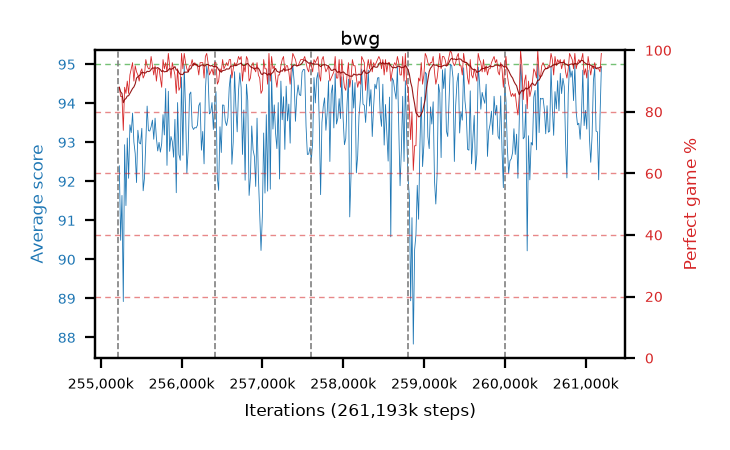

# bwg

step **261,193,728** · 365 evals · trailing **93.94** · peak **94.01** @260,177,920 · sef **98.4** · best30 **96.2** @259,489,792

## Config

| | |
|---|---|
| algo | ppo |
| collect_envs | 128 |
| discount | 0.99 |
| eval_interval | 16384 |
| eval_queue | True |
| eval_queue_depth | 16 |
| eval_workers | 12 |
| fc_layers | (320,) |
| graph_eval_episodes | 100 |
| max_steps | 261193728 |
| min_checkpoint_score | 0.0 |
| ppo_adam_epsilon | 1e-07 |
| ppo_clip | 0.2 |
| ppo_entropy_coef | 0.01 |
| ppo_entropy_coef_final | None |
| ppo_epochs | 8 |
| ppo_gae_lambda | 0.98 |
| ppo_gradient_clipping | 0.5 |
| ppo_horizon | 33.6 |
| ppo_learning_rate | 0.0003 |
| ppo_minibatch | 256 |
| ppo_normalize_adv | True |
| ppo_rollout | 128 |
| ppo_target_kl | 0.0 |
| ppo_transitions_per_rollout | 16384 |
| ppo_value_loss | huber |
| ppo_vf_coef | 0.5 |
| seed | 8 |
| torch_threads | 1 |

## Resumes

Resumed at 255,213,568, 256,409,600, 257,605,632, 258,801,664, 259,997,696

## Evals

| step | avg score | trailing avg | min score | max score | avg reward | perfect % | epsilon |
|---|---|---|---|---|---|---|---|
| 255229952 | 92.4 | 91.51 | 3.0 | 95.0 | 179.28 | 88.0 |  |
| 255246336 | 90.49 | 90.49 | 36.0 | 95.0 | 174.07 | 85.0 |  |
| 255262720 | 91.64 | 91.06 | 28.0 | 95.0 | 175.31 | 85.0 |  |
| ... | ... | ... | ... | ... | ... | ... | ... |
| 261013504 | 93.34 | 93.95 | 33.0 | 95.0 | 183.025 | 91.0 |  |
| 261029888 | 94.85 | 93.98 | 83.0 | 95.0 | 191.77 | 98.0 |  |
| 261046272 | 93.12 | 93.89 | 26.0 | 95.0 | 187.01 | 95.0 |  |
| 261062656 | 92.49 | 93.95 | 5.0 | 95.0 | 183.305 | 92.0 |  |
| 261079040 | 93.17 | 93.88 | 6.0 | 95.0 | 187.06 | 95.0 |  |
| 261095424 | 94.57 | 93.88 | 78.0 | 95.0 | 187.33 | 94.0 |  |
| 261111808 | 94.91 | 93.92 | 92.0 | 95.0 | 189.75 | 96.0 |  |
| 261128192 | 93.29 | 93.87 | 28.0 | 95.0 | 186.05 | 94.0 |  |
| 261144576 | 93.27 | 93.84 | 16.0 | 95.0 | 186.12 | 94.0 |  |
| 261160960 | 92.04 | 93.89 | 6.0 | 95.0 | 184.845 | 94.0 |  |
| 261177344 | 93.65 | 93.87 | 12.0 | 95.0 | 185.415 | 93.0 |  |
| 261193728 | 94.91 | 93.94 | 86.0 | 95.0 | 192.915 | 99.0 |  |
