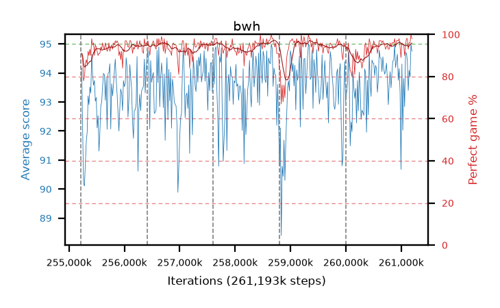

# bwh

step **261,193,728** · 365 evals · trailing **93.99** · peak **94.09** @260,931,584 · sef **98.4** · best30 **96.2** @259,473,408

## Config

| | |
|---|---|
| algo | ppo |
| collect_envs | 128 |
| discount | 0.99 |
| eval_interval | 16384 |
| eval_queue | True |
| eval_queue_depth | 16 |
| eval_workers | 12 |
| fc_layers | (320,) |
| graph_eval_episodes | 100 |
| max_steps | 261193728 |
| min_checkpoint_score | 0.0 |
| ppo_adam_epsilon | 1e-07 |
| ppo_clip | 0.2 |
| ppo_entropy_coef | 0.01 |
| ppo_entropy_coef_final | None |
| ppo_epochs | 8 |
| ppo_gae_lambda | 0.98 |
| ppo_gradient_clipping | 0.5 |
| ppo_horizon | 33.6 |
| ppo_learning_rate | 0.0003 |
| ppo_minibatch | 256 |
| ppo_normalize_adv | True |
| ppo_rollout | 128 |
| ppo_target_kl | 0.0 |
| ppo_transitions_per_rollout | 16384 |
| ppo_value_loss | huber |
| ppo_vf_coef | 0.5 |
| seed | 8 |
| torch_threads | 1 |

## Resumes

Resumed at 255,213,568, 256,409,600, 257,605,632, 258,801,664, 259,997,696

## Evals

| step | avg score | trailing avg | min score | max score | avg reward | perfect % | epsilon |
|---|---|---|---|---|---|---|---|
| 255229952 | 94.17 | 92.14 | 73.0 | 95.0 | 184.035 | 91.0 |  |
| 255246336 | 92.09 | 91.64 | 12.0 | 95.0 | 179.875 | 89.0 |  |
| 255262720 | 90.19 | 91.49 | 18.0 | 95.0 | 166.76 | 78.0 |  |
| ... | ... | ... | ... | ... | ... | ... | ... |
| 261013504 | 94.31 | 93.91 | 53.0 | 95.0 | 189.195 | 96.0 |  |
| 261029888 | 92.03 | 94.05 | 12.0 | 95.0 | 185.92 | 95.0 |  |
| 261046272 | 93.81 | 94.03 | 17.0 | 95.0 | 187.655 | 95.0 |  |
| 261062656 | 92.84 | 93.98 | 14.0 | 95.0 | 181.485 | 90.0 |  |
| 261079040 | 94.71 | 93.98 | 81.0 | 95.0 | 188.51 | 95.0 |  |
| 261095424 | 94.68 | 93.99 | 73.0 | 95.0 | 191.6 | 98.0 |  |
| 261111808 | 94.44 | 94.03 | 41.0 | 95.0 | 191.36 | 98.0 |  |
| 261128192 | 93.4 | 94.02 | 18.0 | 95.0 | 185.255 | 93.0 |  |
| 261144576 | 94.09 | 93.99 | 30.0 | 95.0 | 188.93 | 96.0 |  |
| 261160960 | 93.86 | 93.97 | 15.0 | 95.0 | 188.835 | 96.0 |  |
| 261177344 | 95.0 | 94.01 | 95.0 | 95.0 | 194.0 | 100.0 |  |
| 261193728 | 94.75 | 93.99 | 79.0 | 95.0 | 191.67 | 98.0 |  |
