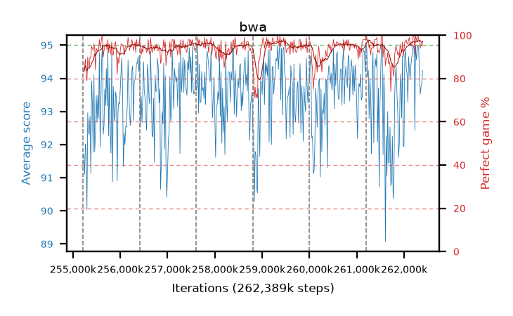

# bwa

step **262,389,760** · 438 evals · trailing **93.97** · peak **94.12** @257,867,776 · sef **98.2** · best30 **96.9** @259,489,792

## Config

| | |
|---|---|
| algo | ppo |
| collect_envs | 128 |
| discount | 0.99 |
| eval_interval | 16384 |
| eval_queue | True |
| eval_queue_depth | 16 |
| eval_workers | 12 |
| fc_layers | (320,) |
| graph_eval_episodes | 100 |
| max_steps | 262389760 |
| min_checkpoint_score | 0.0 |
| ppo_adam_epsilon | 1e-07 |
| ppo_clip | 0.2 |
| ppo_entropy_coef | 0.01 |
| ppo_entropy_coef_final | None |
| ppo_epochs | 8 |
| ppo_gae_lambda | 0.98 |
| ppo_gradient_clipping | 0.5 |
| ppo_horizon | 33.6 |
| ppo_learning_rate | 0.0003 |
| ppo_minibatch | 256 |
| ppo_normalize_adv | True |
| ppo_rollout | 128 |
| ppo_target_kl | 0.0 |
| ppo_transitions_per_rollout | 16384 |
| ppo_value_loss | huber |
| ppo_vf_coef | 0.5 |
| seed | 8 |
| torch_threads | 1 |

## Resumes

Resumed at 255,213,568, 256,409,600, 257,605,632, 258,801,664, 259,997,696, 261,193,728

## Evals

| step | avg score | trailing avg | min score | max score | avg reward | perfect % | epsilon |
|---|---|---|---|---|---|---|---|
| 255229952 | 91.73 | 91.41 | 3.0 | 95.0 | 173.5 | 83.0 |  |
| 255246336 | 91.1 | 91.1 | 23.0 | 95.0 | 175.72 | 86.0 |  |
| 255262720 | 92.02 | 91.62 | 8.0 | 95.0 | 179.76 | 89.0 |  |
| ... | ... | ... | ... | ... | ... | ... | ... |
| 262209536 | 94.86 | 93.5 | 81.0 | 95.0 | 192.865 | 99.0 |  |
| 262225920 | 92.43 | 93.92 | 16.0 | 95.0 | 182.25 | 91.0 |  |
| 262242304 | 95.0 | 92.89 | 95.0 | 95.0 | 194.0 | 100.0 |  |
| 262258688 | 94.56 | 93.68 | 59.0 | 95.0 | 191.48 | 98.0 |  |
| 262275072 | 94.8 | 93.97 | 85.0 | 95.0 | 190.77 | 97.0 |  |
| 262291456 | 95.0 | 93.36 | 95.0 | 95.0 | 194.0 | 100.0 |  |
| 262307840 | 94.87 | 93.83 | 86.0 | 95.0 | 191.88 | 98.0 |  |
| 262324224 | 94.11 | 94.06 | 14.0 | 95.0 | 190.035 | 97.0 |  |
| 262340608 | 93.52 | 94.11 | 27.0 | 95.0 | 186.46 | 94.0 |  |
| 262356992 | 93.75 | 93.98 | 11.0 | 95.0 | 188.725 | 96.0 |  |
| 262373376 | 93.85 | 93.93 | 27.0 | 95.0 | 187.785 | 95.0 |  |
| 262389760 | 94.23 | 93.97 | 28.0 | 95.0 | 190.2 | 97.0 |  |
