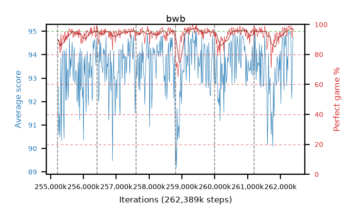

# bwb

step **262,389,760** · 438 evals · trailing **93.91** · peak **94.24** @260,882,432 · sef **97.7** · best30 **96.6** @259,538,944

## Config

| | |
|---|---|
| algo | ppo |
| collect_envs | 128 |
| discount | 0.99 |
| eval_interval | 16384 |
| eval_queue | True |
| eval_queue_depth | 16 |
| eval_workers | 12 |
| fc_layers | (320,) |
| graph_eval_episodes | 100 |
| max_steps | 262389760 |
| min_checkpoint_score | 0.0 |
| ppo_adam_epsilon | 1e-07 |
| ppo_clip | 0.2 |
| ppo_entropy_coef | 0.01 |
| ppo_entropy_coef_final | None |
| ppo_epochs | 8 |
| ppo_gae_lambda | 0.98 |
| ppo_gradient_clipping | 0.5 |
| ppo_horizon | 33.6 |
| ppo_learning_rate | 0.0003 |
| ppo_minibatch | 256 |
| ppo_normalize_adv | True |
| ppo_rollout | 128 |
| ppo_target_kl | 0.0 |
| ppo_transitions_per_rollout | 16384 |
| ppo_value_loss | huber |
| ppo_vf_coef | 0.5 |
| seed | 8 |
| torch_threads | 1 |

## Resumes

Resumed at 255,213,568, 256,409,600, 257,605,632, 258,801,664, 259,997,696, 261,193,728

## Evals

| step | avg score | trailing avg | min score | max score | avg reward | perfect % | epsilon |
|---|---|---|---|---|---|---|---|
| 255229952 | 92.63 | 91.31 | 30.0 | 95.0 | 180.46 | 89.0 |  |
| 255246336 | 90.62 | 90.62 | 23.0 | 95.0 | 179.265 | 90.0 |  |
| 255262720 | 91.48 | 91.05 | 34.0 | 95.0 | 176.145 | 86.0 |  |
| ... | ... | ... | ... | ... | ... | ... | ... |
| 262209536 | 93.92 | 93.19 | 9.0 | 95.0 | 187.81 | 95.0 |  |
| 262225920 | 93.35 | 93.04 | 11.0 | 95.0 | 190.36 | 98.0 |  |
| 262242304 | 94.95 | 93.33 | 90.0 | 95.0 | 192.955 | 99.0 |  |
| 262258688 | 94.92 | 93.84 | 90.0 | 95.0 | 191.885 | 98.0 |  |
| 262275072 | 94.9 | 93.67 | 87.0 | 95.0 | 191.82 | 98.0 |  |
| 262291456 | 94.98 | 93.95 | 93.0 | 95.0 | 192.94 | 99.0 |  |
| 262307840 | 94.92 | 93.49 | 87.0 | 95.0 | 192.88 | 99.0 |  |
| 262324224 | 94.16 | 93.74 | 11.0 | 95.0 | 192.12 | 99.0 |  |
| 262340608 | 92.13 | 93.55 | 19.0 | 95.0 | 185.975 | 95.0 |  |
| 262356992 | 92.91 | 93.91 | 27.0 | 95.0 | 182.82 | 91.0 |  |
| 262373376 | 94.55 | 93.78 | 65.0 | 95.0 | 190.52 | 97.0 |  |
| 262389760 | 94.74 | 93.91 | 85.0 | 95.0 | 189.715 | 96.0 |  |
