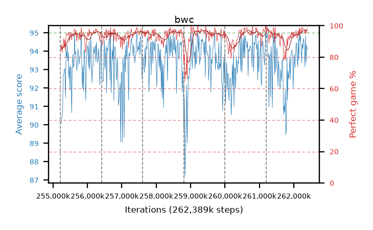

# bwc

step **262,389,760** · 438 evals · trailing **93.62** · peak **94.14** @260,898,816 · sef **97.7** · best30 **96.5** @259,489,792

## Config

| | |
|---|---|
| algo | ppo |
| collect_envs | 128 |
| discount | 0.99 |
| eval_interval | 16384 |
| eval_queue | True |
| eval_queue_depth | 16 |
| eval_workers | 12 |
| fc_layers | (320,) |
| graph_eval_episodes | 100 |
| max_steps | 262389760 |
| min_checkpoint_score | 0.0 |
| ppo_adam_epsilon | 1e-07 |
| ppo_clip | 0.2 |
| ppo_entropy_coef | 0.01 |
| ppo_entropy_coef_final | None |
| ppo_epochs | 8 |
| ppo_gae_lambda | 0.98 |
| ppo_gradient_clipping | 0.5 |
| ppo_horizon | 33.6 |
| ppo_learning_rate | 0.0003 |
| ppo_minibatch | 256 |
| ppo_normalize_adv | True |
| ppo_rollout | 128 |
| ppo_target_kl | 0.0 |
| ppo_transitions_per_rollout | 16384 |
| ppo_value_loss | huber |
| ppo_vf_coef | 0.5 |
| seed | 8 |
| torch_threads | 1 |

## Resumes

Resumed at 255,213,568, 256,409,600, 257,605,632, 258,801,664, 259,997,696, 261,193,728

## Evals

| step | avg score | trailing avg | min score | max score | avg reward | perfect % | epsilon |
|---|---|---|---|---|---|---|---|
| 255229952 | 90.06 | 90.06 | 22.0 | 95.0 | 173.685 | 85.0 |  |
| 255246336 | 90.24 | 90.15 | 12.0 | 95.0 | 176.805 | 88.0 |  |
| 255262720 | 90.61 | 90.3 | 16.0 | 95.0 | 172.29 | 83.0 |  |
| ... | ... | ... | ... | ... | ... | ... | ... |
| 262209536 | 94.19 | 92.89 | 32.0 | 95.0 | 191.11 | 98.0 |  |
| 262225920 | 93.38 | 92.94 | 17.0 | 95.0 | 187.315 | 95.0 |  |
| 262242304 | 94.4 | 92.92 | 35.0 | 95.0 | 192.405 | 99.0 |  |
| 262258688 | 94.14 | 93.06 | 12.0 | 95.0 | 191.105 | 98.0 |  |
| 262275072 | 94.7 | 93.87 | 71.0 | 95.0 | 191.665 | 98.0 |  |
| 262291456 | 94.56 | 93.9 | 69.0 | 95.0 | 191.57 | 98.0 |  |
| 262307840 | 93.99 | 93.95 | 8.0 | 95.0 | 189.915 | 97.0 |  |
| 262324224 | 93.16 | 93.48 | 9.0 | 95.0 | 187.095 | 95.0 |  |
| 262340608 | 94.85 | 93.77 | 87.0 | 95.0 | 190.82 | 97.0 |  |
| 262356992 | 93.4 | 93.71 | 18.0 | 95.0 | 187.29 | 95.0 |  |
| 262373376 | 94.34 | 93.64 | 33.0 | 95.0 | 191.305 | 98.0 |  |
| 262389760 | 94.09 | 93.62 | 34.0 | 95.0 | 191.055 | 98.0 |  |
