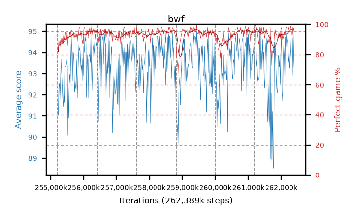

# bwf

step **262,389,760** · 438 evals · trailing **93.63** · peak **94.06** @258,621,440 · sef **98.2** · best30 **96.0** @261,046,272

## Config

| | |
|---|---|
| algo | ppo |
| collect_envs | 128 |
| discount | 0.99 |
| eval_interval | 16384 |
| eval_queue | True |
| eval_queue_depth | 16 |
| eval_workers | 12 |
| fc_layers | (320,) |
| graph_eval_episodes | 100 |
| max_steps | 262389760 |
| min_checkpoint_score | 0.0 |
| ppo_adam_epsilon | 1e-07 |
| ppo_clip | 0.2 |
| ppo_entropy_coef | 0.01 |
| ppo_entropy_coef_final | None |
| ppo_epochs | 8 |
| ppo_gae_lambda | 0.98 |
| ppo_gradient_clipping | 0.5 |
| ppo_horizon | 33.6 |
| ppo_learning_rate | 0.0003 |
| ppo_minibatch | 256 |
| ppo_normalize_adv | True |
| ppo_rollout | 128 |
| ppo_target_kl | 0.0 |
| ppo_transitions_per_rollout | 16384 |
| ppo_value_loss | huber |
| ppo_vf_coef | 0.5 |
| seed | 8 |
| torch_threads | 1 |

## Resumes

Resumed at 255,213,568, 256,409,600, 257,605,632, 258,801,664, 259,997,696, 261,193,728

## Evals

| step | avg score | trailing avg | min score | max score | avg reward | perfect % | epsilon |
|---|---|---|---|---|---|---|---|
| 255229952 | 91.03 | 92.12 | 27.0 | 95.0 | 171.67 | 82.0 |  |
| 255246336 | 92.37 | 92.45 | 24.0 | 95.0 | 181.24 | 90.0 |  |
| 255262720 | 92.54 | 92.48 | 56.0 | 95.0 | 178.38 | 87.0 |  |
| ... | ... | ... | ... | ... | ... | ... | ... |
| 262209536 | 93.55 | 92.56 | 19.0 | 95.0 | 190.515 | 98.0 |  |
| 262225920 | 93.83 | 92.66 | 17.0 | 95.0 | 188.76 | 96.0 |  |
| 262242304 | 93.25 | 93.53 | 8.0 | 95.0 | 187.14 | 95.0 |  |
| 262258688 | 94.06 | 93.83 | 13.0 | 95.0 | 188.99 | 96.0 |  |
| 262275072 | 93.73 | 93.88 | 15.0 | 95.0 | 188.66 | 96.0 |  |
| 262291456 | 94.15 | 93.37 | 10.0 | 95.0 | 192.155 | 99.0 |  |
| 262307840 | 94.96 | 93.67 | 91.0 | 95.0 | 192.92 | 99.0 |  |
| 262324224 | 94.92 | 93.77 | 87.0 | 95.0 | 192.88 | 99.0 |  |
| 262340608 | 94.65 | 93.68 | 66.0 | 95.0 | 191.615 | 98.0 |  |
| 262356992 | 92.92 | 93.62 | 10.0 | 95.0 | 184.82 | 93.0 |  |
| 262373376 | 93.65 | 93.62 | 23.0 | 95.0 | 189.53 | 97.0 |  |
| 262389760 | 94.85 | 93.63 | 87.0 | 95.0 | 191.815 | 98.0 |  |
