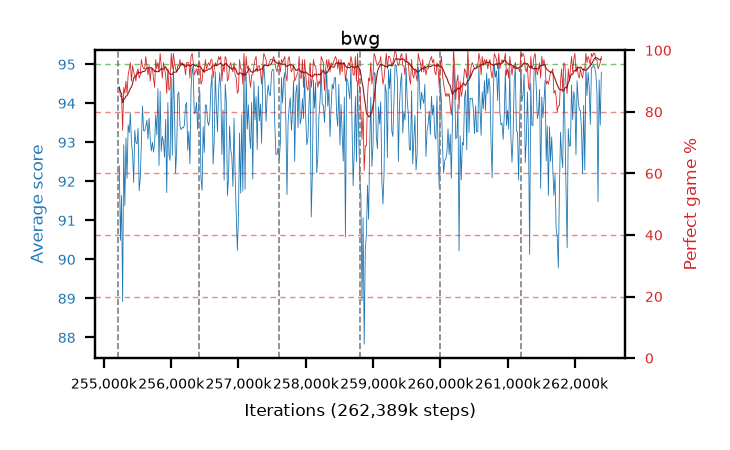

# bwg

step **262,389,760** · 438 evals · trailing **93.73** · peak **94.01** @260,177,920 · sef **98.6** · best30 **96.2** @259,489,792

## Config

| | |
|---|---|
| algo | ppo |
| collect_envs | 128 |
| discount | 0.99 |
| eval_interval | 16384 |
| eval_queue | True |
| eval_queue_depth | 16 |
| eval_workers | 12 |
| fc_layers | (320,) |
| graph_eval_episodes | 100 |
| max_steps | 262389760 |
| min_checkpoint_score | 0.0 |
| ppo_adam_epsilon | 1e-07 |
| ppo_clip | 0.2 |
| ppo_entropy_coef | 0.01 |
| ppo_entropy_coef_final | None |
| ppo_epochs | 8 |
| ppo_gae_lambda | 0.98 |
| ppo_gradient_clipping | 0.5 |
| ppo_horizon | 33.6 |
| ppo_learning_rate | 0.0003 |
| ppo_minibatch | 256 |
| ppo_normalize_adv | True |
| ppo_rollout | 128 |
| ppo_target_kl | 0.0 |
| ppo_transitions_per_rollout | 16384 |
| ppo_value_loss | huber |
| ppo_vf_coef | 0.5 |
| seed | 8 |
| torch_threads | 1 |

## Resumes

Resumed at 255,213,568, 256,409,600, 257,605,632, 258,801,664, 259,997,696, 261,193,728

## Evals

| step | avg score | trailing avg | min score | max score | avg reward | perfect % | epsilon |
|---|---|---|---|---|---|---|---|
| 255229952 | 92.4 | 91.51 | 3.0 | 95.0 | 179.28 | 88.0 |  |
| 255246336 | 90.49 | 90.49 | 36.0 | 95.0 | 174.07 | 85.0 |  |
| 255262720 | 91.64 | 91.06 | 28.0 | 95.0 | 175.31 | 85.0 |  |
| ... | ... | ... | ... | ... | ... | ... | ... |
| 262209536 | 94.41 | 92.9 | 51.0 | 95.0 | 190.335 | 97.0 |  |
| 262225920 | 93.46 | 93.6 | 23.0 | 95.0 | 187.305 | 95.0 |  |
| 262242304 | 94.91 | 93.93 | 86.0 | 95.0 | 192.915 | 99.0 |  |
| 262258688 | 94.92 | 93.32 | 90.0 | 95.0 | 191.885 | 98.0 |  |
| 262275072 | 94.98 | 93.6 | 93.0 | 95.0 | 192.985 | 99.0 |  |
| 262291456 | 94.91 | 93.88 | 86.0 | 95.0 | 192.915 | 99.0 |  |
| 262307840 | 94.76 | 93.49 | 81.0 | 95.0 | 190.685 | 97.0 |  |
| 262324224 | 94.28 | 93.63 | 35.0 | 95.0 | 190.25 | 97.0 |  |
| 262340608 | 91.48 | 93.54 | 21.0 | 95.0 | 184.285 | 94.0 |  |
| 262356992 | 94.6 | 93.6 | 83.0 | 95.0 | 188.58 | 95.0 |  |
| 262373376 | 93.44 | 93.64 | 18.0 | 95.0 | 188.325 | 96.0 |  |
| 262389760 | 94.8 | 93.73 | 82.0 | 95.0 | 191.81 | 98.0 |  |
