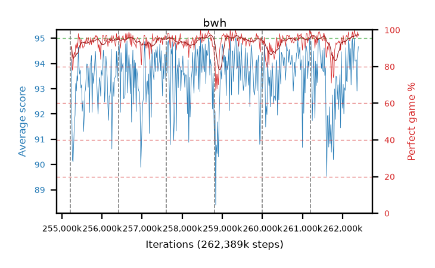

# bwh

step **262,389,760** · 438 evals · trailing **93.6** · peak **94.09** @260,931,584 · sef **97.9** · best30 **96.2** @259,473,408

## Config

| | |
|---|---|
| algo | ppo |
| collect_envs | 128 |
| discount | 0.99 |
| eval_interval | 16384 |
| eval_queue | True |
| eval_queue_depth | 16 |
| eval_workers | 12 |
| fc_layers | (320,) |
| graph_eval_episodes | 100 |
| max_steps | 262389760 |
| min_checkpoint_score | 0.0 |
| ppo_adam_epsilon | 1e-07 |
| ppo_clip | 0.2 |
| ppo_entropy_coef | 0.01 |
| ppo_entropy_coef_final | None |
| ppo_epochs | 8 |
| ppo_gae_lambda | 0.98 |
| ppo_gradient_clipping | 0.5 |
| ppo_horizon | 33.6 |
| ppo_learning_rate | 0.0003 |
| ppo_minibatch | 256 |
| ppo_normalize_adv | True |
| ppo_rollout | 128 |
| ppo_target_kl | 0.0 |
| ppo_transitions_per_rollout | 16384 |
| ppo_value_loss | huber |
| ppo_vf_coef | 0.5 |
| seed | 8 |
| torch_threads | 1 |

## Resumes

Resumed at 255,213,568, 256,409,600, 257,605,632, 258,801,664, 259,997,696, 261,193,728

## Evals

| step | avg score | trailing avg | min score | max score | avg reward | perfect % | epsilon |
|---|---|---|---|---|---|---|---|
| 255229952 | 94.17 | 92.14 | 73.0 | 95.0 | 184.035 | 91.0 |  |
| 255246336 | 92.09 | 91.64 | 12.0 | 95.0 | 179.875 | 89.0 |  |
| 255262720 | 90.19 | 91.49 | 18.0 | 95.0 | 166.76 | 78.0 |  |
| ... | ... | ... | ... | ... | ... | ... | ... |
| 262209536 | 93.15 | 92.47 | 2.0 | 95.0 | 188.035 | 96.0 |  |
| 262225920 | 94.81 | 92.79 | 81.0 | 95.0 | 190.69 | 97.0 |  |
| 262242304 | 94.98 | 93.74 | 93.0 | 95.0 | 192.94 | 99.0 |  |
| 262258688 | 93.76 | 93.3 | 12.0 | 95.0 | 187.74 | 95.0 |  |
| 262275072 | 94.47 | 93.46 | 56.0 | 95.0 | 190.44 | 97.0 |  |
| 262291456 | 95.0 | 93.11 | 95.0 | 95.0 | 194.0 | 100.0 |  |
| 262307840 | 94.11 | 93.41 | 10.0 | 95.0 | 191.075 | 98.0 |  |
| 262324224 | 94.1 | 93.65 | 20.0 | 95.0 | 190.025 | 97.0 |  |
| 262340608 | 94.15 | 93.54 | 17.0 | 95.0 | 190.075 | 97.0 |  |
| 262356992 | 92.91 | 93.65 | 22.0 | 95.0 | 187.75 | 96.0 |  |
| 262373376 | 94.31 | 93.56 | 26.0 | 95.0 | 192.27 | 99.0 |  |
| 262389760 | 94.67 | 93.6 | 81.0 | 95.0 | 190.685 | 97.0 |  |
