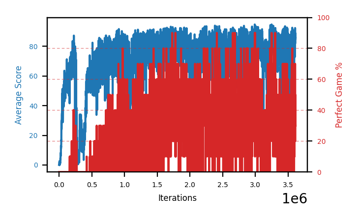
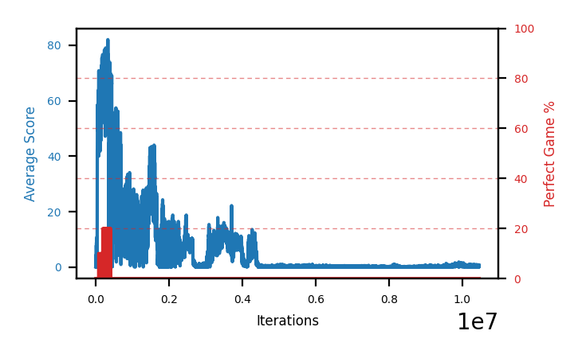
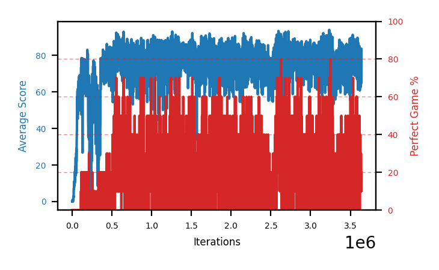

# Archive: batches 1-10

Per-batch write-ups and chart captions for the ten batches before the current baseline.
Moved out of `completedRuns.md` and `charts.md` in three passes: batches 1-8 on
2026-08-04, then batches 9 and 10 on 2026-08-05 once batch 13 established batch 11 as the
baseline every future comparison runs against. Batch 10's checkpoints no longer load on
`master` either — `450e66e` is the last commit with the 26-value vector. **Historical record — not
meant to be read into context.** See [`README.md`](README.md).

The one-line-per-arm ranking for every batch, including these, stays in
[`../completedRuns.md`](../completedRuns.md) — that table is canonical and was not moved.

## From completedRuns.md

## Batch 10 — a fresh baseline, and a new project record

**Launched 2026-08-02, all four stopped 2026-08-03** by request, healthy, to make room for
further changes — not because any of them died or declined. Seven observation/reward changes
had landed the same day batch 10 launched (fatal-move zeroing, wall/body hugging, normalized
group count, the corrected starve/length split, the terminal-discount fix, safe-to-chase-food,
and the audit that started the day), on top of the audit that already made batch 9 incomparable
to batch 8. Nothing had trained on the resulting environment at all, so batch 10 was deliberately
four seeds of **one** config — `DISCOUNT=0.995`, the most reliably-surviving value on record (3 of
3 in batch 7, 2 of 2 in batch 9) — rather than another comparison, on the reasoning that comparing
two things before either has a baseline on the actual environment being measured just repeats
batch 9's own lesson at one remove. Shared base for all four:
`SNEK_PRIORITY_EXPONENT=0.6 SNEK_PRIORITY_SIGNAL=td_loss SNEK_IS_WEIGHTS=0`.

| policy | final step | peak trailing | best-30 perfect | best ckpt (mid-run eval) | top-3 | pooled | outcome |
|---|---|---|---|---|---|---|---|
| `b10a-disc995seed1` | 4.29M | 94.4 @3402k | 78.3% @3402k | close-out eval pending | — | — | stopped healthy |
| `b10b-disc995seed2` | 4.65M | 94.96 @4545k | 85.0% @4547k | 87% @1157k | 86.3% | 70.4%/12000 | stopped healthy, 2nd-best |
| `b10c-disc995seed3` | 4.12M | 93.8 @4021k | 72.7% @4064k | close-out eval pending | — | — | stopped healthy |
| `b10d-disc995seed4` | 4.45M | 94.7 @3978k | 84.3% @1666k | **95%** @1815k | **93.3%** | **74.5%/24600** | stopped healthy, **project record** |

**All four were still healthy when stopped** — no `dead_since`/`zero_since` on any of them, and
two (`b10b`, `b10c`) were at or near their own peak trailing score *at the moment they were
stopped*, not declining from an earlier peak the way every record-setting arm before this batch
was. That is a first for this project: every previous best-checkpoint arm (`b8f`, `b8d`, `b9d`)
had already peaked and was declining by the time it was measured or stopped.

**`b10d`'s 95% (CI 88.8-97.8, 246 checkpoints cleared the ≥90% tier) is the best figure this
project has produced on any environment**, ahead of the pre-audit record of 92% (`b8f`
`ckpt2816000`, no longer reproducible — see the hall of fame) and far ahead of the previous
post-audit best of 82% (`b8f` `ckpt3149000`, also no longer reproducible after this session's
seven fixes). Both `b10b`'s and `b10d`'s measurements were taken **mid-run** — each arm kept
training for another ~2.5-2.9M steps afterward, up to a final step neither eval's checkpoint
range covered — so a full close-out re-measurement across each arm's complete checkpoint history
may move these numbers further; see [`runs.md`](../runs.md) for whether that has happened yet.

**Not yet established: whether this is the config or the environment.** Batch 10 deliberately
ran one config, so it cannot separate "the seven 2026-08-02 fixes made training better" from
"this seed cluster happened to be strong" — n=4 on one value is enough to trust as a baseline,
not enough to attribute the gain. Both `b10d` (95%) and `b10b` (87%) comfortably clear the old
82% ceiling, and `b10a`/`b10c` graph-eval no worse than batch 9's arms did at a comparable
horizon, which is suggestive but not the isolating comparison a future batch would need to make
the claim safely.

Both champion checkpoints are preserved in
[`../hallOfFame/`](../../hallOfFame/README.md#the-current-record-96-and-it-runs-on-master).

## Batch 9 — 0.995 against 0.9975 on the post-audit environment

**Launched 2026-08-02 00:41, all four stopped the same day.** The first batch trained on the
environment left by the observation/reward audit, so **none of its numbers are comparable to any
batch above it** — the same checkpoint that scored 92% pre-audit reads 73% here. Shared base
`SNEK_PRIORITY_EXPONENT=0.6 SNEK_PRIORITY_SIGNAL=td_loss SNEK_IS_WEIGHTS=0`.

| policy | discount | final step | peak trailing | best30 | **best eval'd ckpt** | top-3 | pooled | outcome |
|---|---|---|---|---|---|---|---|---|
| `b9a-disc9975a` | 0.9975 | 3.68M | **89.8** @3277k | **56.0%** @1738k | 65.0% @1735k | 64.3% | **54.9%** /2000 | survived |
| `b9b-disc9975b` | 0.9975 | **10.47M** | 72.1 @**328k** | 5.0% @221k | not measured | — | — | **dead** |
| `b9c-disc995a` | 0.995 | 3.71M | 86.5 @3573k | 37.3% @2608k | 52.0% @2603k | 51.3% | 38.0% /2000 | survived |
| `b9d-disc995b` | 0.995 | 3.45M | 86.7 @1232k | 30.3% @1324k | **70.0%** @2544k | **66.3%** | 42.4% /1700 | survived |

**Why the batch was shaped this way.** The queued plan had two 0.9975 seeds plus `0.996` and
`LEARNING_RATE=1e-4`, resting on 0.995 having survived 3 of 3 — but that was measured pre-audit and
was void, so as written the batch had no 0.995 arm and could not settle the question it existed for.
Four arms on two values answers one question properly instead of three partially. `0.996` and the
learning rate stayed deferred.

**Outcome: the candidates win different things and the question is still open.** Ceiling and top-3
go to 0.995 (`b9d` at 70% / 66.3%), consistency to 0.9975 (`b9a` pools 54.9% with 18 of 20
checkpoints above 40%), and survival to 0.995 at 2 of 2 against 1 of 2. Survival dominates expected
value — mean top-3 across seeds is **58.8% for 0.995** against **32.2% for 0.9975** — but the two
0.995 seeds are **18 points apart** on best checkpoint, so seed spread still exceeds the effect.

**`b9b` is the clearest overrun failure in the file.** It peaked at step **328k**, before any sibling
had warmed up, then ran a further 10.1M steps producing nothing, `zero_since` 9.92M. It did that
overnight with nobody watching, which is the entire argument for the 3-3.5M stop rule rather than
stopping by inspection.

**The three survivors were measured while still training**, at 3.4-3.7M, so their close-outs are
mid-run. `b9c` was still climbing when stopped — peak trailing at 3573k, its last few hundred
thousand steps — so it is the one arm here that might have had more to give.

**Batch 9's best checkpoint (70%) is below `b8f`'s re-measured 82%.** Nothing trained after the audit
yet beats something trained before it, at a comparable horizon. One batch, and not a verdict, but
recorded because it is the opposite of what the fixes were meant to buy.

## Batch 8 — the discount optimum, gradient clipping, and the arm lifetime

**Started 2026-07-29, all arms stopped 2026-08-01.** Seven arms in four slots. It produced the
**project record (92% perfect games)**, falsified `DISCOUNT=0.999` and gradient clipping, and — by
running two arms far longer than any before — established that an arm has a *lifetime*.

| policy | extra override | final step | best 30-eval pf | **best measured ckpt** | pooled | verdict |
|---|---|---|---|---|---|---|
| `b8f-disc9975seed2` | `DISCOUNT=0.9975` | 5.47M | **69.3%** @2828k | **92.0%** @2816k | **66.3%** /5200 | **project record**; declining when stopped |
| `b8d-disc995clip` | `0.995` + `CLIPPING=10` | **11.64M** | 50.0% @2671k | **80.0%** @2538k | 60.4% /2000 | 2nd by measurement, then **died at ~7M** |
| `b8g-clipseed3` | `0.995` + `CLIPPING=10` | 3.43M | 30.0% @253k | none >50% | — | died, recovered after 1.2M, died again |
| `b8e-clipseed2` | `0.995` + `CLIPPING=10` | 1.16M | 21.3% @515k | 32.0% @500k | 32% /100 | flat; one good ckpt, no good region |
| `b8c-disc9975` | `DISCOUNT=0.9975` | 1.75M | 14.7% @343k | not measured | — | monotone decline to a stop |
| `b8a-disc999` | `DISCOUNT=0.999` | 1.11M | 0.7% @82k | 0% (dead) | — | dead at 452k |
| `b8b-disc999seed2` | `DISCOUNT=0.999` | 1.41M | 0.0% | 0% (dead) | — | dead; zero perfect games in 1.41M |

**Four results, in descending order of how much they change what to do next:**

1. **The horizon, not a hyperparameter, was the binding constraint.** `b8f` and `b8d` measured 63%
   and 62% at ~1.8M steps and **92% and 80%** at their best. Every previous record-holder had been
   stopped at ~1.06M. But followed further both peaked at **~2.5-3M** and then declined, and `b8d`
   died. The horizon has both a floor and a ceiling: **stop around 3-3.5M**.
2. **`DISCOUNT=0.9975` holds the record but is 1 of 2 on survival.** `b8f` produced the 92%
   champion; its sibling `b8c` ran the identical config and declined monotonically to a stop. The
   discount optimum sits somewhere in 0.995-0.9975 and is not yet resolved.
3. **`DISCOUNT=0.999` is falsified, 2 of 2 dead** — and it failed differently from other deaths,
   never learning at all (peak trailing 63.1 and 31.8; `b8b` produced zero perfect games in 1.41M
   steps). That gives the discount an optimum rather than a monotone benefit.
4. **`GRADIENT_CLIPPING=10` is falsified at 1 of 3**, against 3 of 3 for plain 0.995. It briefly
   looked like the batch's headline off `b8d` at 163k steps, then off `b8d`'s 62% measurement; both
   readings were premature, and `b8f` matched or beat that ceiling without clipping.

### Original design rationale

The obvious next question: if 0.995 helped this much, does more help more? A perfect game
runs several hundred steps, so even 0.995 (~200-step horizon) may still under-weight the
terminal bonus. All arms keep the winning base
`SNEK_PRIORITY_EXPONENT=0.6 SNEK_PRIORITY_SIGNAL=td_loss SNEK_IS_WEIGHTS=0`:

| policy | extra override | effective horizon | role |
|---|---|---|---|
| `b8a-disc999` | `SNEK_DISCOUNT=0.999` | ~1000 steps | is more better, or unstable? |
| `b8b-disc999seed2` | `SNEK_DISCOUNT=0.999` | ~1000 steps | second seed, since n=1 proves nothing here |
| `b8c-disc9975` | `SNEK_DISCOUNT=0.9975` | ~400 steps | the midpoint, if 0.999 breaks |
| `b8d-disc995clip` | `SNEK_DISCOUNT=0.995 SNEK_GRADIENT_CLIPPING=10` | ~200 steps | clipping on the known-good setting |

Higher discounts are a **known source of instability** — bootstrapped targets grow as the
horizon lengthens — so 0.999 may well be worse rather than better. That is why 0.9975 sits
in the batch as a fallback midpoint and why `b8d` tests a stability aid on the setting that
already works rather than on a riskier one.

### What the batch cost, and the step-rate trap

`b8d` spent ~8.5M steps after its peak and produced nothing measurable in them. It also advanced
**7.3M steps in ~24 hours** while `b8f` managed 1.9M on the same machine — almost entirely because a
dead policy plays very short episodes and therefore burns training steps far faster. A sudden jump
in step rate is a symptom of death, not speed.

## Batch 7 — seeding `b6b`, and finding `DISCOUNT=0.995`

**Started 2026-07-28, all arms stopped 2026-07-29.** Six arms ran in four slots: three
seeds of `b6b`'s config, then `DISCOUNT=0.995` seeded three times as the seeds died.

All shared `SNEK_PRIORITY_EXPONENT=0.6 SNEK_PRIORITY_SIGNAL=td_loss SNEK_IS_WEIGHTS=0`.

| policy | extra | final step | best ckpt | top-3 pooled | outcome |
|---|---|---|---|---|---|
| `b7f-disc995seed3` | `DISCOUNT=0.995` | 1.06M | **51%** @860k | **48.0%** | **best arm on record** |
| `b7e-disc995seed2` | `DISCOUNT=0.995` | 1.28M | 39% @334k | 34.7% | strong, survived |
| `b7d-discount995` | `DISCOUNT=0.995` | 1.60M | 26% @1330k | 22.7% | survived, weakest of the three |
| `b7a-a06seed2` | none | 2.00M | 19% @1822k | 18.3% | survived to 2M |
| `b7b-a06seed3` | none | 1.78M | — | — | **died at 1162k** |
| `b7c-a06seed4` | none | 1.74M | — | — | **died at 573k** |

**The batch was designed to answer a different question than the one it answered.** Its
purpose was seeding `b6b`'s config to n=3, because every single-seed result in this project
had failed to replicate. That question got answered — **2 of 4 seeds survive**, so eff ~1.2
is not the reliable setting it looked like, and the "lower sharpness is safer" reading was
weakened rather than confirmed.

The useful result came from the fourth slot. `DISCOUNT=0.995` was included as the one
untested high-prior knob, and after the first arm looked strong the two freed slots went to
seeding it instead of `b6b`. That decision — replacing dead seeds of a mediocre config with
seeds of a promising one, rather than completing the original design — is what produced the
result. See [`findings.md`](../findings.md).

Both `b6b`-config deaths came **late** (573k, 1162k) compared to the eff ~1.6 deaths (246k,
272k), which suggests lower sharpness delays death rather than preventing it. Any survival
rate from here needs a step horizon attached.

**The gain from `DISCOUNT=0.995` is reliability, not ceiling.** `b7f` (51%) and `b4c` (50%,
eff exponent ~1.6) are a dead heat on level, and their intervals nearly coincide. What changed
is survival: `b4c`'s config threw away two runs in three to reach that level, and the three
`0.995` seeds reached a comparable level three times out of three. Weighting level by survival
makes the difference concrete:

| config | mean level across seeds | survival | expected value |
|---|---|---|---|
| `DISCOUNT=0.995` | 28.2% | **3 of 3** | **28.2%** |
| `b4c` config, eff ~1.6 | 37.1% | 1 of 3 | 12.4% |
| same config at 0.99 (`b7a`) | 12.0% | 2 of 4 | 6.0% |

**~2.3x the expected value of the best previous config.** This was the first change in the
investigation to *remove* the ceiling/reliability tradeoff rather than move along it, and the
mechanism was predicted in advance: at 0.99 the effective horizon is ~100 steps while a perfect
game runs several hundred, so the terminal bonus was discounted into irrelevance.

## Batch 6 — the effective-exponent sweep

**Started 2026-07-27, both arms stopped 2026-07-28.** Both arms keep the `b4c` signature (`td_loss`, no IS) and dial
alpha down, testing whether the effective exponent is what governs stability:

| policy | alpha | effective exponent | prediction |
|---|---|---|---|
| `b6a-alpha04` | 0.4 | ~0.8 — matches live `b5d` | survives |
| `b6b-alpha06` | 0.6 | ~1.2 — between `b5d` and the dead arms | marginal |

Because `td_loss` squares the error before alpha is applied, `alpha=0.8` with `td_loss`
is really ~1.6 on the `td_error` scale — see
[`findings.md`](../findings.md). So the alpha *label* has never matched what was tested, and
these two arms are the first honest points on that axis.

Note `b6b`'s alpha 0.6 **is** the committed default, so that override is a no-op on that
knob; `b6b` is precisely "committed alpha, `theSchlong`'s other two PER changes."

Why this rather than more seeds of `b5c`: `b5c` was still running at the time, and the alpha sweep is the only experiment that
could recover `b4c`'s 51% without its 2-in-3 death rate. If both new arms survive the
200-270k window, the lottery becomes a dial.

**What would falsify the mechanism:** `b6a` dying anyway (something other than exponent
sharpness kills these arms), or both surviving *and* scoring no better than baseline
(sharpness was never where the gain came from either).

**Outcome: the prediction half held and the correction mattered more.** `b6a` (eff ~0.8)
stayed stable throughout and measured 8.1% — safe but a low ceiling. `b6b` (eff ~1.2) was
called "marginal", crashed to near-zero twice, recovered both times, and measured 24.5% —
the best arm at the time. That produced the "sharpness is a variance dial" reading in
[`findings.md`](../findings.md), later weakened when batch 7 seeded `b6b`'s config and lost 2
of 4 to late deaths.

Both arms were measured with the old smoothed-first selector, so **both figures are
underestimates** and are due a re-measure.

## Batch 5 — `b4c` repeat plus factor isolation

**Started 10:05 2026-07-27, restarted 17:09 for visible windows, all arms stopped
2026-07-28.** `b5a`/`b5b` stopped as dead; `b5c`/`b5d` stopped past peak.

All four arms shared `PRIORITY_EXPONENT=0.8` and differed only in the other two PER
factors, making the batch a replication attempt *and* a factor isolation at once:

| policy | differs from `b4c` by | role | outcome |
|---|---|---|---|
| `b5a-schlong` | nothing | `b4c` repeat, seed 1 | **died** 272k |
| `b5b-schlong2` | nothing | `b4c` repeat, seed 2 | **died** 246k |
| `b5c-schlongIS` | IS weights back on | isolates IS weights | survived, 17.0% peak then 2M-step decline |
| `b5d-schlongTDE` | `abs(td_error)` signal | isolates the priority signal | survived, stable, 10.7% ceiling |

`b5c` and `b5d` each differ from the repeats by **exactly one factor**, so the design was
meant to read three ways: all four high would give four seeds for the config plus the
factor isolation free; only the repeats high would name the factor carrying the gain; none
high would mean `b4c` was a lucky seed. That is the same information two sequential
batches would give, in half the wall clock.

**Outcome: the third reading, and the batch inverted its own premise.** Both exact repeats
died permanently in the 200-270k window and stayed flat at 0.0 for 1.7-1.9M steps. Both
single-factor arms survived. This retracted the "restoring `theSchlong`'s PER triples the
perfect rate" finding and led to the effective-exponent mechanism — see
[`findings.md`](../findings.md).

### Restarted at ~36-47k to add visible windows

All four were killed and relaunched from their checkpoints so every arm renders a game
as it trains. Their graphs continue rather than restarting, with a resume marker at the
restart step. **Caveat: cpprb does not persist replay-buffer priorities across
save/restore**, so the restart reset all priorities to uniform and they rebuilt as
transitions were resampled. For a batch whose subject *is* prioritization that is a real
perturbation, but it landed at ~5% of the planned run and hit all four arms about
equally, so it should not bias the between-arm comparison. It is a reason not to restart
an arm deep into a run.

## Batch 4 — the sampling machinery

Three arms spanning the whole prioritization axis: none (`b4a`), none-plus-diversity
(`b4b`), and `theSchlong`'s original maximum (`b4c`). Spanning the axis paid off,
because the answer was at the end nobody expected — uniform sampling was the prior
favourite and came in at a third of `b4c`'s rate.

| arm | expected | actual |
|---|---|---|
| `b4a-uniform` | best of the three; PER already lost at 30k | 8.7% — better than the committed default, far below `b4c` |
| `b4b-unifbuf500k` | uniform plus diversity should stack | 9.3% — steadiest curve, marginal gain over `b4a` |
| `b4c-schlongper` | a long shot; "less correct" than the default | **34.0%** — the breakthrough |

Detail on why `b4c` won is in [`findings.md`](../findings.md). The one caveat carried
forward: it is **n=1**, and its own history contains a collapse at 150-300k deep enough
to have ended the run if it had been judged at 300k.

## Batch 3 — the epsilon hypothesis

Led with interventions that plausibly prevented the ~265k collapse. **Result: A
falsified, B ambiguous and later retracted.**

| item | change | outcome |
|---|---|---|
| A | floor epsilon at 0.001 | **FALSIFIED** at that floor — `b3a-epsfloor`, `b3b-epsfloor2` both degraded anyway |
| B | `REPLAY_BUFFER_MAX_LENGTH=500000` | looked supported, then `b3c-buf500k` died at 750k. **Not settled** |
| C | `PRIORITY_EXPONENT=0.0` | promoted to batch 4, run as `b4a-uniform` |
| D | `GRADIENT_CLIPPING=10` | never run; still queued |
| E | third baseline repeat | effectively done — `b3a` spent its first 267k steps as one |
| F | LR schedule | dropped; no evidence of optimization instability |

The reasoning behind A and B at the time, kept because A was wrong and the reasoning
was still sound:

- **A — floor epsilon.** The one arm that reached epsilon 0.0 was the one arm that
  collapsed, and at 0.0 the buffer becomes a closed policy-data feedback loop. Expected
  the same 14%-class rate as `b1a-base` but held past 300k.
- **B — bigger buffer.** The buffer holds *transitions*, not episodes, and episode
  length grows with skill: at score 5 an episode is ~50 steps so 100k transitions span
  ~2000 episodes, but at score 80 it is ~800+ steps and spans only ~125. Experience
  diversity therefore *shrinks as the policy improves*, which fits the timing of a
  collapse that arrives well after the policy gets good.
- A and B were considered complementary rather than redundant: **A keeps exploratory
  data being generated, B keeps it from being evicted.**

**A's reasoning was sound and its test was too narrow, established 2026-08-04.** A floor of
0.001 is ~1.2 forced non-greedy moves in a 1780-step game, so both `b3a` and `b3b` were
playing essentially greedily and the comparison against 0.0 could not have shown anything. What
nobody checked was the *descent*: the ladder reached 0.001 by median step 15000 and 0.0 shortly
after, so **96.8% of batches 10-11's training steps ran fully greedy**. "A keeps exploratory data
being generated" was the right idea aimed at the wrong parameter. The schedule was rewritten on
2026-08-04; scope note in
[`findings.md`](../findings.md#scope-of-that-falsification-added-2026-08-04-it-was-never-about-the-descent-rate).

## Batch 2 — baseline repeats and n=2

| arm | purpose | outcome |
|---|---|---|
| `b2a-base2` | repeat the baseline to learn its spread | ran to 999k as the 1M reference. No collapse, but a long oscillation ending at 1.1% |
| `b2b-nstep2` | test whether n-step's steadiness survives at n=2 | same shape as n=3, one step milder. Closed the n-step direction |

`b2a-base2` mattered more than expected: it is the same config as `b1a-base` and did
*not* collapse, which is what established that collapse is stochastic rather than a
property of a config.

## Batch 1 — the original plan, and how wrong it was

| policy | change | expected | actual |
|---|---|---|---|
| `b1a-base` | none (control) | a *reference*, not a winner | became the key run: collapsed at 265k, and still finished 2nd overall |
| `b1b-tgt200` | `TARGET_UPDATE_PERIOD=200` | smoother curve, smaller drawdown | faster early, *larger* drawdown |
| `b1c-nstep3` | `N_STEP_UPDATE=3` | earlier learning onset, better late game | slowest to rise, then declined for 850k steps |

The reasoning at the time, kept because two of three predictions were wrong:

- **`b1a-base`** — a control under the same machine load as its batch mates, since
  throughput and contention vary between batches and make cross-batch comparison weaker
  than within-batch.
- **`b1b-tgt200`** — the highest-prior change of the batch. 8 gradient steps between
  target-network syncs is extremely frequent where standard DQN uses hundreds to
  thousands, and a target chasing the online network is a classic cause of oscillation
  and forgetting, which was exactly the reported symptom.
- **`b1c-nstep3`** — the food reward is immediate but the perfect-game bonus is terminal
  and extremely sparse, so credit has to crawl back one step per gradient update; n-step
  returns propagate it ~3x faster.

### The interim read at 83k, and why it was worthless

Batch 1 was first compared at matched step 83000:

| policy | trailing-20 perfect % | 1st perfect | last-5 score | curve mean | max drawdown | peak |
|---|---|---|---|---|---|---|
| `b1a-base` | **1.5** | 44000 | **66.0** | 52.4 | 19.2 | 78.6 |
| `b1b-tgt200` | 0.5 | **33000** | 59.2 | **53.4** | 27.4 | 76.9 |
| `b1c-nstep3` | 0.0 | never | 26.3 | 16.5 | 18.6 | 38.1 |

Three conclusions were drawn from this table and **all three were later overturned**:

1. That no arm showed catastrophic forgetting. `b1a-base` collapsed at 265k.
2. That `b1c-nstep3` had the batch's best trajectory. It peaked at 255k and declined
   for 850k steps.
3. That perfect games arrive ~20x earlier than the premise suggested, since `b1a-base`
   hit a 10% eval at 44k. A single 10-episode eval reading 10% is one perfect game in
   ten, which is noise, not an arrival.

This is the origin of the rule that **nothing can be judged below ~250k steps** — see
[`hyperparamTuning.md`](../hyperparamTuning.md).

### `N_STEP_UPDATE=3`: the momentum that fooled everyone

Judged on trajectory rather than level, n=3 looked like batch 1's most interesting arm.
Score by 40k-step block:

| steps | mean score | max |
|---|---|---|
| 0-40k | 5.1 | 16.2 |
| 40-80k | 26.9 | 38.1 |
| 80-120k | 26.8 | 35.4 |
| 120-160k | 37.4 | 66.3 |
| 160-200k | 49.7 | 70.1 |
| 200-240k | 57.3 | 67.5 |

Near-monotonic, and at 201k it was still gaining +10.3 per 20 evals while `b1a-base` had
gone flat at ~69. That looked like exactly what the investigation wanted: slower but
consistently improving.

It peaked at 255k and declined for the next 850k steps. **The momentum was real and it
still meant nothing** — which is the strongest available argument for the ~350k minimum
horizon, since every signal available at 240k pointed the wrong way.

### `TARGET_UPDATE_PERIOD=200`: hypothesis not supported, but interesting

The prediction was smoother curves and smaller drawdowns. It got the **opposite** on
drawdown (27.4 vs 19.2) and a lower last-5. What it did do is learn **much faster
early** — roughly score 55 by 15k steps where the baseline needed ~25k — and reach its
first perfect game sooner.

So the frequent-target-update theory of forgetting looks wrong, while "less frequent
target updates learn faster early" is worth pursuing. `=50` and `=500` are in the
backlog. Note this arm was stopped at 104k, well short of the judgeable horizon, so
both readings are weak.

## From charts.md

## Batch 9 — two discounts on the post-audit environment

Four arms, two seeds each of `DISCOUNT=0.995` and `0.9975`, and the first batch to run after the
2026-08-02 audit. Its own lesson was methodological: it compared two values before either had a
baseline on the environment being measured, which is why batch 10 spent all four slots on one
config instead.

### ‡ These arms are measured on a different environment

The 2026-08-02 audit changed two observation components and the reward, and every arm below the
batch-9 rows was measured before it. A batch-9 number is **not comparable** to a pre-audit one:
the same checkpoint that scored 92% on the old environment reads 73% on this one. Compare batch-9
arms to each other, and to `b8f`'s re-measured 82% if you want a pre-audit reference. The audit's
own measurements are in
[`archive/findings-superseded.md`](findings-superseded.md).

All three survivors were still training when measured, at 3.4-3.6M steps, so these are mid-run
close-outs rather than final ones.

### b9a-disc9975a — `DISCOUNT=0.9975`, new env

Step 3.61M (running) · peak score **89.8** (at 3277k) · **best 30-eval perfect 56.0%** (at 1738k) · max single eval **90%** · **best measured checkpoint 65.0%** (at 1735k), pooled **54.9%** /2000

**The most consistent arm of batch 9**, and the only 0.9975 seed that survived. Its pooled 54.9%
over 20 checkpoints is well clear of both 0.995 seeds, and 18 of 20 checkpoints measured above 40%.

Its best checkpoint sits at **1735k, less than half way to its trailing peak at 3277k** — the
graph keeps climbing after the measurable quality stops improving, which is the same pattern
`b8f` showed and a reason not to read peak trailing as a proxy for peak policy.

### b9b-disc9975b — `DISCOUNT=0.9975`, new env, dead

Step **10.47M** (stopped 2026-08-02) · peak score 72.1 (at **328k**) · best 30-eval perfect 5.0% (at 221k) · max single eval 20% · not measured

**The overrun failure the 3-3.5M stop rule exists to prevent.** It peaked at step **328k** — before
any sibling had warmed up — then declined and ran a further 10.1M steps producing nothing, with
`zero_since` at 9.92M. Nothing was watching it for eight hours overnight.

Not measured: no checkpoint came near the 60% selector floor, so a close-out would have had
nothing to evaluate.

### b9c-disc995a — `DISCOUNT=0.995`, new env

Step 3.64M (running) · peak score 86.4 (at 2599k) · best 30-eval perfect 37.3% (at 2608k) · max single eval **80%** · **best measured checkpoint 52.0%** (at 2603k), pooled 38.0% /2000

The weakest of the three survivors on every measure, and the reason 0.995 cannot be called the
better value on this environment despite going 2 for 2 on survival. Its good region is narrow:
best and second-best are 2603k and 2626k, 23k apart.

### b9d-disc995b — `DISCOUNT=0.995`, new env

Step 3.40M (running) · peak score 86.7 (at 1232k) · best 30-eval perfect 30.3% (at 1324k) · max single eval **90%** · **best measured checkpoint 70.0%** (at 2544k), pooled 42.4% /1700

**The best single checkpoint of batch 9** at 70%, and the arm that inverts the interim reading —
at 12 of 17 checkpoints its best was 49% and it looked like the weakest arm in the batch. The
remaining five checkpoints contained its top three. A partial close-out is not a small version of
a complete one.

Its trailing average peaked at **1232k** and had fallen to 49.4 by 3.4M, while its best measured
checkpoint is at 2544k — the graph and the measurement disagree about when this arm was good.

---

## Batch 10 — the fresh baseline on the third environment

Four seeds of `DISCOUNT=0.995`, the first arms to train end-to-end on the environment left by
2026-08-02's seven fixes. **Every arm was stopped healthy rather than dying or declining to a
stop** — a first for this project — and it held the best measured checkpoint on record (93%) until
batch 11's close-out beat it with 96%. These four are the control batch 11 is compared against.
Their checkpoints **no longer load on `master`**: `450e66e` is the last commit with the 26-value
vector.

### b10d-disc995seed4 — `DISCOUNT=0.995`, third env, seed 4

Step 4.45M · peak score 94.74 (at 3978k) · best 30-eval perfect 84.3% (at 1666k) · **best measured checkpoint 93%** (at 1695k), pooled **74.9%** /66000

**The best measured checkpoint in the project.** A mid-run eval had read 95% at 1815k; the full
close-out found 93% at 1695k instead, and the two intervals overlap almost entirely — the same
policy family measured twice, not a record and a near-miss. Treat ~87% as the honest estimate of
the underlying rate once the winner's curse is accounted for.

### b10b-disc995seed2 — `DISCOUNT=0.995`, third env, seed 2

Step 4.65M · peak score 94.96 (at 4545k) · **best 30-eval perfect 85.0%** (at 4547k) · best measured checkpoint 90% (at 1501k), pooled 71.8% /62400

Still climbing when it was stopped — peak trailing score at 4545k out of 4652k run. Its ceiling is
unknown and, because the vector has since changed, unknowable: this arm cannot be resumed.

### b10a-disc995seed1 — `DISCOUNT=0.995`, third env, seed 1

Step 4.29M · peak score 94.38 (at 3402k) · best 30-eval perfect 78.3% (at 3402k) · best measured checkpoint 85% (at 2344k), pooled 67.2% /27200

### b10c-disc995seed3 — `DISCOUNT=0.995`, third env, seed 3

Step 4.12M · peak score 93.84 (at 4021k) · best 30-eval perfect 72.7% (at 4064k) · best measured checkpoint 79% (at 3965k), pooled 63.0% /4700

Weakest of batch 10, and the arm whose close-out selected only 47 checkpoints where `b10d` selected
660 — the selector's own read on how much of a run is worth measuring.

---

---

## Batch 8 — the discount optimum, and gradient clipping

Seven arms in four slots. Set out to push the discount past 0.995 and found that the discount
has an optimum: 0.999 is dead 2 of 2, while **0.9975 produced the best arm the investigation
has run**. Gradient clipping, added as an incidental stability aid, was briefly the batch's
headline and ended as its negative result.

### b8f-disc9975seed2 — `DISCOUNT=0.9975`, seed 2

Step 5.47M (stopped 2026-08-01) · peak score **89.4** (at 1716k) · **best 30-eval perfect 69.3%** (at 2828k) · max single eval **100%** · **best measured checkpoint 92.0%** (at 2816k), pooled 66.3% /5200

**The project record.** Its close-out measured 52 checkpoints: best **92.0%** at 2816k
(CI 84.9-95.9), top-3 86.7%, pooled **66.3%** over 5200 episodes, with **38 of 52 above 60%** and
only one below 40%. Both the 92% and the earlier 88% checkpoint are saved in
[`../hallOfFame/`](../../hallOfFame/README.md).

It leads every statistic in the file, graph and measured alike, and recorded the **first 100%
single eval** in the project. Its block means climb from 1.3% over the first 300k to **56.8%
across 2823-2923k**.

**It was measured twice, 13 hours apart, and the second run was 25 points higher** — 63.0% best /
46.5% pooled at 1.78M, then 88.0% / 59.2% at 2.65M. The intervening 870k steps took it from 16
checkpoints above 80% to 63.

**Its 90% graph points measured 22-82%** — a ~60-point spread — while its 80% points produced the
88% champion. The graph eval filters but does not rank; see [`findings.md`](../findings.md).

**Now declining, not oscillating.** Per-1M means: 30.1% (1-2M) → **40.9% (2-3M peak)** → 18.6% →
7.4% → 10.1% (5-6M). An earlier version of this caption called it oscillation rather than decline,
which was right on the evidence at the time — high and low blocks were alternating with 100% evals
in the high ones — and three further declining blocks have settled it.

It is **not dead**: its last perfect game was 2k steps before this snapshot and it still throws the
occasional 100% single eval. But its last two 100k blocks averaged 2.7% against 40.9% at peak.

**Its four 100% graph points were spot-checked on 2026-07-31** and measured 80% (2806k), 83%
(3145k), 81% (3149k) and 73% (3386k) — all top-decile, none beating the 88% champion at 2581k. 26
checkpoints at 90% remain unmeasured. See [`runs.md`](../runs.md).

### b8d-disc995clip — `DISCOUNT=0.995` + **`GRADIENT_CLIPPING=10`**

Step **11.64M** (stopped 2026-08-01) · peak score 86.9 (at 2058k) · **best 30-eval perfect 50.0%** (at 2671k) · max single eval 100% · **best measured checkpoint 80.0%**, pooled 58.4% /2500

**Second best arm in the project.** Its ceiling is **80.0%** at 2538k (CI 71.1-86.7), from the
mid-run measurement; its close-out over 20 different checkpoints peaked at 76.0% @5027k with pooled
60.4%. The 2538k checkpoint is saved in [`../hallOfFame/`](../../hallOfFame/README.md).

Notable that its 76% came at step **5027k** — well past the 2.5-3M peak band — so elite checkpoints
do persist into the decline phase even as the average collapses.

**This does not vindicate gradient clipping.** `b8f` beat it without clipping — 88% vs 80% on best,
tied on pooled. An interim note in these docs, written while `b8d` was measured and `b8f` was not,
claimed clipping raised the ceiling; both re-measurements closed that off.

**Dead, and the longest run in the project.** It reached **11.60M steps** — more than 2x any other
arm — and its last perfect game was at 5496k, **6.1M steps** earlier. Per-1M perfect means:
**27.4% (2-3M peak)** → 14.6% → 11.9% → 0.3% → 0.0% from 6M on, with trailing at 0.0-2.0 for its
final 4.5M steps.

This arm is why the horizon finding now has an **upper** bound as well as a lower one: ~8.5M steps
after its peak produced nothing measurable. See [`findings.md`](../findings.md). Unlike `b8f`, its measured quality did **not** improve with
step count within the selected set (corr −0.11), and its 2.6-3.0M band measured worse than its
2.2-2.6M band.

Its chart is the most patient riser on record. Peak trailing and best-30 window are both from
its most recent 200k steps, after 2M steps of monotone improvement from the 300-600k trough:

| block | mean trailing | mean perfect |
|---|---|---|
| 300-600k | 22.4 | 0.4% |
| 600-900k | 69.4 | 8.5% |
| 1200-1500k | 72.0 | 11.2% |
| 1500-1800k | 73.9 | 18.4% |
| **1800-2100k** | **78.3** | **24.8%** |

Earlier this file called it "the fastest riser on record" for reaching 36.0% by 163k steps.
That reading was wrong in an interesting way: the 163k window was real but was followed by a
near-total collapse (0.4% perfect across 300-600k), and everything durable came after 600k. A
strong early window is not a head start. Measurement agrees — its 153k checkpoint reads 38.0%
against 62.0% at 1688k.

Do not read its latest trailing value as a decline. At 2336k it read **42.6**, while its 50k
block means over the previous 400k run 66.7-80.6 and its most recent block carries the highest
perfect rate of that span (33.2%, with an 80% point). Single evals are 10 episodes.

Its `dead_since` reads 275000 from that collapse while the arm went on to 38.3%, which is why
the summary block carries `zero_since` for "is it dead *now*" — and note `b8d` predates that
field, so its summary lacks the key entirely.

### b8e-clipseed2 — `DISCOUNT=0.995` + `GRADIENT_CLIPPING=10`, seed 2

Step 1.16M · peak score 85.9 (at 504k) · best 30-eval perfect 21.3% (at 515k) · max single eval 60% · **stopped, flat**

Never dead — `dead_since` and `zero_since` were null for the entire run — and never good. No
300k block averaged above 6.9% perfect, and recent-30 had fallen to 1.7% when it was stopped.
The chart is a broad hump peaking around 500k and slowly deflating.

Its one checkpoint above the 50% floor (step 500k) measured **32.0% (CI 23.7-41.7)**, which is
*better* than the 21.3% window implied and comparable to `b7e`'s 39%. So the config found a good
policy once and could not find a second — 1 checkpoint above the floor against `b8f`'s 16.

### b8g-clipseed3 — `DISCOUNT=0.995` + `GRADIENT_CLIPPING=10`, seed 3

Step 3.43M · peak score 77.0 (at 99k) · best 30-eval perfect 30.0% (at 253k) · max single eval 50% · **stopped, dead**

**The most instructive failure in the batch**, and a chart worth reading in full rather than
from its endpoints:

| block | mean trailing | mean perfect |
|---|---|---|
| 0-300k | 52.7 | 8.7% |
| 600-900k | **1.7** | 0.0% |
| 1200-1500k | 8.4 | 0.0% |
| **2100-2400k** | **63.7** | **4.3%** |
| 2700-3000k | **0.0** | 0.0% |
| 3300-3600k | 0.1 | 0.0% |

It sat near zero from 600k to 1800k — **1.2M steps** — and came back to 63.7 trailing. That is
by far the longest recovery on record, and it stretches the "no arm recovers from sustained
zero" rule further than any previous case. Then it collapsed for good, spending its final 900k
at 0.0 (`zero_since` 2625k).

Both halves are the lesson. A long dead stretch is not proof an arm is finished. And a recovery
is not proof of durability — the same thing `b7b` taught, now with a far larger swing. It has
**no checkpoint above the 50% floor** in 3429 evals, so the selector declines to measure it at
all.

### b8c-disc9975 — `DISCOUNT=0.9975`

Step 1.75M · peak score 79.8 (at 305k) · best 30-eval perfect 14.7% (at 343k) · **stopped, monotone decline**

The midpoint arm, included as a fallback in case 0.999 broke — which it did. It looked healthy
and rising at 359k, then declined without recovering: every 200k block lower than the last,
ending at 13% of its peak with no perfect game for 1.26M steps.

Never technically dead (trailing near 10, never 0.0), which is why it needed a different
stopping criterion from the 0.999 arms. Its sibling `b8f` runs the identical config and became
the best arm in the file, so this is seed variance, not the discount value — 0.9975 stands at
1 of 2.

### b8a-disc999 — `DISCOUNT=0.999`

Step 1.11M · peak score 63.1 (at 94k) · best 30-eval perfect 0.7% · **died at 452k**

A chart that never gets going. Unlike the batch-5 and batch-7 deaths, which peaked in the
80s before collapsing, this one tops out at trailing **63.1** and manages a 0.7% best-30
window before flatlining at 452k.

That is the signature of a badly conditioned target rather than of catastrophic forgetting.
At a ~1000-step effective horizon the value function bootstraps over a span longer than an
episode, so the discount has an **optimum near 0.995 rather than a monotone benefit** — see
[`findings.md`](../findings.md). The prediction that 0.999 might destabilise was recorded
before launch.

### b8b-disc999seed2 — `DISCOUNT=0.999`, seed 2

Step 1.41M · peak score **31.8** (at 63k) · best 30-eval perfect 0.0% · **died at 398k**

The second 0.999 seed, and the worst chart in this file. Peak trailing 31.8, and **not one
perfect game across 1.41M steps** — no other arm here has failed to produce at least one.
Two seeds failing this badly is what makes 0.999 falsified rather than unlucky.

---

## Batch 7 — seeding `b6b`, and finding `DISCOUNT=0.995`

Six arms in four slots. The batch set out to seed `b6b`'s config to n=3 and instead found
the strongest result in the investigation in its spare slot.

### b7f-disc995seed3 — alpha 0.6, `td_loss`, no IS, **`DISCOUNT=0.995`**

Step 1.06M · peak score **92.6** (at 267k) · **best 30-eval perfect 44.0%** (at 699k) · **measured 38.8%, best checkpoint 51%**

**The best arm on record.** Its 44.0% best 30-eval window beats `b4c`'s 34.0%, its peak score
of 92.6 of 95 is the highest ever, and its best checkpoint measures **51%** over 100
episodes — equal to `b4c`'s best, on a config whose three seeds all survived.

The red trace is the clearest in this file: sustained 40-70% bands from 600k onward rather
than isolated spikes. Ten measured checkpoints ran 27-51%, six of them above 38%, so the peak
is a **region** rather than a lucky point.

The chart also shows the honest limit of the result. Compare it to `b4c`'s and the ceilings
are the same; what changed is that `b4c`'s config threw away two runs in three to get there.

### b7e-disc995seed2 — alpha 0.6, `td_loss`, no IS, **`DISCOUNT=0.995`**

Step 1.28M · peak score 92.3 (at 997k) · best 30-eval perfect 32.3% (at 318k) · **measured 29.5%**

Second discount seed, and the one that opened fastest — trailing 75.3 within 179k steps, the
strongest start of any arm here. It oscillates more than `b7f` and its best window comes
early (318k), but it never approaches death across 1.28M steps.

### b7d-discount995 — alpha 0.6, `td_loss`, no IS, **`DISCOUNT=0.995`**

Step 1.60M · peak score 88.7 (at 1242k) · best 30-eval perfect 17.7% (at 1336k) · **measured 16.4%**

The first discount arm and the weakest of the three, which is the useful part: at 16.4% it
still beats every non-discount arm in its own batch, so **the worst of three discount seeds
outperforms the best seed of the config it modifies.** Its best work comes late, around
1.24-1.34M, unlike `b7e`'s early peak.

### b7a-a06seed2 — alpha 0.6, `td_loss`, no IS (the seed that lived)

Step 2.00M · peak score 88.8 (at 1978k) · best 30-eval perfect 15.0% (at 1835k) · **measured 12.0%**

The one surviving `b6b` seed, and the direct control for the discount arms — same config,
`DISCOUNT=0.99`. It runs healthy for a full 2M steps and still measures only 12.0%, against
16.4-38.8% for its three discount siblings. Its peak score arrives at 1978k, right at the
end, so it was still improving when stopped.

### b7b-a06seed3 — `b6b` seed 3

Step 1.78M · peak score 83.8 (at 127k) · best 30-eval perfect 7.7% · **died at 1162k**

**The cautionary chart.** Its 200k blocks run 52.6 / 19.1 / 61.9 / 50.9 / 14.3 / 0.1: it
climbed out of one deep trough, was called an oscillator on that basis, and then died from
the next one. **A past recovery is not evidence of a future one** — telling an oscillation
from a slow death needs the trend *after* the trough, not the resilience before it.

### b7c-a06seed4 — `b6b` seed 4

Step 1.74M · peak score 82.6 (at 193k) · best 30-eval perfect 9.7% · **died at 573k**

The other seed failure. Together with `b7b` it took the config's survival from 3-of-4 to
**2-of-4**, weakening the "lower sharpness is safer" reading — 50% survival against eff
~1.6's 33% is not a real difference at these sample sizes.

This arm was also the patience test: at 162k steps down it was deliberately left running
because `b6b` had recovered from a similar trough, and it went on to sit at exactly 0.0 for
**363 consecutive evals**. Both these deaths arrive far later than the eff ~1.6 deaths at
246k and 272k, which suggests lower sharpness delays death rather than preventing it.

---

## Batch 6 — the effective-exponent sweep

Two arms testing a mechanism found by reading the code rather than sweeping: because
`element_wise_huber_loss` squares errors below 1.0 before alpha is applied, `td_loss` with
alpha 0.8 is really **~1.6** on the `td_error` scale. The alpha label had never matched what
was being tested.

### b6b-alpha06 — alpha 0.6, `td_loss`, no IS (eff ~1.2)

Step 1.80M · peak score 89.6 (at 1712k) · best 30-eval perfect 21.7% (at 1467k) · **measured 24.5%**

**The chart that most deserves study, because reading it wrongly cost this investigation its
fourth retraction.** The trace crashes to near-zero twice — once around 140-600k and again
near 1.2M, touching trailing 0.3 and 0.9 — and recovers fully both times, ending with its
highest perfect rates of the whole run.

At the first crash this arm was written off as "a crash with permanent capability loss" that
"never regained a quarter of its peak". It then exceeded that peak. It is a **very
long-period oscillator**, with a period over a million steps, and no read before ~600k would
have been right.

Its 24.5% was measured with the old smoothed-first selector, so it is an **underestimate**
and is due a re-measure.

### b6a-alpha04 — alpha 0.4, `td_loss`, no IS (eff ~0.8)

Step 1.41M · peak score 87.5 (at 356k) · best 30-eval perfect 14.3% (at 372k) · **measured 8.1%**

The mirror image of `b6b` and the flattest healthy chart in this file: trailing score sits
near 73 for more than a million steps, never approaches death, and never gets much above its
own average. The prediction made before launch — that eff ~0.8 survives — held.

The pair together is the whole point: **`b6a` is safe and low, `b6b` is violent and high.**
That produced the "sharpness is a variance dial" reading, later weakened when batch 7 seeded
`b6b`'s config and lost 2 of 4 arms to late deaths.

---

## Batch 5 — the `b4c` replication that failed

Four arms, all at alpha 0.8. Two exact `b4c` repeats and two single-factor reverts. **Both
exact repeats died**, which retracted the "restoring `theSchlong`'s PER triples the perfect
rate" finding and started the effective-exponent line of investigation.

### b5c-schlongIS — alpha 0.8, `td_loss`, **IS weights back on**

Step 2.31M · peak score 87.8 (at 265k) · best 30-eval perfect 17.0% (at 211k) · **measured 2.1%**

The most instructive chart in this file about **why graphs must not be used to rank arms.**
Its red trace looks healthy through the first 400k and its 17.0% window was second-best in
the batch, yet 100-episode measurement puts it **last of all four at 2.1%** — barely above
the ~1% committed baseline.

The blue trace explains the mechanism: IS correction makes the arm *stable* — it sailed
through the 200-270k window that killed `b5a` and `b5b` without dropping below 62 — but it
cancels the prioritization it is correcting, and most of the benefit with it. Stability
bought at the cost of everything worth having.

This arm also demonstrates the checkpoint-retention trap. It ran 2M steps past its peak, so
by measurement time the 211k checkpoint behind that 17.0% had been evicted and only weak
survivors remained. **Its true ceiling is unmeasurable.**

### b5d-schlongTDE — alpha 0.8, **`abs(td_error)`** priorities, no IS

Step 2.08M · peak score 86.2 (at 500k) · best 30-eval perfect 10.7% (at 410k) · **measured 6.6%**

The other single-factor revert, and the other survivor. Reverting the priority *signal*
instead of the IS weights lands the effective exponent at ~0.8 rather than ~1.6. Like `b5c`
it survives, and like `b5c` it tops out low.

The chart shows a real dip to ~23 around 243k — the same crisis window that killed the two
repeats — followed by full recovery. So the crisis is a property of the config family, not
of the two arms that died; what differs is whether it is absorbing.

### b5a-schlong — exact `b4c` repeat, seed 1

Step 2.05M · peak score 83.9 (at 59k) · best 30-eval perfect 10.0% (at 84k) · **died at 272k**

This chart is the retraction. Identical config to `b4c` — the arm that measured ~50% at its
best checkpoint — and it goes to **0.0 and stays there for 1.7M steps.** Note how much of
the x-axis is flat: that is the eval-cost confound, since a dead policy ends every episode
instantly and burns steps several times faster than a live one. High step count on this
chart means nothing.

Checking `b4c` afterwards showed it bottomed at trailing 10.1 in the same 200-270k window
and recovered. So the config produces a **~1-in-3 lottery ticket** rather than a better
policy.

### b5b-schlong2 — exact `b4c` repeat, seed 2

Step 1.92M · peak score 83.8 (at 69k) · best 30-eval perfect 7.7% (at 129k) · **died at 246k**

The second exact repeat, and the confirmation. Same shape as `b5a` above: a healthy first
130k, then the 200-270k crisis, then flat at 0.0 for 1.9M steps. Two independent seeds
failing the same way is what makes this a retraction rather than one unlucky run.

---

## Batch 4 — the sampling machinery, and the breakthrough

Three arms spanning the prioritization axis: none, none-plus-diversity, and `theSchlong`'s
original maximum. The last one won by a wide margin.

### b4c-schlongper — alpha 0.8, `td_loss` priorities, no IS weights

Step 1.06M · peak score **92.0** of 95 (at 869k) · **best 30-eval perfect 34.0%** · **checkpoint 869k measures 51.0% over 100 episodes**

**The best arm in the investigation, by roughly 2x on every measure that matters.** This
is `theSchlong`'s exact PER configuration — the three changes made during the cpprb port,
all reverted together.

Its checkpoint at 869k was reloaded and evaluated over 100 greedy episodes: **51.0%
perfect (95% CI 41.3-60.6%), median score 95 of 95.** It wins more than half the games it
plays. See [`findings.md`](../findings.md) for all four checkpoint measurements.

The red trace is unmistakable against every other chart in this file: sustained 40-60%
spikes from 700k onward, **41 separate evals at >=50%**, and a peak of 80% at 970k. No
other arm has ever produced a single eval above 40%.

It is also the highest-variance arm here, and the chart shows why that matters: a **severe
collapse from 150k to 300k** takes score from 74 down to ~19 before it recovers. Judged at
300k — the horizon this document uses — this arm would have been killed as a failure. It
then climbed for 600k steps to a level nothing else has approached. The dip to 0% at
~1046k is the same phenomenon recurring; it is already recovering (71.4 score / 20% at
1058k).

High ceiling, wide spread — exactly what the human described `theSchlong` as. Consistency
is now the open problem rather than ceiling.

### b4b-unifbuf500k — alpha 0 (uniform) + 500k buffer

Step 1.23M · peak score 86.6 (at 743k) · best 30-eval perfect 9.3% · cumulative 4.03%

Uniform sampling with a 5x buffer, and the **steadiest arm in the investigation** — the
blue trace holds ~65-69 for a million steps with no collapse and its perfect rate is still
slowly rising (5.7% trailing, up from 4.3%). Contrast with `b3c-buf500k`, which had the
same buffer *with* PER and died: the difference between them is prioritization.

Steady, though, at a low level. This is the "stable but stuck" pattern again, and it is
the trade `b4c` refuses to make.

### b4a-uniform — alpha 0 (uniform), default buffer

Step 1.25M · peak score 85.9 (at 550k) · best 30-eval perfect 8.7% · cumulative 3.50%

Plain uniform sampling, which was the prior favourite going into this batch and came in at
about a third of `b4c`'s rate. Its perfect rate built steadily to 6.8% around 575k and has
drifted down since, ending near 1.8%.

Useful as the clean control: **removing prioritization entirely is better than the
committed `alpha=0.6 + IS` config but far worse than `theSchlong`'s aggressive
prioritization.** So the relationship is not monotonic in "how much prioritization", which
is why isolating which of `b4c`'s three changes carries the gain is batch 5's priority.

---

## Batch 3 — the epsilon hypothesis, settled

All three arms are past 490k, all three epsilon treatments engaged long ago, and the
verdict is in: **the two floored arms degraded and the fully greedy arm did not.**
Compare the three charts below in order — they are the clearest evidence in this
investigation, because the prediction was specific and it failed both ways.

### b3a-epsfloor — `MIN_EPSILON=0.001`, floored since 267k

Step 515k · peak score 83.5 (at 236k) · **best perfect-30 11.0%** · latest block 61.4 / 1.3%

**Batch 3's best perfect rate, and it still degraded.** Its perfect rate climbed
2.6 → 4.4 → 6.2 → **8.6** across the 50k blocks to 300k, with the 250-300k block
holding the highest score mean of any arm at any point (74.4, floor 58.2).

Then it turned: 8.6% → 6.8 → 2.6 → 3.6 → 3.4 → **1.3**, with score sliding 74.4 → 61.4.
The floor was engaged from 267k, i.e. for the entire decline, so it did not prevent
anything.

### b3b-epsfloor2 — `MIN_EPSILON=0.001`, floored since 147k

Step 516k · peak score **85.8** (at 305k) · best perfect-30 8.3% · latest block 52.0 / 3.3%

The arm with the longest treatment exposure — floored from 147k, 369k steps of it — and
**the clearest single refutation of hypothesis A.**

The chart is a rounded arc: up to a peak at ~305k, then a decline that both deepens and
widens, with the blue trace's troughs reaching into the 30s by 500k where earlier lows
were in the 50s. Growing variance alongside a falling mean is the signature to
recognise. Its worst eval in the 500-550k block is 28.2, against 52.2 in the 250-300k
block. Zero exploration was never involved.

### b3c-buf500k — `REPLAY_BUFFER_MAX_LENGTH=500000`

Step 492k · peak score **85.7** (at 312k) · best perfect-30 5.7% · latest block 66.5 / 2.1%

**The arm that settled the batch, and the flattest curve in the investigation.** It
crossed `avg_reward > 100` at 282k with `MIN_EPSILON` at its 0.0 default, so it has been
running **fully greedy since 282k** — the condition that was supposed to destroy it.

The prediction was that it would break around 430-460k regardless of buffer size. **It
did not.** It set its best score of the whole run at 312k, *after* going greedy, and at
492k its 450-500k block is 66.5 against 70.7 at 250-300k — a 4-point slide where the
floored arms lost 13 and 19. Its trailing-30 perfect rate is also the only one currently
rising (0.7% → 2.7%).

Compare this chart with `b3b`'s directly: same time span, same peak height, but this one
has no arc and no variance growth. The one config difference that matters is the 5x
buffer.

**Retracted at 4.81M steps: this arm died.** Score fell to 0.0 at ~750k and stayed there
for the next 4 million steps, giving it the worst cumulative perfect rate (0.27%) of any
arm that ever learned to play. The praise above was a snapshot at 500k of a run with 4M
steps of information still in it.

Note the shape of the tail on this chart — it is what total policy destruction looks
like, and it is nothing like the gentle slides elsewhere in this file. Also note that a
dead policy is *fast*: episodes end instantly, so evals become free and this arm raced
to 4.81M steps while its batch mates did ~1.2M. Step count is not progress.

---

## Batch 2

### b2a-base2 — baseline repeat

Step 968k · peak score 83.8 (at 293k) · trailing-30 perfect **0.7%** · best perfect-30 7.0%

The counterpart to `b1a-base` and the reason repeats matter. Same config, and it ran
**well past the 265k step where its twin collapsed** without ever breaking — no cliff
anywhere on this curve.

**This is also the reference run for the premise of the whole investigation, and it
misses badly.** At 967k steps — the horizon where ~50% perfect games was expected —
its 950-1000k block is 64.3 score and **1.1% perfect**. Its best window all run was
7.0%. See "The committed config reaches ~1% at 1M steps" in
[`findings.md`](../findings.md).

The chart's other useful feature is its **very long wavelength**: score dips to a
trough near 575k, recovers to ~66 by 760k, then drifts down again. At 680k this looked
like terminal decay and was written up as such; 80k steps later it looked like a
recovery; by 967k it is a shallow downward drift with big slow swings. A trough spans
~100k steps, so snapshots 150k apart give opposite verdicts — hence the rule against
calling trends from the most recent window.

Also worth noting: it never triggered the last epsilon rung, its `avg_reward` peaking
at 99.1 against the threshold of 100.

### b2b-nstep2 — `N_STEP_UPDATE=2`

Step 414k · peak score 74.6 (at 140k) · last-5 48.3 · trailing-30 perfect 0.0%

Tested whether n-step's steadiness survives at a faster rate than n=3. It does not:
this is the same shape as the n=3 chart, one step milder — peak below either
baseline, then a long slow decline. Trailing-30 perfect rate is **0.0%**, and only
two isolated perfect evals in its whole history.

Two arms, same shape, ordered by n. That is a trend rather than noise, and it closes
the n-step direction.

---

## Batch 1

### b1a-base — control, committed defaults

Step 414k · peak score 87.5 (at 135k) · latest 60.5 · perfect peaked at 14% mean / 40% spikes, now 2.9%

**The most important chart here: catastrophic forgetting, caught in full — and then
a half-recovery.** Broad plateau from 30k to ~260k with the perfect rate (red)
building to 14% mean and 40% spikes, a hard break at ~265k down to 20-40, then an
unaided climb back to ~65 from 350k on.

The thing to look at is the **red trace after 350k**, not the blue one. Blue
recovers; red stays sparse and short. Score came back, the ability to finish games
did not. This is the clearest picture in the investigation of why score alone is
the wrong late-run metric.

This happened *after* its best perfect rate — the run was on track for a good
result and destroyed it. `b2a-base2` below is the identical config and has not
collapsed, so this is stochastic rather than inherent to the config. It is also the
only arm that ever drove epsilon to exactly 0.0 (at 92k), which was the leading
suspect for a long time — since falsified, see [`findings.md`](../findings.md).

### b1b-tgt200 — `TARGET_UPDATE_PERIOD=200`

Step 106k (stopped) · peak score 76.9 · last-5 62.5 · trailing-30 perfect 1.0%

Fastest early riser in the batch, reaching ~55 by 15k where the baseline needed
~25k, and first perfect game at 33k. But it settled into a noisy plateau slightly
below the baseline and its perfect rate never took off. Stopped to free a slot;
resumable with `SNEK_TARGET_UPDATE_PERIOD=200`.

### b1c-nstep3 — `N_STEP_UPDATE=3`

Step 858k · peak score 76.0 (at 255k) · last-5 29.7 · trailing-30 perfect 0.0%

**A complete arc, and a negative result.** Slowest to rise; at matched steps it
looked like a clear loser; through 200k it was the only arm still gaining while the
others flattened, which made it the most interesting arm in batch 1. Then it peaked
at 76 around 255k and **declined for the next 600k steps**, settling flat at ~30.

Its only perfect games were a handful around 206-300k; nothing since. The long
right-hand tail is the useful part of this chart — it is what "promising trajectory
that simply runs out" looks like, and it is only visible at this horizon.

