# Charts — archived batch sections

Chart sections retired from [`../charts.md`](../charts.md), newest-retired first. **History only —
do not read into context during normal work**, same as everything else in this folder.

`charts.md` keeps the **six most recent batches**. When a batch is stopped and added there, the
oldest section moves here, so the live file stays short enough to actually read. The PNGs are *not*
moved: every image stays in `../charts/`, so the captions here still render.

| retired | batch | why it went |
|---|---|---|
| 2026-08-18 | C51 pilot | batches 42 and 43 (continuing the four best checkpoints) landed. The pilot was explicitly a *temporary seventh* while its arms were a live control; every C51 arm is now closed, so it went first |
| 2026-08-18 | 38 | retired with the pilot in the same pass — two sections had to go to hold six. **38 rather than the strict-oldest 28-29, and rather than 36**: 28-29 is the direct source of b42/b43's four checkpoints and is what they are read against, and 36 is still the named control for 39. Nothing kept here cites 38, and its conclusion — the Adam-ε dose is a dead heat at n=4 — is carried in full by [`findings.md`](../findings.md) |
| 2026-08-17 | 32 | batch 39 (zero-init) launched; b32's question — the Adam epsilon dose — closed for good the same day when b36+b38 resolved it at 4 seeds a side. Retired ahead of the strict-oldest 28-29, which are held for the pending b37 replication |
| 2026-08-17 | 33 | batch 38 (Adam ε 3.125e-4 on `fc 320`) launched; batch 33 is closed and falsified, so it went ahead of the still-live b32 control and the contiguous gate ladder |
| 2026-08-17 | 31 | batch 35's results (gate 40) landed; retired ahead of the strict-oldest 28-29 because 31 is a void arm with no close-out and the gate ladder is kept contiguous for the incoming b37 |
| 2026-08-16 | 30 | batch 34's results (gate 70) landed; batch 30 retired to keep six + the C51 pilot |
| 2026-08-16 | 26 | batch 33 (win reward 10) landed; batch 26 became the seventh-newest |
| 2026-08-15 | 25 | batch 32 (Adam `epsilon` on C51) landed; batch 25 became the seventh-newest |
| 2026-08-15 | 24 | batch 31 (the first C51 batch) landed; batch 24 became the seventh-newest |
| 2026-08-15 | 23 | batch 28 landed; batch 23 became the seventh-newest |
| 2026-08-14 | 22 | batch 30 launched on the laptop; batch 22 became the seventh-newest |
| 2026-08-14 | 21 | batch 27 launched; batch 21 became the seventh-newest |
| 2026-08-14 | 20 | batch 26 landed; batch 20 became the seventh-newest |
| 2026-08-12 | 19 | batch 20's `100,50,50` closed the nine-shape sweep; batch 19 became the seventh-newest |
| 2026-08-12 | 18 | retired with 19 in the same pass — `charts.md` was holding seven batch sections |
| 2026-08-12 | 17 | batch 22 landed; batch 17 became the seventh-newest |
| 2026-08-12 | 16 | batch 23 landed; batch 16 became the seventh-newest |
| 2026-08-11 | 15 | batch 21 landed; batch 15 became the seventh-newest |
| 2026-08-09 | 14 | batch 20 landed; batch 14 became the seventh-newest |
| 2026-08-08 | 13 | batch 19 landed; batch 13 became the seventh-newest |
| 2026-08-08 | 12 | batch 18 landed; batch 12 became the seventh-newest |

---

## C51 pilot — distributional RL, learning-rate screen — *closed at 600k, chose `5e-5`*

**A seventh section on purpose, and temporary.** The cap of six counts numbered batches. This screen
became `b31`, which is now void — but its two `lr 1e-4` arms are **batch 32's control**, so the section
stays until b32 closes rather than being retired with b31.

**The table and the graphs below this paragraph are regenerated by
[`pick_c51_lr.py`](../pick_c51_lr.py)** between the `C51-PILOT-STATUS` markers, so they are current as of
whenever it last ran, and the prose outside them is hand-written. **Editing inside the markers is
pointless** — the next run overwrites it.

The first C51 arms in this project, from
[`../plans/distributional-c51.md`](../../plans/distributional-c51.md): the scalar head is replaced by a
distribution over the return on **51 atoms over `[-5, 120]`** trained by cross-entropy, with the PER
priority as the KL. Everything else is **b25's config verbatim** — `fc 200,100,100`, IS off, target 1000,
discount 0.9975, `FORK_BRANCHES=4`, no food-distance shaping — so `b25a-d` is the seed-matched control
when this becomes a batch.

**Closed 2026-08-15 at 20:09, and `5e-5` was chosen for `b31` on consistency rather than on being
best.** The two readings worth carrying: at n=2 the **between-seed spread (up to 57.6 pp) is twice the
spread between the rate means (30.5 pp)**, so the ranking is thin; and **time to the first perfect game
predicted nothing** about where an arm finished (Spearman ρ = 0.05 — the 8k starter finished at 11.7, the
141k starter at 85.3). `2.5e-4` is the one clear failure, with one arm collapsing to zero at 599k. Three
arms had not stopped improving at the cap, so for `1e-5` and `1e-4` the **600k horizon** may be what bound
them rather than the rate. Full account:
[`findings.md`](../findings.md#-the-c51-learning-rate-screen-the-seed-spread-beat-the-rate-effect-and-time-to-first-win-predicted-nothing).

**It is a learning-rate screen, not a result.** A cross-entropy loss starts at `ln 51 ≈ 3.93` where the
Huber TD loss starts near 0, so b25's `1e-5` is not obviously the same step size for a categorical head.
**Four rates × two seeds, seed-matched across the rates**, launched as two waves an hour and a half apart:
`1e-5` and `5e-5` at 15:06 (`c51pilot-`), then `1e-4` and `2.5e-4` at 16:41 (`c51pilotB-`) — so wave B is
several hundred thousand steps behind and the horizon line in the generated block is what makes the
comparison fair. Eight trainers on a 14-core laptop is deliberate and was measured first: ~2.3 GB per arm
against 36 GB, and a swap-in rate of 244 pages per 20 s, so the cost is throughput and not paging.

<!-- C51-PILOT-STATUS:BEGIN -->
*Generated by `pick_c51_lr.py` at 2026-08-15 20:09, when the last pilot arm stopped — the numbers below are read straight off the eval series, and the prose around this block is hand-written.*

**Compared at a common horizon of 600k steps**, the lowest final step any arm reached, because both metrics accumulate over an arm's own evals and a longer arm would otherwise win on horizon alone.

| lr | seeds | mean best-30 | mean `sef` | mean peak trail |
|---|---|---|---|---|
| 5e-05 **← chosen** | 2 | 69.5 | 12.6 | 92.42 |
| 1e-05 | 2 | 56.5 | 3.6 | 89.89 |
| 0.0001 | 2 | 39.0 | 5.3 | 88.19 |
| 0.00025 | 2 | 4.0 | 0.0 | 68.79 |

| arm | lr | seed | step | best-30 | `sef` | peak trail | first perfect |
|---|---|---|---|---|---|---|---|
| `c51pilot-lr1e5seed1` | 1e-05 | 1 | 600k | 85.3 | 7.3 | 93.56 | 141k |
| `c51pilot-lr5e5seed2` | 5e-05 | 2 | 600k | 71.7 | 13.0 | 93.30 | 20k |
| `c51pilot-lr5e5seed1` | 5e-05 | 1 | 600k | 67.3 | 12.1 | 91.54 | 15k |
| `c51pilotB-lr1e4seed2` | 0.0001 | 2 | 600k | 66.3 | 10.6 | 90.80 | 46k |
| `c51pilot-lr1e5seed2` | 1e-05 | 2 | 600k | 27.7 | 0.0 | 86.22 | 92k |
| `c51pilotB-lr1e4seed1` | 0.0001 | 1 | 600k | 11.7 | 0.0 | 85.58 | 8k |
| `c51pilotB-lr25e4seed1` | 0.00025 | 1 | 600k | 5.7 | 0.0 | 70.82 | 49k |
| `c51pilotB-lr25e4seed2` | 0.00025 | 2 | 600k | 2.3 | 0.0 | 66.76 | 59k |

**Chosen: `5e-05`** — best_perfect30 69.5 against 56.5 for the next rate (1e-05).

**Batch `b31` launched at 2026-08-15 20:09** on this rate, 4 seeds, 2M cap, `fc 200,100,100`, otherwise b25's config — so `b25a-d` is the seed-matched control.

**c51pilot-lr1e5seed1** — lr 1e-05, best-30 85.3, first perfect 141k

**c51pilot-lr5e5seed2** — lr 5e-05, best-30 71.7, first perfect 20k

**c51pilot-lr5e5seed1** — lr 5e-05, best-30 67.3, first perfect 15k

**c51pilotB-lr1e4seed2** — lr 0.0001, best-30 66.3, first perfect 46k

**c51pilot-lr1e5seed2** — lr 1e-05, best-30 27.7, first perfect 92k

**c51pilotB-lr1e4seed1** — lr 0.0001, best-30 11.7, first perfect 8k

**c51pilotB-lr25e4seed1** — lr 0.00025, best-30 5.7, first perfect 49k

**c51pilotB-lr25e4seed2** — lr 0.00025, best-30 2.3, first perfect 59k
<!-- C51-PILOT-STATUS:END -->

## Batch 38 — **Adam ε `3.125e-4`** on b36's `fc 320` — *closed: the dose is a dead heat at n=4, as pre-registered*

**b36's config verbatim with `SNEK_ADAM_EPSILON=3.125e-4` the only change**, seeds 1-4, 3M steps. Launcher
[`launch_b38_eps3125.sh`](../scripts/launch_b38_eps3125.sh); chained behind b36's close-out by
[`chain_after_evals.sh`](../scripts/chain_after_evals.sh). **The numbering skips 37 deliberately** — `b37` is the
desktop's b29 replication (seeds 5-8), queued the same evening from the other host. Rationale in
[`runs.md`](../runs.md).

**What it is for.** b32 showed Adam ε cuts greedy-action churn **−26%** on a shared state set but could not
separate `1.5e-4` from `3.125e-4` at n=2 a side. b36 + b38 is **4 seeds per side on one architecture** —
the first configuration here that can resolve the dose at all. Pre-registered expectation: **a null on the
dose**, since b32's two values came out 0.0865 against 0.0895.

**All four ran to the 3M cap and self-terminated**, then closed out at gate 95 as 4 parallel processes at
`EVAL_WORKERS=4`. Paired against b36 by seed:

| arm | best-30 | `sef` | trailing @3M | pooled /eq | pooled **≤2M** | b36's ≤2M | best ckpt |
|---|---|---|---|---|---|---|---|
| `b38a` | 84.3 | **31.0** | 87.8 | **78.51** | **77.99** | 75.36 | **96.0 @2355k** |
| `b38b` | **88.3** | 15.5 | **74.6** ↓ | 71.79 | 73.01 | 76.70 | 95.0 @284k |
| `b38c` | 80.0 | 18.6 | **94.1** | 72.53 | 73.37 | 74.82 | 95.0 @290k |
| `b38d` | 87.3 | 22.2 | 92.1 | 72.66 | 74.55 | 80.19 | 93.4 @557k *[91 ep]* |
| **group** | 80.0-88.3 | 15.5-31.0 | | **73.87** | **74.73** | **76.77** | **no arm ≥98%** |

**The dose question closes as a dead heat, exactly as pre-registered.** At a matched ≤2M horizon b38 pools
**74.73 against b36's 76.77** — 3 of 4 seeds favour `1.5e-4`, mean **−2.04 pp**, sign test **p=0.625**. So
`1.5e-4` stays the default as the lower-variance reference, and **the dose is closed for good**: b32 could
not separate the two at n=2 and n=4 now says there is nothing to separate. Best-30 (80.0-88.3 vs
84.0-86.7) and best checkpoint (93.4-96.0 vs 91.6-97.0) agree.

**The ≤2M column is exact, not estimated.** `pooled_equal_effort` was recomputed from each row's stored
`episode_perfect` flags truncated to the 20-episode screen depth, reproducing all 8 published figures to
the decimal before being applied at the cutoff — so the horizon mismatch that made the first b38 reading
unquotable is removed rather than caveated.

**And the extra million steps was worth nothing or less.** Pooling over all rows against ≤2M only: **3 of 4
arms got *worse* past 2M** (b38b 73.01→71.79, b38c 73.37→72.53, b38d 74.55→72.66). `b38a` is the exception
and it is a real one — it improved (77.99→78.51) and holds the batch's best checkpoint at **2355k**, past
b36's horizon entirely. So C51 past 2M is mildly negative on average with one seed still gaining, which
**answers the horizon question b36's launcher raised**: there is no case for running C51 past ~2M, and a
future C51 batch can stop there.

**No arm produced a ≥98% checkpoint, so there is no HOF-500 to run** — the same outcome as b36. Against
`b24` (`ddqn`, same `fc 320`, pooled 85.97-89.03, ≥98% in all four seeds) both C51 batches remain far
behind.

**The seed spread got worse, and that half of the earlier reading survives.** best-30 spread **8.3 pp
against b36's 2.7**, so the higher dose did not tighten anything.

**b38a-c51fc320eps3125seed1** — highest `sef` of the four (29.3), peaks latest (1129k)

**b38b-c51fc320eps3125seed2** — the batch's best-30 (88.3) and its lowest trailing (81.2)

**b38c-c51fc320eps3125seed3** — the weak seed, best-30 80.0, yet the highest trailing (93.2)

**b38d-c51fc320eps3125seed4** — only arm to reach peak trailing 95.0

## Batch 35 — chase-safe `c=0.10`, **gate 40** — *done on the desktop: null, and the sweet spot at 75 is isolated*

**The gate ladder's deep rung: `b29`'s config with `SNEK_CHASE_SAFE_GATE=40`, everything else identical** —
`fc 320`, IS off, `td_error`, target 1000, discount 0.9975, `FORK_BRANCHES=4`, `c=0.10`, 2M cap, seeds 1-4.
Holds the per-flip dose at 0.10 (the calibration clamp) and moves only the gate, so the total episode dose
rises ~2.5× vs gate 85.

**Null on the record metric — yet the highest pooled of any shaped batch.** Pooled equal-effort **88.2**
(88.6 / 85.9 / 90.7 / 87.6), above b29's 87.8, b34's 86.4 and the b24 control's 87.9, but **0 of the 3 measured
seeds held any ≥98%/500 checkpoint** (best partials abandoned at 96-97% over 310-367 episodes; `b35c`'s HOF-500
was still running at check time). So across four gates — 85, 75, 70, 40 — **only 75 records**; the sweet spot
is a narrow, isolated band, and mid-game shaping (40) lifts the *average* board without buying the record-tier
endgame. **Consolidation and the record tier are decoupled.** All four arms healthy throughout (peak 95.00, no
zero stretch). Full read:
[`findings.md`](../findings.md#-chase-safe-reward-shaping-null-at-gate-85-at-any-dose-records-at-gate-75--the-gate-is-the-lever);
per-arm table in [`completedRuns.md`](../completedRuns.md#batch-35--chase-safe-c010-gate-40-null--the-sweet-spot-at-75-is-isolated-not-a-plateau).
`sef` is on a 2M horizon, comparable to the b28/b29/b34 waves.

| arm | best-30 | `sef` | pooled (eq) | HOF-500 |
|---|---|---|---|---|
| `b35c-chase10g40seed3` | 97.7 | 59.7 | **90.7** | HOF-500 running (best full 100% @1166k /100) |
| `b35a-chase10g40seed1` | 96.0 | 47.4 | 88.6 | best 96.2% @1409k (319 ep, ab.) — **0 held** |
| `b35d-chase10g40seed4` | 96.7 | 61.3 | 87.6 | best 97.0% @1480k (367 ep, ab.) — **0 held** |
| `b35b-chase10g40seed2` | 94.7 | 62.8 | 85.9 | best 96.5% @1353k (310 ep, ab.) — **0 held** |

**b35c-chase10g40seed3** — highest pooled of any shaped batch; HOF-500 still running

**b35a-chase10g40seed1**

**b35d-chase10g40seed4**

**b35b-chase10g40seed2** — weakest seed

## Batch 34 — chase-safe `c=0.10`, **gate 70** — *done on the desktop: null, gate 75 is a narrow sweet spot*

**One variable off the record region: `b29`'s config with the gate dropped 75 → 70.** Otherwise identical —
`fc 320`, IS off, `td_error`, target 1000, discount 0.9975, `FORK_BRANCHES=4`, `c=0.10`, 2M cap, seeds 1-4,
seed-matched control `b24`. Trained, closed out and HOF-500 re-measured on the desktop.

**Gate 70 is a null — a 5-length step off 75 loses the effect.** Pooled equal-effort **86.4** (~1.5 under
b24's 87.9, just under `b29`'s 87.8) and **0 of 4 seeds held any ≥98%/500 checkpoint**, against `b29`'s 21
across two seeds. The close-out threw off two 100%/100 and two 98%/100 rows, but every one deflated below
gate 98 at 500 episodes. All four arms healthy throughout (peak trailing 95.00, no zero stretch). This
confirms gate 75 is a **band, not a threshold** — 85 is null, 75 records, 70 null again. Full read:
[`findings.md`](../findings.md#-chase-safe-reward-shaping-null-at-gate-85-at-any-dose-records-at-gate-75--the-gate-is-the-lever);
per-arm table in [`completedRuns.md`](../completedRuns.md#batch-34--chase-safe-c010-gate-70-null--gate-75-is-a-narrow-sweet-spot-not-a-threshold).
The `sef` numbers are on a 2M horizon and comparable to the b28/b29 waves below (also 2M), not to the 3M
batches.

| arm | best-30 | `sef` | pooled (eq) | HOF-500 |
|---|---|---|---|---|
| `b34d-chase10g70seed4` | 95.7 | 68.9 | 89.5 | best 97.2% @1915k (392 ep, ab.) — **0 held** |
| `b34c-chase10g70seed3` | 97.0 | 66.1 | 89.4 | best 96.0% @1532k (321 ep, ab.) — **0 held** |
| `b34a-chase10g70seed1` | 94.3 | 46.7 | 82.9 | best 95.2% @1126k (248 ep, ab.) — **0 held** |
| `b34b-chase10g70seed2` | 94.0 | 54.9 | 83.8 | best 93.8% @1776k (193 ep, ab.) — **0 held** |

**b34d-chase10g70seed4** — highest `sef`; best HOF-500 partial (97.2%, abandoned)

**b34c-chase10g70seed3** — highest best-30 of b34 (97.0)

**b34a-chase10g70seed1**

**b34b-chase10g70seed2** — weakest seed

## Batch 32 — **Adam's `epsilon`** on C51, `lr 1e-4`, two reference values — *closed: `epsilon` works at −26% churn, the dose does not matter*

**Final training numbers, 2026-08-16.** Both `1.5e-4` arms beat the `1e-7` control's ≤364k best-30 of 33.9,
and three of four annealed epsilon to 0.0035 where the control stayed near the ceiling:

| arm | `eps` | best-30 | at | `sef` | final ε |
|---|---|---|---|---|---|
| `b32a` | 1.5e-4 | **77.0** | 724k | **16.1** | 0.0035 |
| `b32c` | 3.125e-4 | 73.3 | 353k | 9.0 | 0.0036 |
| `b32b` | 1.5e-4 | 63.0 | 865k | 10.3 | 0.0035 |
| `b32d` | 3.125e-4 | **10.0** | 326k | 0.0 | 0.0115 |

Group means **70.0** at `1.5e-4` and **41.7** at `3.125e-4`, but `b32d` is the whole difference and n=2
cannot resolve a 2× dose — that was stated before launch and still holds. **The primary readout is churn,
and it has not been re-measured past 360k**; the table below is the 360k reading. Everything under it is
unchanged and still the right way to read this batch.

**Whether `epsilon` can separate C51's learning speed from its churn.** Adam steps by
`lr·m/(√v + ε)`, so `ε` is the gradient magnitude below which the update stops being scale-invariant —
above it a parameter moves ~`lr` per step whatever its gradient, below it a small gradient buys a small
step. We had been at Keras's default **1e-7**, where essentially everything is in the first regime, so a
coordinate carrying nothing but batch noise takes a full-size step. That matters far more for a 3×51 = 153
output categorical head than a 3-output scalar one, and the reference implementations do not use the
framework default. Full argument and the measurements behind it:
[`findings.md`](../findings.md#-the-c51-arms-chaos-is-the-learning-rate-not-c51--and-the-rate-is-high-because-c51-needs-it).

| arms | `SNEK_ADAM_EPSILON` | source |
|---|---|---|
| `b32a`, `b32b` (seeds 1, 2) | **1.5e-4** | Dopamine's Rainbow config |
| `b32c`, `b32d` (seeds 1, 2) | **3.125e-4** | Dopamine's C51 config |
| *control, already on disk* | 1e-7 | `c51pilotB-lr1e4seed1/2`, same config, 600k |

`lr 1e-4` throughout, otherwise b25's config plus `ALGO=c51`. **The control is not in this wave** — the two
pilot arms at `lr 1e-4` ran it at the default, so seeds 1 and 2 are reused deliberately and the comparison
is paired at 600k with the extra 400k free. `lr 1e-4` rather than the pilot's chosen `5e-5` because that is
where the defect is largest while the rate still learns: churn **0.117-0.245** against the ddqn control's
0.033-0.058, never settling, yet seed 2 reached best-30 66.3 still rising at 599k.

**The readout is churn and drawdown depth, not `best_perfect30`** — within-rate seed spread at `1e-4` is
54.6 pp, so at n=2 per side the score resolves nothing. Measured with
[`perDiagnostics/c51_stability.py`](../perDiagnostics/c51_stability.py) at `--end 600000`.

**Verdict, 2026-08-16: `epsilon` works, at about half the size first reported, and the dose does not
matter.** The re-measure to 600k also found a defect in how churn was being compared, so the numbers below
supersede the 200k/360k table this section used to carry.

**Churn per 5k steps on a *shared* 1500-state set** — drawn from `hallOfFame/b29b…ckpt1447000`, mean length
**50.5**, identical for all six arms, paired against each arm's own seed at `eps 1e-7`:

| `eps` | seed 1 | seed 2 | group | best-30 @1M | change vs own control |
|---|---|---|---|---|---|
| **1e-7** (control, `c51pilotB`) | 0.134 | 0.103 | **0.119** | 33.9 (≤364k) | — |
| **1.5e-4** (`b32a`/`b32b`) | **0.085** | **0.088** | **0.0865** | **77.0 / 63.0** | **−37% / −15%** |
| **3.125e-4** (`b32c`/`b32d`) | **0.092** | **0.087** | **0.0895** | 73.3 / **10.0** | **−31% / −16%** |

**4 of 4 paired comparisons favour `epsilon`, group effect −26%, and it is flat from 600k to 1M** (b32's
shared-set mean 0.0875 → 0.086), so it is not an early-training transient. **The dose is a dead heat**
(0.0865 vs 0.0895), exactly as pre-registered for n=2 a side.

**Why these numbers are lower than the ones this section used to show.** The old table used **per-arm** state
sets, and churn depends on the action gap — ~0.2 reward units early-game against 20-24 in the endgame. The
`eps 1e-7` controls die early, so their sets had mean lengths of **11.9 and 21.2** against the treated arms'
34.9-38.0, and they were scored on near-tied states that flip for free. Churn, gap and `len` came out
rank-correlated across all six arms. On the shared set the effect fell from −47% to −26%.
[`c51_stability.py --states-from`](../perDiagnostics/c51_stability.py) is the fix and is now required for any
cross-arm reading; full account in
[`findings.md`](../findings.md#-corrected-2026-08-16-every-per-arm-churn-figure-above-is-inflated-2x-and-the-fix-is-a-shared-state-set).

**Two things the shared set settles.** **Gap no longer explains churn** — `c51pilotB` seed 2 now has the
*largest* action gap of the six (16.0 against 11.3-13.9) and still churns more than every treated arm, where
on per-arm sets the controls had the two smallest gaps. And **it is the optimizer, not policy quality**:
`b32d` has best-30 **10.0**, worst of the six by a wide margin, yet churn **0.087**, indistinguishable from
the three good arms and well below both controls. Churn tracked the `epsilon` value, not the score.

**What is still not established.** Four paired comparisons rest on **2 independent seeds**, and the per-seed
effect spans **−15% to −37%** — a 2.5× range in the effect itself; a sign test on 2 seeds is p=0.25.
**Direction consistent 4 of 4, magnitude ~26%, not significant.** `eps 1.5e-4` is a reasonable default on
this evidence and not a demonstrated one, which is what `b36`+`b37` (4 seeds a side) is for.

**The confound to keep in view is reverse causation:** churn falls as a policy converges, and these arms are
also *better*, so "a better policy settles" would produce the same table. The evidence against it is
`b32d` — **lowest churn of all six arms (0.062) and the worst best-30 (10.0)**, epsilon still near the
exploration ceiling. Churn fell in an arm that did not learn better, which is what acting on the optimizer
rather than on performance looks like. Not settled at n=2; the 600k pairing is the one to judge on.

**Unchanged by this:** `aeff` is 28-33 of 51 atoms in every arm and boundary mass stays ~0. That is **not**
a defect — realised returns at γ=0.9975 have pooled **sd 24.89**, implying a calibrated net should read ~41
effective atoms, so ours are slightly *over*confident rather than never sharpening. The n-step candidate
that reading supported is [retracted](../findings.md#-the-c51-arms-chaos-is-the-learning-rate-not-c51--and-the-rate-is-high-because-c51-needs-it).

**b32a-c51eps15e4seed1** — `eps 1.5e-4`, seed 1

**b32b-c51eps15e4seed2** — `eps 1.5e-4`, seed 2

**b32c-c51eps3125e4seed1** — `eps 3.125e-4`, seed 1

**b32d-c51eps3125e4seed2** — `eps 3.125e-4`, seed 2

## Batch 33 — a filled board pays **10**, not 100 — *stopped at 1.64-1.77M of 3M: the largest single-knob regression measured here*

**`SNEK_PERFECT_GAME_REWARD=10`, `SNEK_V_MAX=40`, otherwise batch 32's config at `eps 1.5e-4`, seeds
1-4.** `b32a`/`b32b` are an exact paired control differing only in the win reward. Launched 01:32,
stopped 10:04 on 2026-08-16 at the user's call, no close-out — the training curves settle it. Launcher
[`launch_win10.sh`](../scripts/launch_win10.sh); full write-up in [`completedRuns.md`](../completedRuns.md), mechanism in
[`findings.md`](../findings.md#-falsified-2026-08-16-shrinking-the-win-reward-100--10-does-not-buy-c51-stability--it-teaches-the-agent-that-winning-is-a-mistake).

| arm | step | best-30 | at | trailing now | `sef` | final ε |
|---|---|---|---|---|---|---|
| `b33b` | 1640k | 25.3 | 238k | 73.6 | 0.0 | 0.0102 |
| `b33c` | 1772k | 22.3 | 150k | 78.1 | 0.1 | 0.0115 |
| `b33a` | 1732k | 20.3 | 179k | 76.4 | 0.1 | 0.0110 |
| `b33d` | 1708k | 18.3 | 353k | 67.9 | 0.1 | 0.0104 |
| **`b32a`** control | 1000k | **77.0** | 724k | 84.3 | 16.1 | 0.0035 |
| **`b32b`** control | 1000k | **63.0** | 865k | 69.4 | 10.3 | 0.0035 |

**Every arm peaks by 353k and declines for the next 1.4M steps.** That shape is the reading: the better it
fits the objective, the worse it plays.

**The motivation was resolution, it was delivered, and it bought nothing.** The win is what forces a
125-unit support, so at 51 atoms a meal is **0.40 atoms**; at `v_max=40` it is **1.11**. Measured on the
trained arm: **1.22 atoms per food against the control's 0.44**, the 2.8× as designed. So **atom spacing is
not what limits C51 here.**

**Why it fails, in one line.** Every meal of progress moves board-fill up a notch and moves `V` **down
1.7-4.4 points** while the meal pays 1 — so `Q(don't eat) > Q(eat)` and the agent correctly avoids
finishing. The control's `V` moves **+4.4 to +12.1** over the same bands. The threshold is
`W > 1/(1 − γ^k)`, which at γ=0.9975 and 7-12 steps per meal is **34-58**: 100 clears it, 10 does not.

**Two things this is *not*.** The board-fill input is **rank 1 of 30** by saliency in both arms, so it is
not being ignored; and the endgame action gap is **19.8-24.3, larger than `V` itself**, so the actions are
not near-tied. Measured with [`perDiagnostics/endgame_gradient.py`](../perDiagnostics/endgame_gradient.py) —
which also found that **indices 18-20, "this move wins", are constant zeros in 0.000-0.025% of states**,
so neither arm learns to win from them. An earlier reading of this batch as a *calibration* failure was
withdrawn the same day: against the optimal value the net is 9-16% optimistic, which is ordinary.

**What that looks like on the board**, greedy, 60 episodes each:

| arm | outcomes | median steps/meal at 95+ | starve headroom | `chase_safe` |
|---|---|---|---|---|
| `b33a` @852k | 44 coll / 4 starve / **12 perfect** | **32.5** | 468 | 0.054 |
| `b33b` @1640k | 54 / 4 / 2 | 33.5 | 466 | 0.044 |
| `b33c` @1772k | 44 / 14 / 2 | 42.5 | 458 | 0.051 |
| `b33d` @1708k | 53 / 3 / 4 | 36.0 | 464 | 0.052 |
| **`b32a` @724k** control | **5 / 0 / 55** | **2.0** | 498 | 0.158 |

It **stalls** two meals short and dies of **geometry, not the clock** — 44 of 48 lost episodes still
winnable a median **1 move** before death at median length 96, with 458-468 steps of starve budget in
hand. **The predicted urgency collapse is confirmed and larger than predicted (16-21×, not 10×); the
predicted *symptom* — starvation — is wrong**, and that correction is the transferable part.

**b33a-c51win10seed1** — paired with `b32a`. Best-30 20.3 @179k, then 1.55M steps of decline

**b33b-c51win10seed2** — paired with `b32b`. The batch's best at 25.3, still a third of its control

**b33c-c51win10seed3** — peaks earliest (150k) and starves most (14 of 60)

**b33d-c51win10seed4** — the weakest, best-30 18.3

## Batch 31 — **C51** at `lr 5e-5`, 2M — *stopped at 538-569k, no close-out*

**The first C51 batch, and void.** b25's config verbatim plus `ALGO=c51` (51 atoms over `[-5, 120]`, KL
priority) at the rate [`pick_c51_lr.py`](../pick_c51_lr.py) chose from the pilot, seeds 1-4, 2M cap. Killed at
23:10 after `c51_stability.py` showed the chaos these curves show is the **learning rate, not C51** — which
made 2M at a rate chosen under the old reading not worth four slots. **No close-out was run**, by decision.

| arm | step | best-30 | `sef` | peak trail |
|---|---|---|---|---|
| `b31d-c51lr5e5seed4` | 569k | **71.7** | 16.5 | 92.86 |
| `b31a-c51lr5e5seed1` | 555k | 66.7 | 9.5 | **94.86** |
| `b31b-c51lr5e5seed2` | 538k | 53.3 | 1.7 | 92.26 |
| `b31c-c51lr5e5seed3` | 562k | 21.0 | 0.0 | 89.76 |

All four healthy at the kill (no zero stretch). The **50.7 pp best-30 spread at one config** is the n=4
noise problem restated, not a result — which is the other reason not to spend a close-out on it.

**b31a-c51lr5e5seed1**

**b31b-c51lr5e5seed2**

**b31c-c51lr5e5seed3**

**b31d-c51lr5e5seed4**

## Batch 30 — the same shaping on `fc 200,100,100`, `c=0.10`, gate 85 — *done: close-out + HOF-500 null (laptop)*

b27's config with one change, the net: **`200,100,100`** instead of `320`. Everything else is identical —
`c=0.10`, gate 85, IS off, `td_error`, target 1000, discount 0.9975, `FORK_BRANCHES=4`, no food-distance
shaping, **2M cap**, seeds 1-4. Together with b24/b25/b27 it makes a **2×2 of shaping × architecture**, so
the shaping result stops depending on one net.

**Done at the 2M cap on the laptop, all four — and the early edge washed out.** At ~0.95M this wave read
`sef` **+6.9, 4 of 4 ahead** of its b25 control; **carried to the full 2M cap the lead is gone.** Matched
at ≤2M, mean best-30 **92.9 vs 93.6 (−0.7)** and mean `sef` **56.9 vs 58.6 (−1.7)** — a dead heat, if
anything a shade behind, and now pointing the *same* way as b27. The +6.9 was the ~10 pp `n=4` noise
resolving as the control caught up, not a shaping effect. All four healthy throughout (peak trailing ~95,
no dead or zero stretch), so the potential-based term is not destabilizing — it just is not helping. Final
training numbers, shaped first, b25-r2 control at the matched ≤2M horizon in parentheses:

| arm | seed | best-30 (control) | `sef` (control) | peak trail |
|---|---|---|---|---|
| `b30e-chase10fc200x100x100seed1` | 1 | 93.7 (`b25a` 93.7, +0.0) | 58.4 (61.4, −3.0) | 95.00 |
| `b30g-chase10fc200x100x100seed3` | 3 | 93.3 (`b25c` 93.7, −0.4) | 58.3 (61.0, −2.7) | 95.00 |
| `b30f-chase10fc200x100x100seed2` | 2 | 92.3 (`b25b` 95.3, −3.0) | 55.9 (57.9, −2.0) | 94.92 |
| `b30h-chase10fc200x100x100seed4` | 4 | 92.3 (`b25d` 91.7, +0.6) | 55.0 (54.2, +0.8) | 95.00 |
| **mean** | | **92.9 (93.6, −0.7)** | **56.9 (58.6, −1.7)** | — |

**Close-out landed 15:05 on 2026-08-15 — all four `complete`, and it points the same way as the training
numbers: below the control.** A first pass (4 parallel `top20`, gate 95) was killed ~13:29 with all four
`complete=false`; the relaunch with `EVAL_RESUME=1` reused every banked measurement (~75k episodes across
the four) and finished the remainder.

| arm | pooled (equal-effort, gate 95) | full-length rows | ≥98%/100 | best full-length row |
|---|---|---|---|---|
| `b30f-chase10fc200x100x100seed2` | **84.32** | 22 | 1 | 98.0% @643k |
| `b30g-chase10fc200x100x100seed3` | 84.28 | 39 | 3 | **99.0% @738k** |
| `b30e-chase10fc200x100x100seed1` | 83.75 | 28 | **6** | **99.0% @641k** |
| `b30h-chase10fc200x100x100seed4` | 81.00 | 10 | 0 | 97.0% @614k |
| **mean** | **83.34** | | **10 total** | |

**83.3 against b25-r2's ~86.1** on the same equal-effort figure — the shaped wave is ~2.8 behind its
seed-matched control on `fc 200,100,100`, which is the *same direction and about the same size* as b27's
85.2 vs 87.9 on `fc 320`. Two architectures, two nulls-or-worse.

**HOF-500 re-measure (gate 98, flat, laptop, 15:33 on 2026-08-15): 0 of the 10 close-out checkpoints
clear ≥98%/500.** Every `99%/100` and `98%/100` row deflated below the gate at 500 episodes — b30e best
**96.1%** @651k, b30g **95.3%** @709k, b30f **90.9%** @643k, all abandoned — the selection-inflation this
project documents (`100`-episode tops read high because they are the arm's best). Its seed-matched control
**`b25`-r2 is also 0** (25 checkpoints, best 97.2%), so on `fc 200,100,100` shaped and unshaped are a
**dead heat at zero records**.

**That completes the shaping×architecture 2×2 on the decisive metric.** On `fc 320` the control (`b24`)
held **two** records and the shaped arm (`b27`) **none**; on `fc 200,100,100` neither reaches one.
Chase-safe shaping produces no record-tier checkpoint on either net and removes the control's records on
the wider one — **null-to-negative, confirmed on two architectures.**

**b30e-chase10fc200x100x100seed1**

**b30f-chase10fc200x100x100seed2** — the first red mark of the relaunch, at step 6k.

**b30g-chase10fc200x100x100seed3**

**b30h-chase10fc200x100x100seed4**

**`b30a-d` are the same config killed at 137-139k** and are captioned here only so the completeness check
above stops reporting them. They ran while `perfect_percent` read 0 for every eval — the reward-identified
perfect game, [`findings.md`](../findings.md#-a-perfect-game-was-identified-by-its-final-reward-and-the-shaping-term-silenced-every-counter)
— so their curves are mismeasured *and* their epsilon was pinned at the 0.0125 ceiling, which makes them
unusable as arms rather than merely short. `savedPolicies/b30[a-d]` is gone; `runs/b30a-d*` is kept
deliberately, so `refresh_charts.sh` keeps copying these four PNGs. Nothing should be read off them.

## Batch 26 — FC `100,100` under IS-off (`SNEK_IS_WEIGHTS=0`), `td_error`, seeds 1-4 — *closed, HOF-500 empty*

The third shape in the width follow-up: a shallow **two-layer `100,100`** net, after b24 (`320`) and b25
(`200,100,100`) both lifted consolidation. It asks whether a shallower shape still gets the gain, or whether
it needs the depth/capacity those two had. Seed-matched control is b22 (`50,100,50`, IS off). Trained on the
desktop.

**All four trained to the 3M cap and closed out (gate 95).** The shallow shape **does not carry the lift**:
close-out pooled mean **79.2** is only **+3.5 over the b22 control's 75.7** — against b24's +12.2 (`320`) and
b25's +10.3 (`200,100,100`). Three seeds learned well (`sef` 44-58); `b26d` is a weak seed (`sef` 13.8,
pooled 69.6) but never died. **No arm produced a ≥98%/100 checkpoint** — the best full-length reads are
`b26b`/`b26c` at 97.0%/100 — so the auto-HOF-500 (gate 98, running now) selects nothing and lands empty; the
record stays b24's. **‡ This is also the arm that separates width from size, and it retracts b25's reading.** `100,100`
has **1.14× the control's parameters — more than b24's `320` at 0.94×** — and gets a quarter of the lift,
so "the gain tracks capacity" is wrong. The ordering that holds is the **widest layer**: 320 → +12.2,
200 → +10.3, 100 → +3.5, 50 → 0
([finding](../findings.md#-corrected-2026-08-14-the-is-off-architecture-lift-tracks-the-widest-layer-not-the-parameter-count)).
Sorted by close-out pooled.

| arm | peak trail | best-30 | `sef` (3M) | close-out pooled | best full-length |
|---|---|---|---|---|---|
| `b26b` | 95.00 | **93.7%** @1982k | **58.0%** | **83.8** | 97.0% @1948k |
| `b26c` | 94.96 | 92.0% @2231k | 52.1% | 83.2 | 97.0% @1969k |
| `b26a` | 94.92 | 88.0% @2349k | 44.6% | 80.0 | 95.0% @2904k |
| `b26d` | 94.84 | 79.7% @1073k | 13.8% | 69.6 | none ≥95% (all ab.) |
| **mean — b26 fc100,100 IS-off** | **94.93** | **88.4%** | **42.1%** | **79.2** | 0 of 4 held ≥98%/100 |
| **mean — b22 fc50,100,50 IS-off (control)** | 94.88 | 86.2% | 30.5% | 75.7 | — |

**b26b-fc100x100noisseed2**

**b26c-fc100x100noisseed3**

**b26a-fc100x100noisseed1**

**b26d-fc100x100noisseed4**

## Batch 25 — FC `200,100,100` under IS-off (`SNEK_IS_WEIGHTS=0`), `td_error`, seeds 1-4

b22's exact IS-off config with a 3-layer `200,100,100` net (36,804 params, **3.09×** the control) — the second
shape in the width follow-up after b24's `320` result. It asks whether b24's consolidation lift is width
itself or just more parameters, and whether it survives at a shape other than one wide layer. Seed-matched
control is b22 (`50,100,50`, IS off). Trained on the desktop.

**Fully evaluated — and the first auto-HOF chain ran end to end (training → close-out → HOF-500).** The
close-out (gate 95) pools a mean **86.0** — **+10.3 over the b22 control's 75.7, within 1.9 of b24's
87.9** — so the consolidation lift **replicates at a 3-layer `200,100,100` shape**. (This section first
read that as "capacity rather than width"; **b26 falsified it** — `100,100` carries more parameters than
b24's `320` and gets +3.5. The shapes order by widest layer, and `200,100,100` costs 3.09× the control's
parameters to land *below* `320`'s 0.94×.) Peak is unmoved at 95.0. **But the HOF-500 (gate 98) held nothing: every
arm's ≥98%/100 candidates were abandoned, none reaching 98% over 500** — the /100 highs inflated exactly as
b24's did. The strongest was `b25b` @911k, still 97.2% when gate-98 stopped it at 392 episodes; that is a
plausible ~97%/500 holder the folder's gate-97 standard would have run to completion, so it needs a hand
re-measure before any hall claim. **No b25 checkpoint enters the folder on the auto run.** Sorted by
close-out pooled.

| arm | peak trail | best-30 | `sef` | close-out pooled | HOF-500 (gate 98) |
|---|---|---|---|---|---|
| `b25c` | 95.00 | 93.7% | **66.9%** | **87.2** | none ≥98% (best 95.3% @827k, ab.) |
| `b25d` | 95.00 | 94.3% | 62.2% | 85.9 | none ≥98% (best 96.4% @2431k, ab.) |
| `b25a` | 95.00 | 93.7% | 63.2% | 85.6 | none ≥98% (best 92.7% @802k, ab.) |
| `b25b` | 95.00 | **95.3%** | 62.7% | 85.5 | none ≥98% (best **97.2%** @911k, ab.) |
| **mean — b25 fc200,100,100 IS-off** | **95.00** | **94.3%** | **63.8%** | **86.0** | 0 of 4 held ≥98%/500 |
| **mean — b22 fc50,100,50 IS-off (control)** | 94.88 | 86.2% | 30.5% | 75.7 | — |

**b25c-fc200x100x100noisseed3-r2**

**b25a-fc200x100x100noisseed1-r2**

**b25b-fc200x100x100noisseed2-r2**

**b25d-fc200x100x100noisseed4-r2**

## Batch 24 — FC width `320` under IS-off (`SNEK_IS_WEIGHTS=0`), `td_error`, seeds 1-4

Batch 22's exact IS-off config with the network widened to a single `320` layer (batch 20's `320`
shape) — width is the only change. It asks the question batch 20 could not answer under the β→1.0
control: **does width matter once the prioritisation is fixed at IS-off?** The seed-matched control is
b22 (`50,100,50`, IS off). Trained on the desktop.

**Width raises consolidation under IS-off, and the batch set a new record.** All four peak at **95.00**, so
width does not move the ceiling. But the close-out pools **87.9** (eq-effort, gate 95): **+12.2 over the b22
control's 75.7, and higher on every seed** — above every prior gate-95 arm, the b18b record's 78.5 included.
This is the project's first sign that width and prioritisation interact: width paid nothing under β→1.0
(batch 20), and it pays here under IS-off.

**The HOF-500 re-measured all 199 ≥97%/100 checkpoints; 9 held ≥97%/500 and the batch took the record.** The
new record is **`b24d` @1342k, 98.0%/500** (490/500, CI [96.4,98.9]), edging `b18b` @1588k (97.6%/700) and
tied by `b24b` @2860k (98.0%/500). The /100 rows were badly inflated — `b24a`'s two 100%/100 highs produced
**0 survivors** at 500 episodes (b23b's 97%/100 → 92.4%/500 was the same pattern) — so read the `best HOF-500`
column, not `best /100`.

All at the 3M cap, sorted by close-out pooled. Close-out and HOF-500 ran on the desktop (gate 95 / gate 97,
`EVAL_WORKERS=4`).

| arm | peak trail | best-30 | `sef` | close-out pooled | best /100 | best HOF-500 |
|---|---|---|---|---|---|---|
| `b24a` | 95.00 | 95.3% | 60.5% | **89.03** | **100.0%** @1633k | — (0 of 43 held) |
| `b24b` | 95.00 | **96.7%** | **73.2%** | 88.84 | 99.0% @1031k | **98.0%** @2860k |
| `b24c` | 95.00 | 96.0% | 67.4% | 87.68 | **100.0%** @2126k | 97.4% @2982k |
| `b24d` | 95.00 | 96.7% | 62.9% | 85.97 | 99.0% @1292k | **98.0%** @1342k ← **record** |
| **mean — b24 fc320 IS-off** | **95.00** | **96.2%** | **66.0%** | **87.9** | — | — |
| **mean — b22 fc50,100,50 IS-off** | 94.88 | 86.2% | 30.5% | 75.7% | — | — |

**b24b-fc320noisseed2**

**b24d-fc320noisseed4**

**b24c-fc320noisseed3**

**b24a-fc320noisseed1**

## Batch 23 — β annealed 0→0.1, `td_error` priority, fc 50,100,50

One step further down the IS-β ladder than batch 21: β annealed from **0 to 0.1** over 300k
(`SNEK_IS_BETA=0`, `SNEK_IS_BETA_FINAL=0.1`), so the update keeps **α·(1−β)=0.54** of the priority
signal at the target — between b21's 0.30 (β→0.5) and the full 0.6 with IS off. Otherwise batch 20's
control. It asks whether dialing β toward 0 approaches the no-IS behaviour smoothly.

**β→0.1 lands at the no-IS consolidation level, and the close-out confirms it.** Training graph: mean
best-30 **85.8**, `sef` **33.1** (n=4, `sef` spread 23.5-56.0). The desktop close-out then reads **pooled
75.7** (eq-effort, gate 95) — **+20.7 over the control, +11.4 over b21, and higher on all four seeds than
either** (sign-test p=0.0625 each, the n=4 floor) — closing most of the gap to b18's no-IS ~78.8 (ESS/N
0.21, a different base). Both metrics climb monotonically down the β ladder: pooled control 55.0 → b21
64.3 → **b23 75.7** → b18 ~78.8; `sef` 11.2 → 14.3 → **33.1** → 34.6. Peak trailing **94.90** is flat with
every batch since 11 — ceiling unmoved, only consolidation differs. `b23b` holds a dense strong region on
the graph — **five full-length checkpoints ≥95/100 around 777k, best 97/100** — and looked like a
hall-of-fame candidate, but the re-measurement protocol falsified it: at **500 fresh episodes the
close-out-selected @777k reads 92.4%**, the *worst* of its own cluster (textbook selection bias) and well
below the 97.6% record. No b23 checkpoint enters the hall of fame.

All at the 3M cap, sorted by best-30. Close-out under gate 95, `EVAL_WORKERS=4`.

| arm | peak trail | best-30 | `sef` | close-out pooled | best row |
|---|---|---|---|---|---|
| `b23b` | **95.00** | **91.0%** | **56.0%** | **82.1%** | **97.0% @777k (n=100)** |
| `b23a` | **95.00** | 87.0% | 23.5% | 77.2% | 80.0% @1039k (n=20) |
| `b23c` | 94.78 | 83.0% | 24.0% | 71.5% | 75.0% @1393k (n=20) |
| `b23d` | 94.82 | 82.3% | 28.7% | 72.1% | 75.0% @603k (n=20) |
| **mean — b23 β→0.1** | 94.90 | 85.8% | 33.1% | **75.7%** | — |
| **mean — b21 β→0.5** | 94.69 | 74.1% | 14.3% | 64.3% | — |
| **mean — control β→1.0** | 94.44 | 64.0% | 11.2% | 55.0% | — |
| **mean — b18 no IS** | — | 87.3% | 34.6% | ~78.8% | — |

**Only `b23b` cleared gate 95 at full length** (12 rows, top-3 96.3%); the other three have no full-length
row, so their `best row` is a 20-episode screen (a bound), while `pooled` is exact.

**b23b-beta01seed2**

**b23a-beta01seed1**

**b23c-beta01seed3**

**b23d-beta01seed4**

---

## Batch 22 — IS off (`SNEK_IS_WEIGHTS=0`), `td_error` priority, fc 50,100,50

The bottom of the IS-β ladder short of the no-IS extreme: importance sampling **off**, so the gradient
carries the full `|δ|^0.6` prioritisation (**ESS/N ≈0.38**). Same config as b21/b23 — IS is the only
knob. Trained on the desktop, closed out under gate 95.

**Done at 3M — and IS-off is a dead heat with β→0.1.** Close-out **pooled 75.7** (eq-effort, gate 95),
identical to b23's 75.7, with best-30 86.2 vs 85.8 and `sef` 30.5 vs 33.1 — indistinguishable. So the
consolidation gain **saturates by β→0.1**: taking the last of the IS correction off buys nothing more.
The ladder is control 55.0 → b21 64.3 → **{b23 β→0.1, b22 IS-off} 75.7** → b18 ~78.8 (a different base).
Peak trailing 94.88, ceiling unmoved. `b22a` reached a 96/100 full-length checkpoint @1075k and `b22d` a
95/100 @2275k — below the 97.6% record and, by the shrink pattern, not record candidates.

All at the 3M cap, sorted by best-30. Close-out under gate 95, `EVAL_WORKERS=4`.

| arm | peak trail | best-30 | `sef` | close-out pooled | best row |
|---|---|---|---|---|---|
| `b22d` | **94.94** | **88.3%** | 25.6% | 76.3% | 95.0% @2275k (n=100) |
| `b22a` | 94.88 | 87.0% | **46.3%** | **78.9%** | **96.0% @1075k (n=100)** |
| `b22c` | 94.92 | 86.7% | 27.5% | 75.0% | 80.0% @866k (n=20) |
| `b22b` | 94.78 | 83.0% | 22.5% | 72.5% | — (no full-length row) |
| **mean — b22 IS off** | 94.88 | 86.2% | 30.5% | **75.7%** | — |
| **mean — b23 β→0.1** | 94.90 | 85.8% | 33.1% | 75.7% | — |
| **mean — b18 no IS** | — | 87.3% | 34.6% | ~78.8% | — |

**`b22a` and `b22d` cleared gate 95 at full length; `b22b`/`b22c` did not** (best rows are screens or
bounds), so their `pooled` is the figure to read.

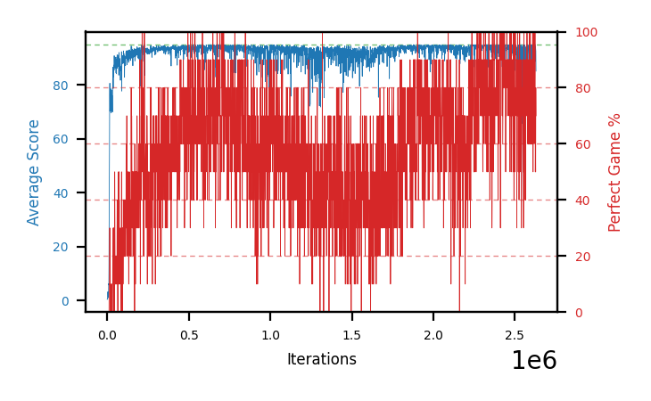
**b22d-noisseed4**

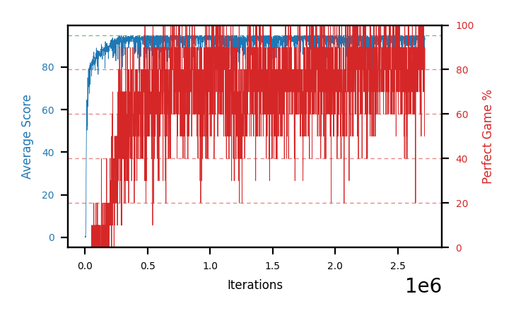
**b22a-noisseed1**

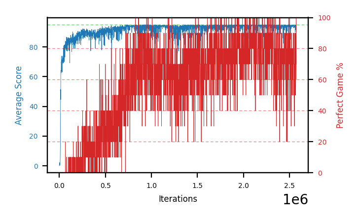
**b22c-noisseed3**

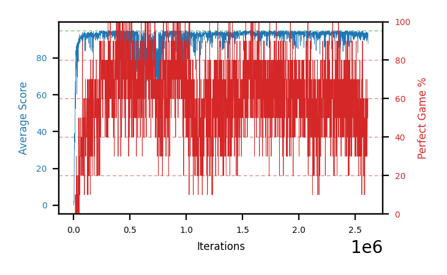
**b22b-noisseed2**

## Batch 21 — partial IS (β 0.4→0.5), `td_error` priority, fc 50,100,50

One knob off batch 20's control: IS β annealed to **0.5** not 1.0, so the gradient keeps `|δ|^{0.30}` of
prioritisation (**ESS/N ≈0.86** on the four end-of-run buffers) instead of the near-uniform ≈1.0 that β=1
gives. The aim: keep IS's anti-forgetting effect while letting end-game transitions pull harder.

**Verdict: better than the β→1.0 control, well short of no-IS.** Best-30 74.1 vs the control's 64.0 (+10 pp)
and `sef` 14.3 vs 11.2, 3 of 4 seeds favouring β→0.5 — directional but n=4 cannot resolve it (p 0.375-0.625).
The desktop close-out confirms the direction: **pooled (eq-effort, gate 95) 64.3 vs 55.0 (+9.3), 3 of 4
seeds.** Still far below batch 18 (no IS: best-30 87.3, `sef` 34.6, ESS/N 0.21). Peak trailing 94.69 is flat
with every batch since 11, so the ceiling is unmoved — only consolidation differs. **Batch 22** (`td_error`,
IS off, ESS/N ≈0.38) tests the next point down. Trained on the laptop, close-out on the desktop.

All at 3M, sorted by best-30. Close-out under gate 95, `EVAL_WORKERS=4`.

| arm | peak trail | best-30 | `sef` | close-out pooled | best row |
|---|---|---|---|---|---|
| `b21b` | 94.78 | **80.7%** | **21.6%** | **68.8%** | 89.3% @2525k (n=56) |
| `b21d` | **94.80** | 76.3% | 16.5% | 66.0% | 84.1% @2392k (n=44) |
| `b21c` | 94.64 | 70.7% | 11.1% | 62.8% | 82.5% @2203k (n=40) |
| `b21a` | 94.52 | 68.7% | 8.2% | 59.5% | 81.6% @1263k (n=38) |
| **mean — b21 β→0.5** | 94.69 | 74.1% | 14.3% | 64.3% | — |
| **mean — control β→1.0** | 94.44 | 64.0% | 11.2% | 55.0% | — |

**No full-length rows** (deepest 38-56 of 100 under gate 95), so `best row` is a bound and `pooled` is exact.

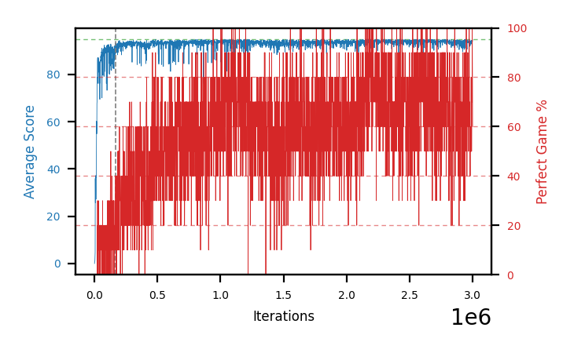
**b21b-beta05seed2**

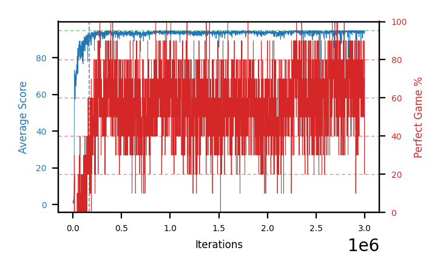
**b21d-beta05seed4**

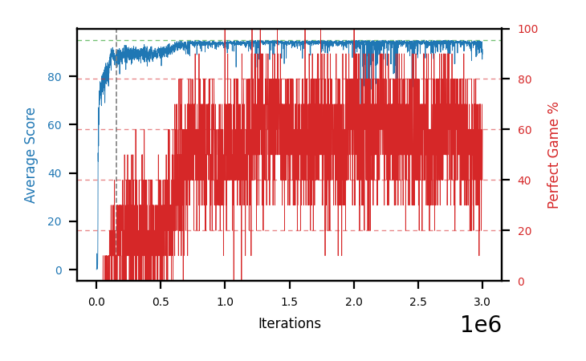
**b21c-beta05seed3**

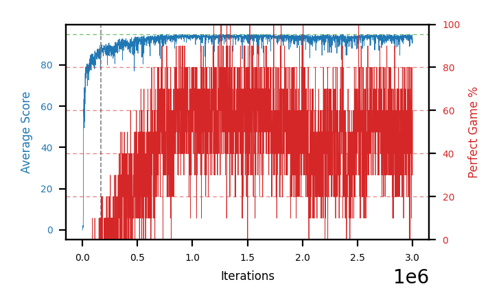
**b21a-beta05seed1**

## Batch 20 — matched-capacity reshuffle (`100,50,50`) against the control, both to 3M

The last of the nine shapes: 10,853 params, **0.92×** the control, depth 3 — the same depth and
effectively the same capacity, with the width moved to the first layer. It was pre-registered as an
expected null, and it closes the sweep.

**Verdict: null on the ceiling, as designed.** Peak trailing **94.16** vs the control's 94.44 (−0.28,
**2 of 4** seeds, p=0.750) — inside the flat band on three seeds; only `b20aj` at 93.56 falls below it.
Drawdown **6.35** vs 5.42 is a match, so the base's anti-forgetting property is intact. Every
consolidation column reads *lower* (`sef` 1.9 vs 11.2, best-30 51.2 vs 64.0, pooled 46.3 vs 55.0), but
at **1 of 4** seeds and p=0.375 that is the same seed-driven noise the batch has produced in both
directions — here it is `b20aj` alone (`sef` 0.1%, pooled 30.8 against its control's 62.7).

**‡ The finding is what this shape does to the *rest* of the sweep.** `100,50,50` (10,853 params) and
`320` (10,883 params) differ by 0.3% in capacity, and they land on **pooled 46.3 and 65.1** — an 18.8 pp
spread that **brackets the control from both sides** at effectively identical parameter count. Whatever
the consolidation columns are measuring across batch 20's shapes, it is not capacity: two nets the same
size disagree by more than any shape disagrees with the control. That retroactively settles `320`'s
apparent +10.1 pooled edge as noise, which is where the ‡ downgrades in this batch had already landed it
by the per-seed test.

All at the 3M cap, sorted by best-30. Close-out under gate 95, `EVAL_WORKERS=4`,
`SNEK_FC_LAYERS=100,50,50`.

| arm | peak trail | best-30 | `sef` | max drawdown | close-out pooled | best row |
|---|---|---|---|---|---|---|
| `b20ai` | 94.34 | **58.7%** | **4.5%** | 5.58 | **52.1%** | **72.0% @2647k (n=25)** |
| `b20al` | **94.36** | 57.0% | 1.9% | 5.74 | 51.8% | 64.3% @2836k (n=28) |
| `b20ak` | **94.36** | 53.3% | 1.0% | **5.32** | 50.8% | 68.0% @2692k (n=25) |
| `b20aj` | 93.56 | 36.0% | 0.1% | 8.74 | 30.8% | 52.0% @1026k (n=25) |
| **mean — `100,50,50`** | 94.16 | 51.2% | 1.9% | 6.35 | 46.3% | — |
| **mean — control** | 94.44 | 64.0% | 11.2% | 5.42 | 55.0% | — |
| **mean — `320`** (same params) | 94.67 | 74.7% | 16.5% | 7.44 | 65.1% | — |

**No full-length rows** (deepest 25-28 of 100 under gate 95), so `best row` is a bound and `pooled` is
the exact column. Nothing near 95%, so no hall-of-fame candidate.

**b20ai-fc100x50x50seed1**

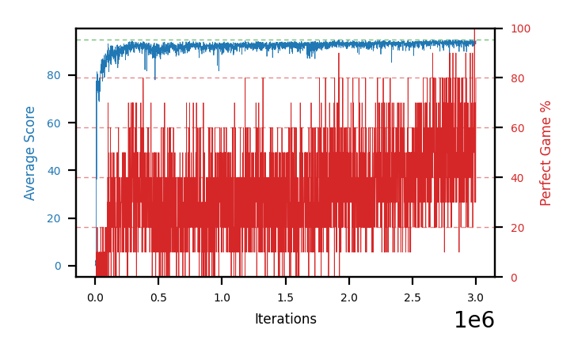
**b20al-fc100x50x50seed4**

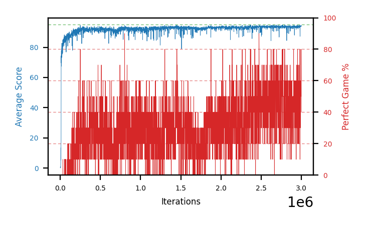
**b20ak-fc100x50x50seed3**

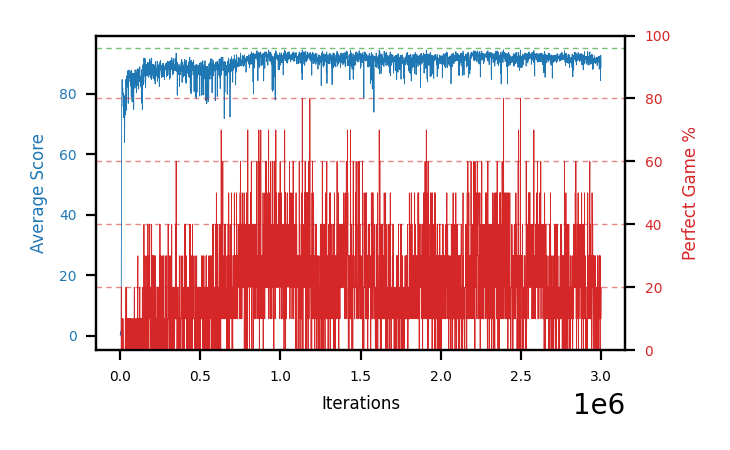
**b20aj-fc100x50x50seed2**

## Batch 20 wave 3 — small-capacity (`25,50,25`) against the control, both to 3M

The smallest net in the sweep: 3,428 params, **0.29×** the control, depth 3. The pre-registered question
was whether capacity is binding at all — if under a third of the parameters holds the ceiling, it is not.

**Verdict: it does not hold the ceiling — capacity finally binds.** Peak trailing **93.75** vs the
control's 94.44, the first shape in batch 20 to move peak at all: all four seeds lower, two of them
(`b20q` 93.08, `b20s` 93.36) below the flat 94.4-94.9 band every batch since 11 has held. Every
consolidation column drops too (`sef` 2.1 vs 11.2, best-30 52.8 vs 64.1, pooled 43.1 vs 55.0), and
drawdown roughly doubles (11.1 vs 5.4). All four seeds favour the control on every column.

**‡ The first directional result in the batch, at the n=4 floor.** Seed-matched paired differences
(`25,50,25` − control):

| metric | by seed | mean | p (exact paired, 16 flips) | seeds favouring `25,50,25` |
|---|---|---|---|---|
| peak trailing | −0.72 / −0.36 / −0.98 / −0.70 | −0.69 | 0.125 | 0 of 4 |
| `sef` | −0.2 / −9.9 / −2.0 / −24.3 | −9.10 | 0.125 | 0 of 4 |
| best-30 | 0.0 / −12.0 / −9.6 / −23.3 | −11.23 | 0.250 | 0 of 4 |
| pooled | −3.0 / −5.2 / −13.3 / −26.1 | −11.89 | 0.125 | 0 of 4 |
| max drawdown | +8.6 / +6.6 / +6.1 / +1.5 | +5.71 | 0.125 | 0 of 4 (all worse) |

p bottoms out at the n=4 floor (0.125) on four of five metrics, every seed pointing the same way — the
cleanest signal batch 20 has produced. Unlike the shapes at or above the control's capacity, cutting to
0.29× lowers the ceiling *and* worsens consolidation.

All at 3M, sorted by best-30. Close-out under gate 95, `EVAL_WORKERS=4`, `SNEK_FC_LAYERS=25,50,25`.

| arm | peak trail | best-30 | `sef` | max drawdown | close-out pooled | best row |
|---|---|---|---|---|---|---|
| `b20r` | **94.48** | **66.3%** | **6.3%** | 10.84 | **57.4%** | 76.0% @1874k (n=25) |
| `b20t` | 94.06 | 57.0% | 2.0% | **6.22** | 45.3% | 60.0% @1530k (n=25) |
| `b20s` | 93.36 | 46.7% | 0.2% | 11.16 | 39.5% | 56.0% @739k (n=25) |
| `b20q` | 93.08 | 41.3% | 0.0% | 16.30 | 30.3% | 44.0% @897k (n=25) |
| **mean — `25,50,25`** | 93.75 | 52.8% | 2.1% | 11.13 | 43.1% | — |
| **mean — control** | 94.44 | 64.0% | 11.2% | 5.41 | 55.0% | — |

**No full-length rows** (deepest 25-29 of 100 under gate 95), so `best row` is a bound and `pooled` is the
exact column. Nothing near 95%. Drawdown mean 11.1 is the batch's worst so far, but still batch-19
territory, far from batch 18's ~57.

**b20r-fc25x50x25seed2**

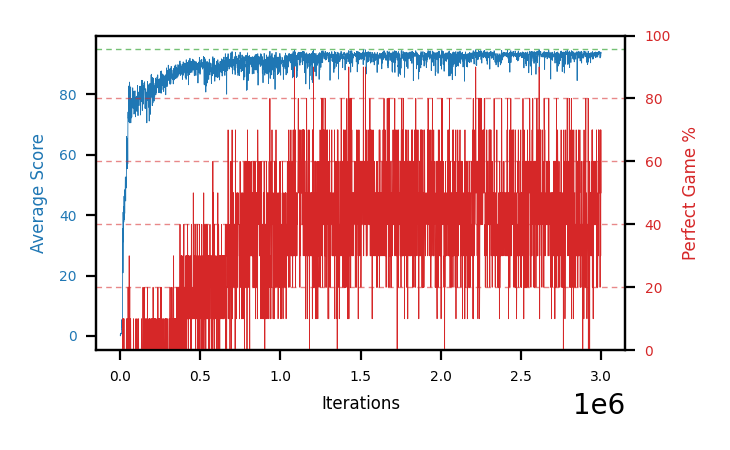
**b20t-fc25x50x25seed4**

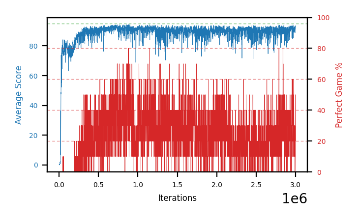
**b20s-fc25x50x25seed3**

**b20q-fc25x50x25seed1**

## Batch 20 wave 3 — deep-narrow (`60,30,30,30,30`) against the control, both to 3M

Five narrow layers: 6,573 params, **0.55×** the control, depth **5** — the deepest shape in the sweep,
testing whether depth helps once width is small.

**Verdict: it matches the ceiling but forgets more.** Peak trailing **94.25** vs 94.44 — inside the band,
essentially a match (−0.18, p 0.375). Consolidation is a wash (pooled 51.6 vs 55.0, p 0.5; one seed
favours it). What moves cleanly is drawdown: **12.3 vs 5.4, all four seeds worse** — deeper-and-narrower
holds the level but is markedly less steady.

**‡ Only drawdown separates from noise.** Seed-matched paired differences (`60,30,30,30,30` − control):

| metric | by seed | mean | p (exact paired, 16 flips) | seeds favouring the shape |
|---|---|---|---|---|
| peak trailing | −0.20 / −0.44 / +0.32 / −0.40 | −0.18 | 0.375 | 1 of 4 |
| `sef` | −0.1 / −14.0 / +9.7 / −21.7 | −6.53 | 0.375 | 1 of 4 |
| best-30 | −0.6 / −18.0 / +17.0 / −17.3 | −4.73 | 0.375 | 1 of 4 |
| pooled | −2.5 / −8.9 / +9.9 / −12.1 | −3.41 | 0.500 | 1 of 4 |
| max drawdown | +5.1 / +9.3 / +5.8 / +7.4 | +6.89 | 0.125 | 0 of 4 (all worse) |

The ceiling and consolidation gaps are seed-3-carried noise (p ≥ 0.375); drawdown is worse on all four
seeds at p=0.125.

All at 3M, sorted by best-30. Close-out under gate 95, `EVAL_WORKERS=4`, `SNEK_FC_LAYERS=60,30,30,30,30`.
Trained on the laptop; checkpoints rsynced to the desktop for the close-out.

| arm | peak trail | best-30 | `sef` | max drawdown | close-out pooled | best row |
|---|---|---|---|---|---|---|
| `b20w` | **94.66** | **73.3%** | **11.9%** | **10.88** | **62.7%** | 78.6% @1945k (n=28) |
| `b20x` | 94.36 | 63.0% | 4.6% | 12.04 | 59.2% | 75.0% @1139k (n=28) |
| `b20v` | 94.40 | 60.3% | 2.2% | 13.58 | 53.8% | 77.4% @2436k (n=31) |
| `b20u` | 93.60 | 40.7% | 0.1% | 12.74 | 30.8% | 56.0% @2534k (n=25) |
| **mean — `60,30,30,30,30`** | 94.25 | 59.3% | 4.7% | 12.31 | 51.6% | — |
| **mean — control** | 94.44 | 64.0% | 11.2% | 5.41 | 55.0% | — |

**No full-length rows** (deepest 25-36 of 100), so `best row` is a bound. Nothing near 95%.

**b20w-fc60x30x30x30x30seed3**

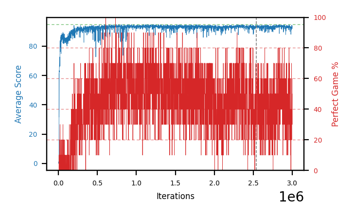
**b20x-fc60x30x30x30x30seed4**

**b20v-fc60x30x30x30x30seed2**

**b20u-fc60x30x30x30x30seed1**

## Batch 20 — capacity escalation (`100,200,100`, 3.69×) against the control, both to 3M

The largest net in the sweep: 43,703 params, **3.69×** the control, depth 3. It escalates above the 2.66×
(`200,100,50`) arm to ask whether *any* amount of extra capacity moves the ceiling, given 2.66× did not.
Ran on the desktop `the-claw-den`, seeds 1-4.

**Verdict: null on the ceiling, the seed-1 pattern again.** Peak trailing **94.61** vs the control's 94.44
(+0.17, p 0.875) — inside the flat 94.4-94.9 band. Consolidation reads up (best-30 71.3 vs 64.0, pooled
63.4 vs 55.0), but the rise is one seed: `b20ae` (+36 best-30, +35 pooled) against control arm `b20a`, the
batch's weak seed (41.3 best-30, 33.2 pooled). The other three seeds are flat-to-mixed (best-30 −9 / −1 /
+3) and no p clears the 0.125 floor. **3.69× behaves like the control**, the same reading `200,100,50`
(2.66×) gave — closing the capacity question: across 0.92× / 1.00× / 1.38× / 2.66× / 3.69× nothing moved the
ceiling, only cutting to 0.29× (`25,50,25`) did, downward.

All at 3M, sorted by best-30. Close-out under gate 95, `EVAL_WORKERS=4`, `SNEK_FC_LAYERS=100,200,100`.

| arm | peak trail | best-30 | `sef` | close-out pooled | best row |
|---|---|---|---|---|---|
| `b20ah` | **94.88** | **83.0%** | **32.9%** | **74.6%** | 91.8% @1470k (n=73) |
| `b20ae` | 94.76 | 77.7% | 21.8% | 67.8% | 89.1% @1561k (n=55) |
| `b20af` | 94.60 | 69.3% | 10.2% | 63.1% | 82.9% @1918k (n=35) |
| `b20ag` | 94.18 | 55.3% | 1.4% | 48.3% | 64.0% @551k (n=25) |
| **mean — `100,200,100`** | 94.61 | 71.3% | 16.6% | 63.4% | — |
| **mean — control** | 94.44 | 64.0% | 11.2% | 55.0% | — |

**No full-length rows** (deepest 25-82 of 100 under gate 95), so `best row` is a bound and `pooled` is exact.
Nothing near 95%.

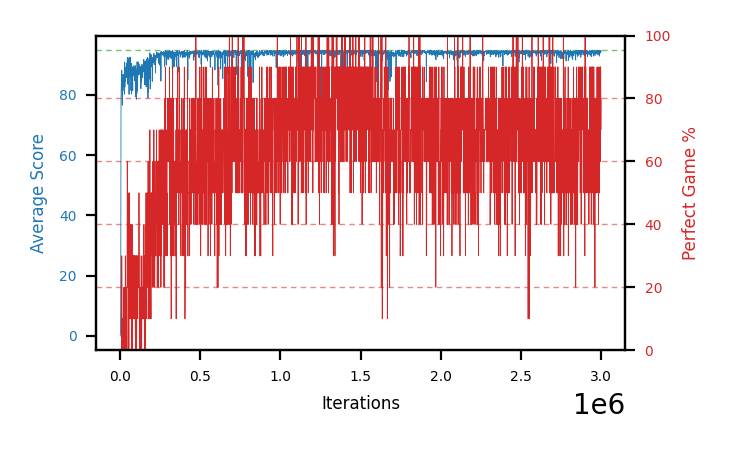
**b20ah-fc100x200x100seed4**

**b20ae-fc100x200x100seed1**

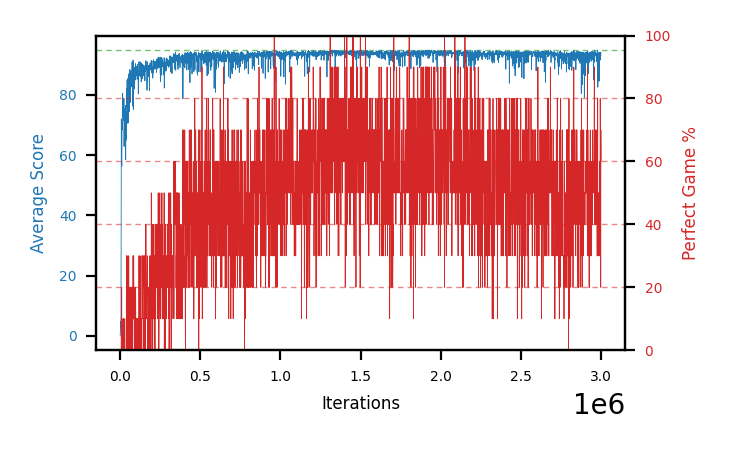
**b20af-fc100x200x100seed2**

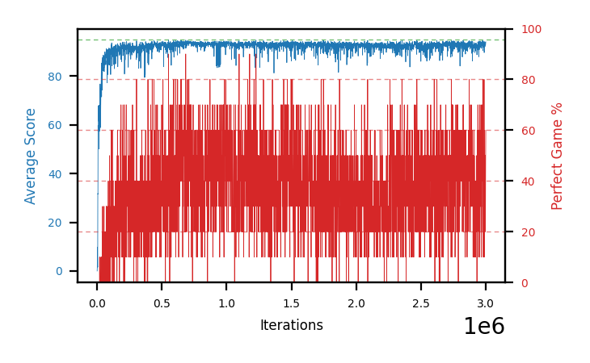
**b20ag-fc100x200x100seed3**

## Batch 20 wave 3 — iso-param depth-2 (`93,93`) against the control, both to 3M

Two layers of 93: 11,907 params, **1.00×** the control, at depth 2 against the control's depth 3. The
iso-param depth rung between the control (depth 3) and `320` (depth 1) — hold capacity, cut a layer.

**Verdict: null — matches the control.** Peak trailing 94.41 vs 94.44 (−0.03), the ceiling unmoved, and no
metric separates at n=4 (p 0.375-1.0, 1 of 4 seeds favouring the shape). Seed 1's big best-30 gap (+33) is a
control weakness — `b20a` is the batch's weak arm — not a shape strength. Depth 2 behaves like the control,
exactly as depth-1 `320` did; only `25,50,25`'s 0.29× cut has moved the ceiling.

All at 3M, sorted by best-30. Close-out under gate 95, `EVAL_WORKERS=4`, `SNEK_FC_LAYERS=93,93`.

| arm | peak trail | best-30 | `sef` | close-out pooled | best row |
|---|---|---|---|---|---|
| `b20aa` | **94.78** | **74.3%** | **15.6%** | **65.6%** | 82% @2908k (n=38) |
| `b20ad` | 94.44 | 66.7% | 10.0% | 56.1% | 79% @2912k (n=28) |
| `b20ab` | 94.32 | 54.0% | 0.7% | 42.0% | 56% @2661k (n=25) |
| `b20ac` | 94.08 | 50.7% | 0.6% | 42.2% | 56% @2663k (n=25) |
| **mean — `93,93`** | 94.41 | 61.4% | 6.7% | 51.5% | — |
| **mean — control** | 94.44 | 64.0% | 11.2% | 55.0% | — |

**No full-length rows** (deepest 25-38 of 100 under gate 95), so `best row` is a bound and `pooled` is exact.
Nothing near 95%.

**b20aa-fc93x93seed1**

**b20ad-fc93x93seed4**

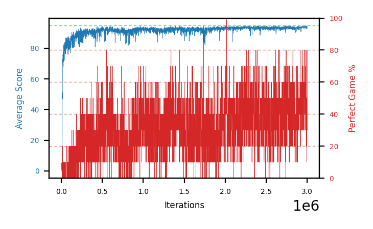
**b20ab-fc93x93seed2**

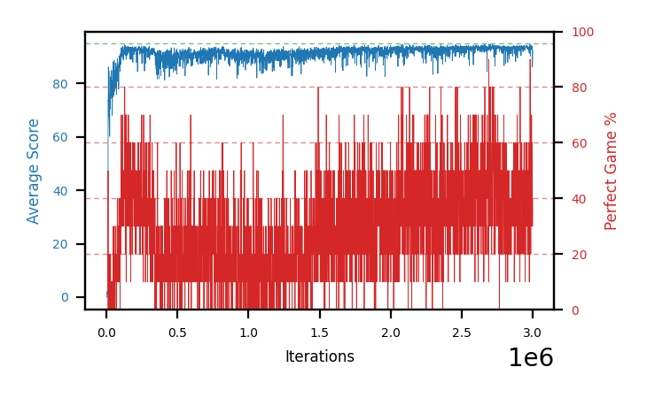
**b20ac-fc93x93seed3**

## Batch 20 wave 2 — depth-1 (`320`) against the control, both to 3M

A single hidden layer of 320 units: 10,883 params, **0.92×** the control, and depth 3 → 1. It holds
capacity roughly constant and strips out all depth, so it is the cleanest architecture test available —
if it matches the control, depth is contributing nothing.

**Verdict: it matches the control — depth buys nothing here.** Peak trailing **94.67** against 94.44, all
four seeds inside the flat 94.4-94.9 band. The consolidation columns all read higher (`sef` 16.5 vs 11.2,
best-30 74.7 vs 64.1, pooled 65.1 vs 55.0) and, unlike `200,50`, they go the *right* way — but none of it
reaches significance.

**‡ 3 of 4 seeds favour the shape on every column, but the magnitude is one seed.** Seed-matched paired
differences (`320` − control):

| metric | by seed | mean | p (exact paired, 16 flips) | seeds favouring `320` |
|---|---|---|---|---|
| peak trailing | +0.82 / +0.02 / +0.10 / +0.00 | +0.23 | 0.250 | 4 of 4 |
| `sef` | +12.7 / +6.9 / +1.7 / −0.1 | +5.30 | 0.250 | 3 of 4 |
| best-30 | +31.7 / +3.0 / +8.0 / −0.3 | +10.60 | 0.250 | 3 of 4 |
| pooled | +32.1 / +7.6 / −1.0 / +1.7 | +10.10 | 0.250 | 3 of 4 |

The consistency is better than `200,50`'s (1 of 4), but `p` bottoms out at 0.250 at n=4, and seed 1 —
where the control `b20a` is the batch's weakest arm — supplies most of every mean (excluding it, the
pooled edge is +2.8).

All at 3M, sorted by best-30. Close-out under gate 95, `EVAL_WORKERS=4`, `SNEK_FC_LAYERS=320`.

| arm | peak trail | best-30 | `sef` | max drawdown | close-out pooled | best row |
|---|---|---|---|---|---|---|
| `b20n` | **94.86** | **81.3%** | 23.1% | 6.10 | 70.3% | 87.0% @2896k (n=54) |
| `b20p` | 94.76 | 80.0% | **26.2%** | 6.44 | **73.0%** | 89.3% @2321k (n=56) |
| `b20m` | 94.62 | 73.0% | 12.9% | **5.24** | 65.3% | 82.4% @2935k (n=34) |
| `b20o` | 94.44 | 64.3% | 3.9% | 11.96 | 51.8% | 69.2% @2807k (n=26) |
| **mean — `320`** | 94.67 | 74.7% | 16.5% | 7.44 | 65.1% | — |
| **mean — control** | 94.44 | 64.0% | 11.2% | 5.41 | 55.0% | — |

**No arm produced a full-length row** (deepest 26-56 of 100), so `best row` is a bound — `pooled` is the
exact column. Nothing reached 95%. Drawdown rose to 7.44, driven by `b20o` (11.96), still batch-19
territory and far from batch 18's ~57 — the base's anti-forgetting property holds under this shape too.

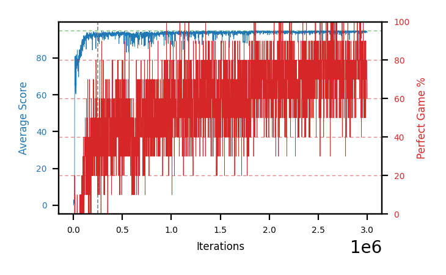
**b20n-fc320seed2**

**b20p-fc320seed4**

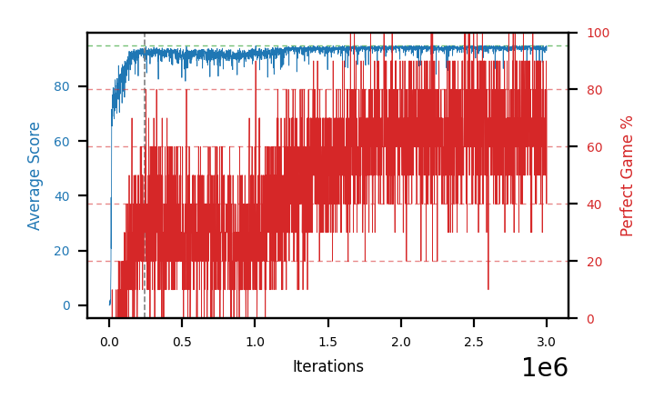
**b20m-fc320seed1**

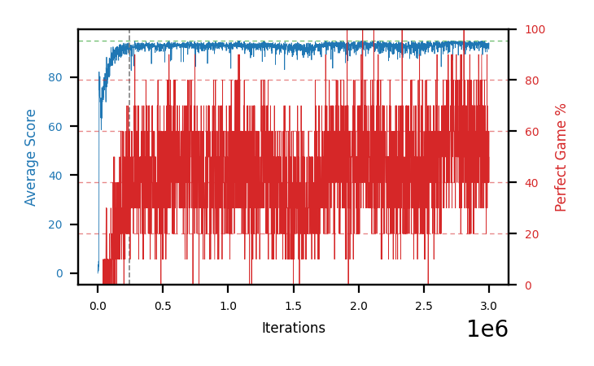
**b20o-fc320seed3**

## Batch 20 wave 2 — wide-early (`200,50`) against the control, both to 3M

The wide-early shape: two layers, 200 units first, 16,403 params (1.38× the control). The mechanism
was that the observation is already high-level, so what the net needs is *conjunctions* of engineered
features rather than a deep hierarchy — and conjunctions want width in the first layer.

**Verdict: it did not move the ceiling either, and it is behind the control on the primary metric.**
Peak trailing **94.55** against the control's 94.44 — a 0.11 gap inside a band nine batches have held.
`sef` **8.60%** against 11.2%, i.e. *worse* on the metric with the lowest between-seed variance.

**‡ The apparent best-30 and pooled gains are one seed, and that seed is a control weakness.**
Seed-matched paired differences (`200,50` − control) are what settles this:

| metric | by seed | mean | p (exact paired, 16 flips) | seeds favouring `200,50` |
|---|---|---|---|---|
| `sef` | +8.5 / −6.3 / −0.3 / −12.4 | −2.62 | 0.625 | **1 of 4** |
| best-30 | +31.4 / −9.0 / −1.0 / −8.0 | +3.35 | 1.000 | **1 of 4** |
| pooled | +31.3 / −3.4 / −4.3 / −6.5 | +4.27 | 1.000 | **1 of 4** |

Every positive mean is carried by seed 1 alone, where the control arm `b20a` is the batch's weakest
(`sef` 0.2%, pooled 33.2%). Three of four seeds favour the control on all three metrics.

All at 3M, sorted by best-30. Close-out under gate 95, `EVAL_WORKERS=4`, `SNEK_FC_LAYERS=200,50`.

| arm | peak trail | best-30 | `sef` | max drawdown | close-out pooled | best row |
|---|---|---|---|---|---|---|
| `b20i` | 94.64 | **72.7%** | 8.7% | 9.48 | 64.5% | 87.0% @2818k (n=46) |
| `b20l` | **94.82** | 72.3% | **13.9%** | **7.18** | **64.8%** | 85.7% @2940k (n=42) |
| `b20j` | 94.58 | 69.3% | 9.9% | 9.76 | 59.3% | 83.3% @2001k (n=42) |
| `b20k` | 94.18 | 55.3% | 1.9% | 7.84 | 48.5% | 72.0% @1073k (n=25) |
| **mean — `200,50`** | 94.55 | 67.4% | 8.60% | 8.56 | 59.3% | — |
| **mean — control** | 94.44 | 64.0% | 11.2% | 5.41 | 55.0% | — |

**No arm produced a full-length row** (deepest 25-46 of 100), so `best row` is a bound, not a
measurement — `pooled` is the exact column. Nothing reached 95%.

Drawdown rose from the control's 5.41 to 8.56 but stayed in batch 19 territory (8.76), nowhere near
batch 18's ~57 — so the base's anti-forgetting property survives this shape too.

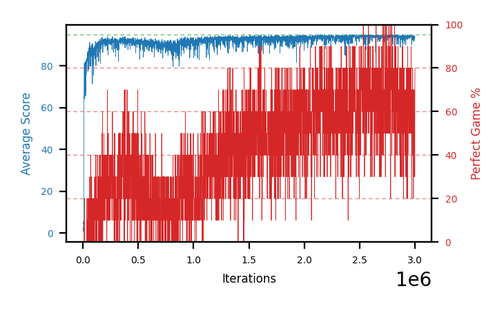
**b20i-fc200x50seed1**

**b20l-fc200x50seed4**

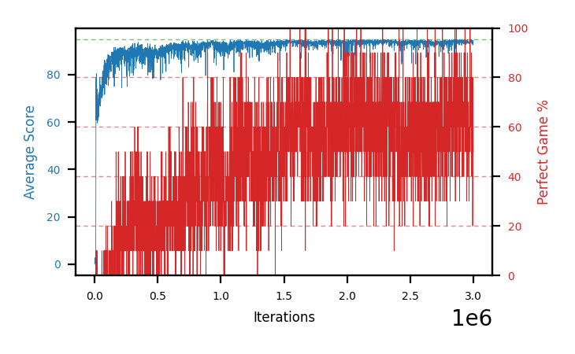
**b20j-fc200x50seed2**

**b20k-fc200x50seed3**

## Batch 20 wave 1 — FC-layer capacity (`200,100,50`) vs control (`50,100,50`), both to 3M

The first time the network shape has been varied in the project, aimed at the one quantity nine batches
of optimiser knobs never moved — the ceiling. Control `50,100,50` re-baselined at β=300k (`b20a-d`) and
capacity `200,100,50`, 2.66× the parameters (`b20e-h`). Both ran to **3M** at a matched horizon — the
capacity arms crashed once at ~1.75M on a since-fixed matplotlib chart-writer leak, then resumed to 3M.

**Verdict: 2.66× capacity did not move the ceiling.** Peak trailing **94.44** (control) vs **94.70**
(capacity) — both inside the flat 94.7-95.0 band every batch has held since 11, for a net 2.66× wider.
There is an apparent consolidation edge (best-30 64.0 → 71.4, close-out pooled 55.0 → 64.6) which the
original write-up called "a hint, not a result".

**‡ Downgraded 2026-08-10: it is not even a directional hint.** The paired per-seed differences are
**+28.7 / −4.7 / +19.4 / −5.0** on pooled — **2 of 4** seeds, exact paired p=**0.500** — and the two
seeds carrying it are seeds 1 and 3, exactly where the *control* is weakest (`b20a` `sef` 0.2%, `b20c`
2.2%). The same check on wave 2's `200,50` shows the same shape at 1 of 4. So the edge is control seed
variance, not capacity: the control's four seeds span `sef` 0.2-26.3% and pooled 33.2-71.3%, which is
wider than any between-shape gap in the batch. Capacity-up is not the route to a higher ceiling.

All at 3M. Sorted by best-30. `sef` and close-out pooled (equal-effort, gate 95) are now comparable — same horizon.

| arm | shape | peak trail | best-30 | `sef` | close-out pooled |
|---|---|---|---|---|---|
| `b20g` | 200,100,50 | 94.76 | **81.7%** | 25.6% | **72.2%** |
| `b20d` | 50,100,50 | 94.76 | 80.3% | 26.3% | 71.3% |
| `b20b` | 50,100,50 | 94.84 | 78.3% | 16.2% | 62.7% |
| `b20h` | 200,100,50 | **94.82** | 76.3% | 16.7% | 66.3% |
| `b20e` | 200,100,50 | 94.56 | 68.3% | 7.4% | 61.9% |
| `b20f` | 200,100,50 | 94.64 | 59.3% | 1.7% | 58.0% |
| `b20c` | 50,100,50 | 94.34 | 56.3% | 2.2% | 52.8% |
| `b20a` | 50,100,50 | 93.80 | 41.3% | 0.2% | 33.2% |
| **mean — control** | 50,100,50 | 94.44 | 64.0% | 11.2% | 55.0% |
| **mean — capacity** | 200,100,50 | 94.70 | 71.4% | 12.9% | 64.6% |

Per-arm numbers are in the table above; charts (3M) best-first within each shape.

### Control `50,100,50`

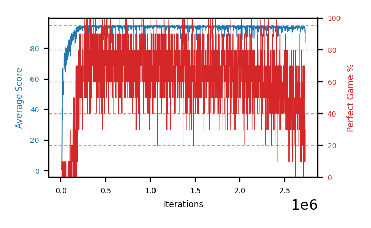
**b20d-fc50seed4**

**b20b-fc50seed2**

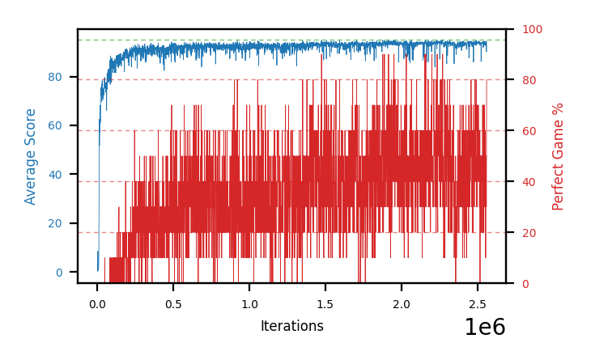
**b20c-fc50seed3**

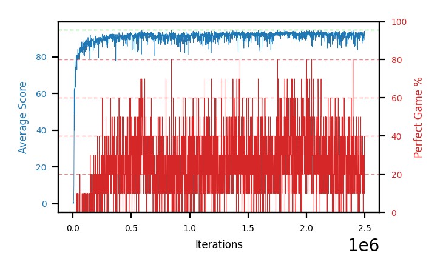
**b20a-fc50seed1**

### Treatment `200,100,50` (2.66× params)

Resumed from the ~1.75M crash (a since-fixed chart-writer leak, not the arms) to 3M. `b20g` is the
strongest arm of the batch (best-30 81.7%, close-out 72.2%); `b20f` is the laggard, mirroring `b20a`.

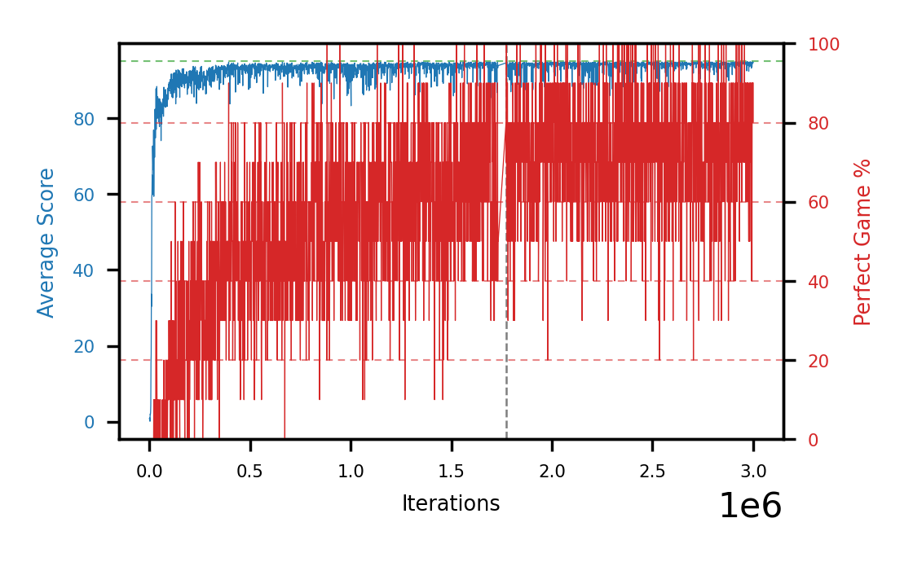
**b20g-fc200seed3**

**b20h-fc200seed4**

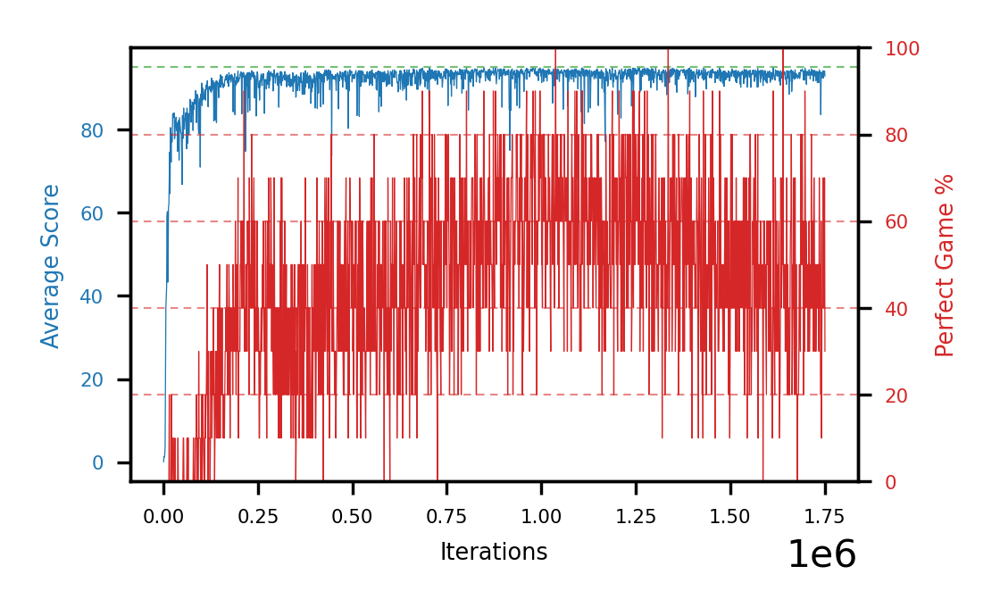
**b20e-fc200seed1**

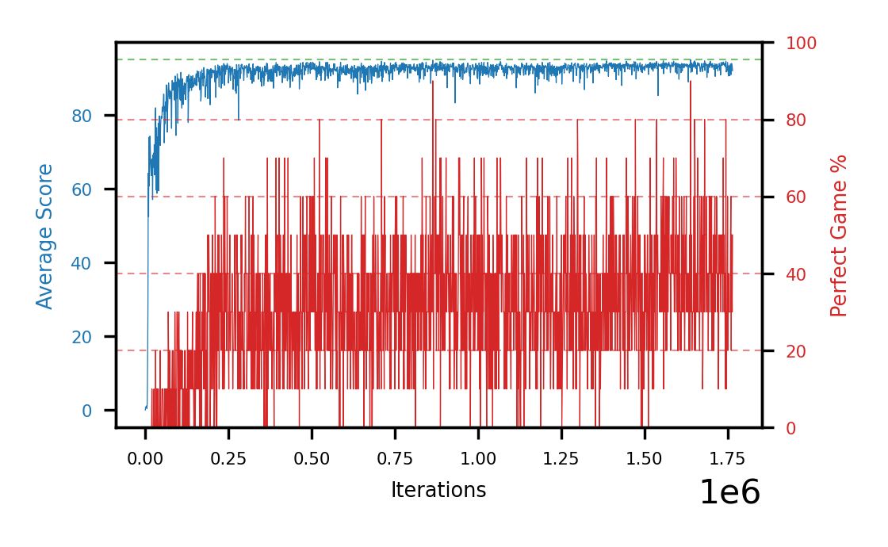
**b20f-fc200seed2**

## Batch 19 — standard PER (`td_error` priority + IS on), falsified, stopped at 2.00-2.42M

Four seeds, batch 18's config byte-for-byte with the two PER overrides *dropped* — priority signal
`td_loss` → **`td_error`**, importance sampling **off → on** with β annealing 0.4 → 1.0 over 1M steps.
A clean one-knob-group test with batch 18 as the seed-matched control. **It is the clearest negative
since batch 12's deadlock: every comparable metric moved against it, 4 of 4 seeds, p=0.125** — the
floor at n=4. Paired against batch 18 truncated to a matched **2.004M** (`b19c` is the shortest arm):

| metric | b18 (`td_loss`, no IS) | b19 (standard PER) | delta | p |
|---|---|---|---|---|
| **`strong_eval_fraction`** (primary) | **31.60%** | **13.82%** | **-17.78 pp** | **0.125** (4/4) |
| `best_perfect30` | 85.52% | 63.27% | **-22.25 pp** | **0.125** (4/4) |
| mean perfect, back half | 68.86% | 48.88% | **-19.98 pp** | **0.125** (4/4) |
| peak trailing | 94.85 | 94.16 | **-0.69** | **0.125** (4/4) |
| **max drawdown** | 55.52 | **8.76** | **-46.76** | **0.125** (4/4) |
| steps to pf30 ≥ 40% | 299.5k | 324.7k (3 arms) | slower on 3/3 | — |

**`b19c` never reached pf30 ≥ 40% at all**, so that row has no fourth pair and is left unpooled rather
than filled in — the three seeds that did reach it were all slower (508k vs 460k, 244k vs 180k, 222k vs
216k).

**‡ The ceiling moved for the first time in nine batches, and it moved down.** Peak trailing has read
94.8-95.0 for every batch from 11 through 18 regardless of config; here it is 94.66 / 94.40 / 92.72 /
94.86, mean **94.16**, and lower on 4 of 4 seeds. A −0.69 mean is small in absolute terms, but it is
the first config to shift a quantity that eight consecutive batches could not budge — in the wrong
direction.

**‡ The drawdown result is real, large, and does not rescue the batch.** Max drawdown fell from
55.52 to **8.76**, 4/4 — by far the biggest movement in the table and the strongest anti-forgetting
result the project has. But the arms achieve it by sitting *lower*, not by holding a high level:
recent-30 is 43.3 / 51.3 / 14.3 / 56.0 against the control's much higher figures, and `sef` more than
halved. Flat curves at a worse level is what a full IS correction damping the replay signal looks
like. Since reducing catastrophic forgetting is a *means* in this project and not the goal, a −17.78 pp
primary is not paid for by a smaller drawdown — but the β anneal is now a candidate to pair with any
future change that raises the level.

**Full-length numbers, comparable to batch 18 above and to nothing below it.** These arms ran to
2.0-2.4M, so `sef` is inflated by run length relative to any shorter batch.

| seed | step | peak trailing | best-30 | `sef` | recent-30 | max drawdown |
|---|---|---|---|---|---|---|
| 4 | 2423k | **94.86** | **85.7%** | **40.2%** | **56.0%** | 12.84 |
| 1 | 2192k | 94.66 | 71.0% | 8.0% | 43.3% | **4.94** |
| 2 | 2116k | 94.40 | 66.7% | 4.6% | 51.3% | 10.20 |
| 3 | 2004k | 92.72 | 29.7% | **0.0%** | 14.3% | 7.04 |
| **mean** | | **94.16** | **63.3%** | **13.2%** | **41.2%** | **8.76** |

### b19d-stdperseed4 — standard PER, seed 4

2423k steps, peak trailing **94.86**, best-30 **85.7%** @1944k, `sef` **40.2%**, recent-30 56.0%,
max drawdown 12.84.

**The seed that escaped, and it is why the batch is a falsification rather than a catastrophe.** It is
level with its batch-18 control on every column (`sef` 40.2 against 41.6, peak 94.86 against 94.92),
so whatever standard PER costs, one seed in four does not pay it. Read against the other three, this
arm is the evidence that the damage is a *distribution* shifting left rather than a mechanism that
cannot work.

### b19a-stdperseed1 — standard PER, seed 1

2192k steps, peak trailing 94.66 @1299k, best-30 71.0% @1301k, `sef` 8.0%, recent-30 43.3%,
max drawdown **4.94** — the smallest in the batch.

Peaked early at 1.30M and then held a visibly flat, slightly declining band for 900k steps without
ever collapsing. Its control `b18a` reached `sef` 41.2% against this arm's 8.0% while suffering a 56.6
drawdown, so the pair is the whole batch in miniature: far steadier, far worse.

### b19b-stdperseed2 — standard PER, seed 2

2116k steps, peak trailing 94.40 @1889k, best-30 66.7% @1914k, `sef` 4.6%, recent-30 51.3%,
max drawdown 10.20.

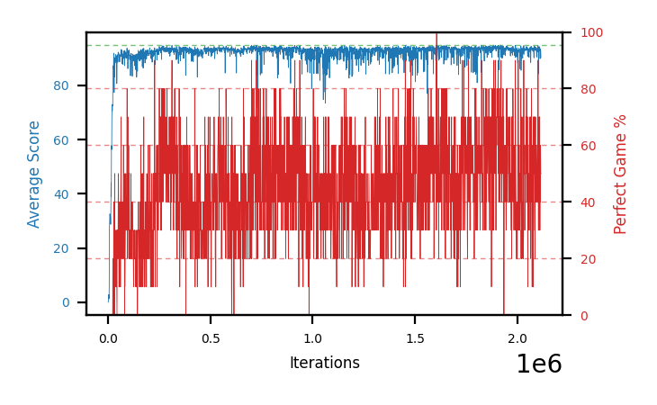

**The slowest consolidator of the four:** it did not reach pf30 ≥ 60% until 1861k where its control
did so at 310k, a 1.55M gap. It was still improving when stopped — peak trailing and best-30 both land
in its final 250k — so this is an arm whose curve had not finished, and the one place the batch's
horizon is a genuine caveat rather than a formality.

### b19c-stdperseed3 — standard PER, seed 3

2004k steps, peak trailing 92.72 @1500k, best-30 **29.7%** @195k, `sef` **0.0%**, recent-30 14.3%,
max drawdown 7.04.

**Not one eval at ≥80% perfect in 2005 evals**, and its best 30-eval window came at **195k** — the
opening of the run. It never reached pf30 ≥ 40%, and peak trailing 92.72 is more than two points below
anything else in batches 18-19. It was never dead (`zero_since` null, trailing 88.7 at the end) and it
never collapsed — so it is **none of the four failure modes** in
[`failureModes.md`](../failureModes.md): it learned to play well, plateaued just short of finishing, and
stayed there. The nearest thing on record is batch 12's deadlock, which was much worse. Seed 3 was
also batch 18's weakest arm, so the seed carries some of this — but `b18c` still managed `sef` 24.3%.

## Batch 18 — `TARGET_UPDATE_PERIOD=1000`, forking retained, stopped at 2.40-2.61M

Four seeds, batch 17's config exactly with the target period taken from 8 to **1000** — a clean
one-knob test, because forking stayed on in both. **The pre-registered primary metric moved, and it is
the strongest speed result this project has:** steps to pf30 >= 40% is **102k earlier, 4 of 4 seeds,
p=0.125** — the floor at n=4. Paired against batch 17 truncated to a matched 1.406M:

| metric | b17 (period 8) | b18 (period 1000) | delta | p |
|---|---|---|---|---|
| **steps to pf30 >= 40%** (primary) | 402k | **300k** | **-102.2k** | **0.125** (4/4) |
| **max drawdown** | 73.97 | **53.20** | **-20.76** | 0.375 |
| `strong_eval_fraction` | 17.56% | 24.29% | +6.73 pp | 0.625 |
| `best_perfect30` | 76.08% | 82.75% | +6.67 pp | 0.625 |
| mean perfect, back half | 57.83% | 64.02% | +6.19 pp | 0.750 |
| peak trailing | 94.56 | 94.69 | +0.14 | 0.875 |

**‡ The one prior data point predicted the opposite on drawdown and was wrong.** `b1b-tgt200` (batch 1,
period 200) got a *worse* drawdown than its baseline, 27.4 against 19.2, and that was recorded as the
risk to watch. At period 1000 the drawdown **improved by 20.8 points**, 3 of 4 seeds. The batch-1 hint
was right about "longer learns faster early" and wrong about the cost.

**Full-length numbers, which are not comparable to the batches below.** These arms ran to 2.4-2.6M
against batch 17's 1.4-1.6M, and `sef` is a fraction of an arm's *own* evals, so the figures below are
inflated by run length relative to any shorter batch. `b18d` at **47.9%** and `b18a` at **41.4%** are
nonetheless the two highest `sef` readings ever recorded here, against `b15a`'s 39.9% at 5.79M.

| seed | step | pf30 >= 40% at | b17 control | peak trailing | best-30 | `sef` (full) | max drawdown |
|---|---|---|---|---|---|---|---|
| 1 | 2612k | 460k | 560k | 94.92 | 88.0% | **41.4%** | 56.58 |
| 2 | 2401k | **180k** | 332k | 94.96 | 86.0% | 25.0% | 85.08 |
| 3 | 2510k | 342k | 386k | 94.94 | 84.3% | 24.3% | 56.14 |
| 4 | 2597k | 216k | 329k | 94.92 | **91.0%** | **47.9%** | **32.62** |
| **mean** | | **300k** | **402k** | **94.94** | **87.3%** | **34.7%** | **57.6** |

**The ceiling still has not moved — an eighth flat result.** Peak trailing reads 94.92 / 94.96 / 94.94 /
94.92, mean **94.94**, inside 0.4 of every batch from 11 on. Whatever the target period does, it is not
raising the maximum an arm reaches.

### b18d-tgt1000seed4 — period 1000, forking on, seed 4

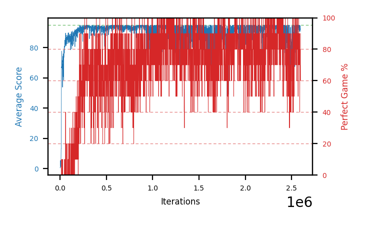

Step 2.60M · peak trailing 94.92 (at 2346k) · **best 30-eval perfect 91.0%** (at 2369k) · `strong_eval_fraction` **47.9%** · recent-30 79.0%

**The steadiest arm on record.** 47.9% of its evals at >=80% perfect is the highest ever, and its max
drawdown of **32.62** is less than half the batch-17 mean — the red trace stays high instead of
collapsing and recovering. Reached pf30 >= 40% at 216k against its control's 329k.

### b18a-tgt1000seed1 — period 1000, forking on, seed 1

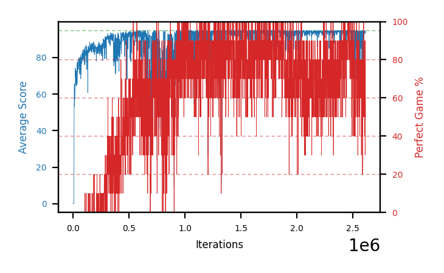

Step 2.61M · peak trailing 94.92 (at 1605k) · best 30-eval perfect 88.0% (at **2480k**) · `strong_eval_fraction` 41.4% · recent-30 64.0%

Second-highest `sef` ever, and still finding its best window at 2480k — near the end of the run. Its
seed-1 counterpart in batch 17 was the arm that made that batch a null, so **the pairing that looked
worst going in came out +40 pp on `sef`**. One seed, but worth noting against the temptation to read
seed identity as arm quality.

### b18c-tgt1000seed3 — period 1000, forking on, seed 3

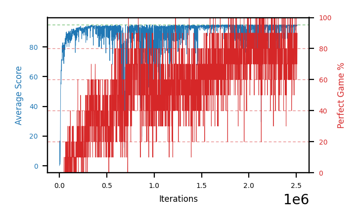

Step 2.51M · peak trailing 94.94 (at 2161k) · best 30-eval perfect 84.3% (at 2168k) · `strong_eval_fraction` 24.3% · recent-30 **79.3%**

**Highest recent-30 of the batch at the moment it was stopped**, with peak and best window both inside
its last 350k — the arm most plausibly cut short.

### b18b-tgt1000seed2 — period 1000, forking on, seed 2

Step 2.40M · peak trailing 94.96 (at 1575k) · best 30-eval perfect 86.0% (at 1600k) · `strong_eval_fraction` 25.0% · recent-30 56.3%

**Fastest start on record: pf30 >= 40% at 180k.** Also the batch's worst drawdown at 85.08, and the
weakest recent-30 — it peaked around 1.6M and gave a lot back. The two facts together are the case for
reading this batch on speed rather than on stability.

## Batch 17 — forked endgame collection (`SNEK_FORK_*`), a null, stopped at 1.41-1.57M

Four seeds, batch 16's config exactly plus forking at length ≥ 85 — one variable, an exact control.
**A null**: `strong_eval_fraction` -1.67 pp at a matched 1.245M (p=0.875). Full write-up in
[`completedRuns.md`](../completedRuns.md#batch-17--forked-endgame-collection-a-null-that-produced-the-project-record).

**These four charts are the clearest picture of the seed-variance problem in this document.** Same
config, adjacent seeds, and the batch spans `sef` **1.4% to 36.6%** — a 26x spread that is entirely
between-seed noise, since nothing differs but the seed. `b17b` and `b17a` sitting side by side is why
n=4 cannot resolve an effect below ~10 pp.

| seed | pf30 ≥ 40% at | b16 control | peak trailing | best-30 | `sef` @1.245M |
|---|---|---|---|---|---|
| 1 | 560k | 450k | 93.86 | 54.0% | **1.3%** |
| 2 | 332k | 400k | **95.00** | **92.7%** | **32.0%** |
| 3 | 386k | 379k | 94.78 | 82.0% | 9.9% |
| 4 | 329k | 465k | 94.60 | 75.7% | 18.6% |
| **mean** | **402k** | **424k** | **94.56** | **76.1%** | **15.4%** |

Peak trailing and best-30 above are **full-length**; `sef` is truncated to 1.245M because it is a
fraction of an arm's own evals.

### b17b-forkseed2 — forking on, disc 0.9975 + shield 0.8, seed 2

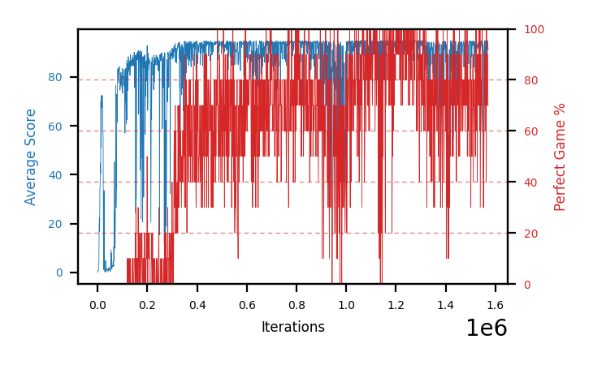

Step 1.57M · **peak trailing 95.00** (at 1280k) · **best 30-eval perfect 92.7%** (at 1223k) · `strong_eval_fraction` **36.6%** · recent-30 71.0% · **best ckpt 95.17% @1190k over 600 fresh episodes**

**The best arm this project has produced, on the graph and in the close-out, and it is in a null
batch.** 92.7% best-30 is the highest that column has ever read — `b11b` managed 91.7% at 3.56M and
`b15a` 89.7% at 5.79M — and it got there at **1.22M**, a third of the steps. Peak trailing 95.00 ties
`b15a` for the highest on record.

**The close-out read 99/100 @1205k; re-measurement over 6,600 fresh episodes cut that to 92.4%.** The
record still moved — @1190k pools to **95.17% over 600** (CI 93.1-96.6) against the old 93.0-93.5% — but
by ~1.7 pp, not to 96%. A position-chosen grid over 1110-1270k reads **84.06%**, against **96.2%** for
the same region's selected rows, and one point in it (**1140k**) reads **12.0%**: the high-perfect
stretch on the right of this chart is **not** the plateau the close-out implied. `pooled_equal_effort`
**82.42%** is unaffected and is still a record. See
[`completedRuns.md`](../completedRuns.md#-the-close-out-b17b-is-the-best-policy-this-project-has-measured-by-a-clear-margin).

### b17d-forkseed4 — forking on, disc 0.9975 + shield 0.8, seed 4

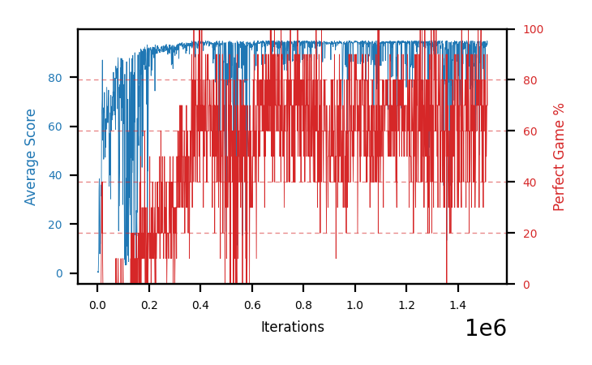

Step 1.51M · peak trailing 94.60 (at 1007k) · best 30-eval perfect 75.7% (at **679k**) · `strong_eval_fraction` 20.7% · recent-30 68.3%

Fastest starter of the batch (pf30 ≥ 40% at 329k) and its best window came earliest of any arm here, at
679k — then 800k steps without beating it. A flat-after-early-peak shape, like `b16a`.

### b17c-forkseed3 — forking on, disc 0.9975 + shield 0.8, seed 3

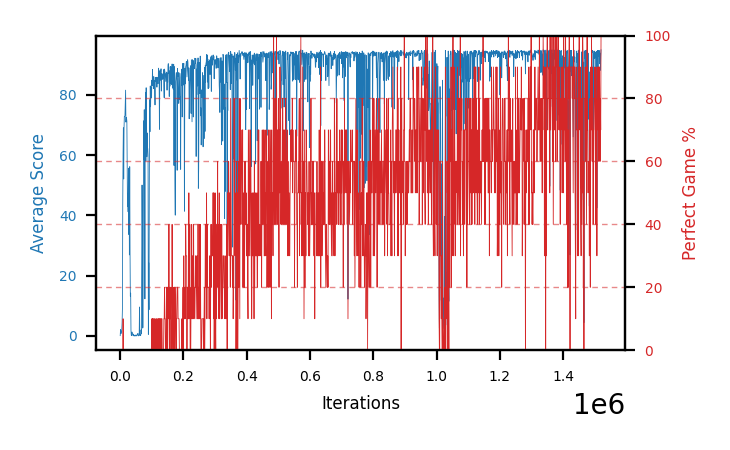

Step 1.52M · peak trailing 94.78 (at **1386k**) · best 30-eval perfect 82.0% (at **1388k**) · `strong_eval_fraction` 16.4% · recent-30 73.3%

**Still climbing when it was stopped** — both its peak and its best window land in its final 140k
steps, and its `sef` went 6.7% → 16.4% over the last 500k. Also carries the batch's worst drawdown
(85.96). The arm most likely to have been cut short.

### b17a-forkseed1 — forking on, disc 0.9975 + shield 0.8, seed 1

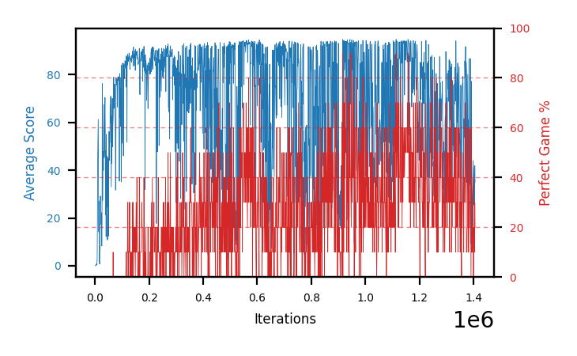

Step 1.41M · peak trailing 93.86 (at 1144k) · best 30-eval perfect 54.0% (at 1166k) · `strong_eval_fraction` **1.4%** · recent-30 26.7%

**The arm that decides the batch, and the failure mode is visible in the chart**: it reaches 95/95
repeatedly and never holds it, so the red perfect-rate trace spikes and collapses rather than settling.
28.2% of its back-half evals fell to ≤10% perfect against 0.2-10.9% across batch 16. It is also the
only arm of the eight that **never reached ε ≤ 0.003** — the schedule is gated on sustained perfect
rate, so the oscillation kept its exploration high, which fed the oscillation. Its fork counters are
normal, and `b13a` failed the same way with forking off.

## Batch 16 — `FOOD_DISTANCE_REWARD=0`, the shaping term ablated, stopped at ~1.25M

Four seeds, batch 14's config exactly minus the food-distance shaping — one variable, an exact
control. **Stopped by hand at ~1.25M**, far short of batch 14/15's 4.2-5.8M, so read these charts for
their *left* halves: the level metrics below (`strong_eval_fraction`, best-30) sit at a much shorter
horizon than the batches beneath and are **not comparable to them at face value** — the comparison that
is valid truncates batch 14 to the same 1.25M, and doing that makes this **the first non-null in six
batches**. Closed out at `EVAL_MIN_ACHIEVABLE=95`; full write-up in
[`completedRuns.md`](../completedRuns.md#batch-16--the-food-distance-shaping-ablated-the-first-non-null-in-six-batches).

**The ceiling did not move — a sixth flat result.** Peak trailing across the four arms reads
94.98 / 94.82 / 94.68 / 94.36, mean **94.71**, inside 0.3 pp of the 94.8-95.0 band the previous five
batches sit in. Removing the shaping neither raised nor lowered the peak.

**What did change is the seed spread, and it is the one thing worth watching.** Steps to pf30 ≥ 40%
came out 379-465k (sd 41k) against batch 14's 227-639k (sd 189k) — a **4.6x tighter** spread on the
metric whose seed variance is this project's binding constraint. Flat mean (-5k, p=0.875), collapsed
variance. Four samples cannot establish that; it is a hypothesis for the wider design, not a finding.

| seed | pf30 ≥ 40% at | b14 control | peak trailing | best-30 | `sef` (short horizon) |
|---|---|---|---|---|---|
| 1 | 450k | 639k | 94.82 | 87.0% | 20.6% |
| 2 | 400k | 227k | **94.98** | 85.0% | **30.7%** |
| 3 | 379k | 530k | 94.36 | 72.7% | 10.6% |
| 4 | 465k | 320k | 94.68 | 73.0% | 7.2% |
| **mean** | **424k** | **429k** | **94.71** | **79.4%** | **17.3%** |

### b16b-noshapeseed2 — shaping off, disc 0.9975 + shield 0.8, seed 2

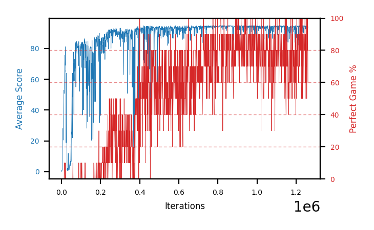

Step 1.26M · **peak trailing 94.98** (at 816k) · best 30-eval perfect 85.0% (at 919k) · `strong_eval_fraction` **30.7%** · recent-30 79.0%

**Strongest of the batch and the flattest** — peaked at 816k and held 79% recent perfect at stop. At
this ~1.25M horizon its `sef` matches batch 14's best arms, but the horizons are not comparable; the
close-out is what settles level.

### b16a-noshapeseed1 — shaping off, disc 0.9975 + shield 0.8, seed 1

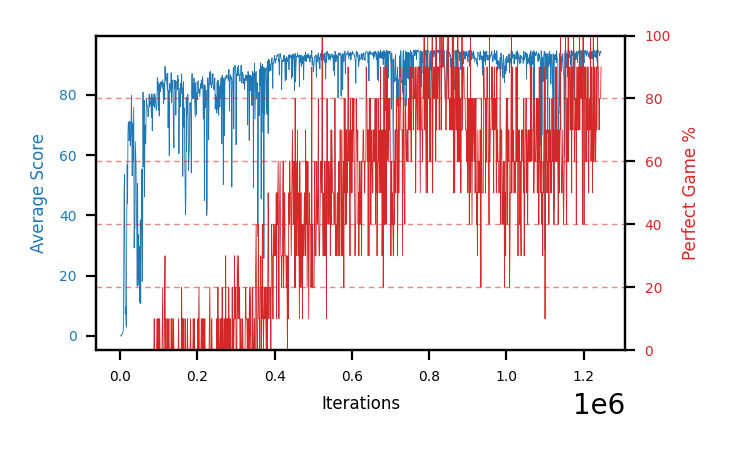

Step 1.25M · peak trailing 94.82 (at 837k) · **best 30-eval perfect 87.0%** (at 850k) · `strong_eval_fraction` 20.6% · recent-30 77.0%

Highest best-30 window of the batch (87.0%), though both peak and best window land early (~840k) and
it has plateaued since. Solid but unremarkable.

### b16c-noshapeseed3 — shaping off, disc 0.9975 + shield 0.8, seed 3

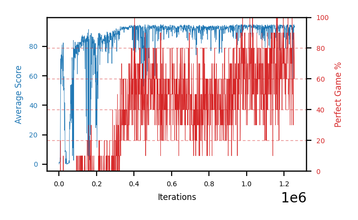

Step 1.26M · peak trailing 94.36 (at **1198k**) · best 30-eval perfect 72.7% (at 1221k) · `strong_eval_fraction` 10.6% · recent-30 67.0%

**The latest-peaking arm** — best window at 1221k, at the very end — so unlike its siblings it may not
have plateaued when stopped. Recovered from a mid-run dip to ~86% trailing back to 93.7%, which is
what dragged its `sef` down despite a normal peak.

### b16d-noshapeseed4 — shaping off, disc 0.9975 + shield 0.8, seed 4

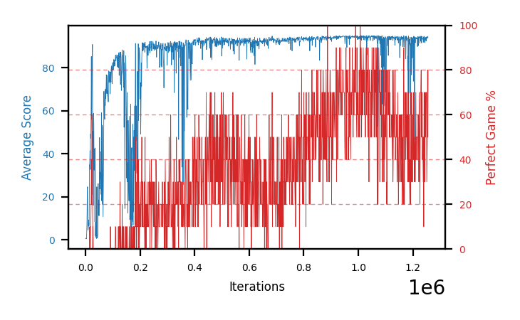

Step 1.26M · peak trailing 94.68 (at 946k) · best 30-eval perfect 73.0% (at 1032k) · `strong_eval_fraction` **7.2%** · recent-30 **55.7%**

**Weakest of the batch** on `sef` and recent perfect (55.7%), though its peak trailing sits mid-pack —
the gap is consistency, not ceiling. The same seed-4 slot that was the speed outlier in both batch 14
and batch 16.

## Batch 15 — `N_STEP_UPDATE=3`, falsified on speed, and the longest arms on record

Four seeds to 5.5-5.8M in 15.9 h — 1.3M further than any previous batch. n-step's predicted effect
was faster credit propagation, and **the pre-registered metric moved the wrong way**: steps to
pf30 ≥ 40% came out **128k later** than batch 14's control, 3 of 4 seeds slower (p=0.250). The evals
agree it is a null — best checkpoint +0.05 pp (p=1.000), `pooled_equal_effort` +2.24 pp (p=0.625).
Full write-up:
[`completedRuns.md`](batches12-15.md#batch-15--n_step_update3-falsified-on-speed-null-on-level-and-a-97100-that-is-really-93).

**Read these four charts for their right-hand halves, which no earlier batch has.** Two arms were
still gaining in their final 500k band at 5.5-6.0M, and `b15d`'s peak trailing score is at its
second-to-last eval. The long-standing "arms peak by ~3.4M" reading is now falsified three batches
running.

**What has *not* moved is the ceiling.** Peak trailing score across the five batches on this vector
reads 94.92 / 94.80 / 94.90 / 95.00 (b11, b13, b14, b15) — flat inside 0.2 points, with `b15a`'s
95.00 beating `b11b` by 0.08 after 2.2M more steps. Whatever the extra horizon buys, it is not a
higher peak.

| seed | pf30 ≥ 40% at | b14 control | best ckpt | eq-effort | `sef` (full) |
|---|---|---|---|---|---|
| 1 | 620k | 639k | 95% | 77.7% | **39.9%** |
| 2 | **524k** | 227k | **97%** | **79.7%** | 39.0% |
| 3 | **707k** | 530k | 86% *trunc* | 66.4% | 9.4% |
| 4 | 378k | 320k | 91% | 73.5% | 33.8% |
| **mean** | **557k** | **429k** | **92.3%** | **74.3%** | **30.5%** |

### b15a-nstep3seed1 — n=3, disc 0.995 + shield 0.8, seed 1

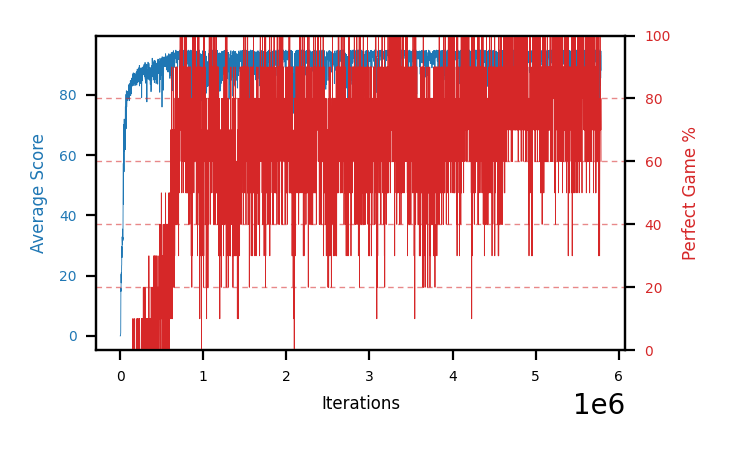

Step 5.79M · **peak trailing 95.00** (at 4716k) · **best 30-eval perfect 89.7%** (at 4705k) · `strong_eval_fraction` **39.9%** · final band 80.6%

**The best arm this project has produced on two measures** — the highest peak trailing score on the
current vector (95.00, past `b11b`'s 94.92) and the highest `strong_eval_fraction` on record (39.9%,
past `b14d`'s 39.3%). It is also **still gaining in its final band**, 80.6% mean perfect over
5.5-6.0M against an 80.4% previous best, so it was stopped mid-climb.

Both records come with the run-length caveat: `strong_eval_fraction` is a share of the arm's own
evals, and this arm spent 1.3M more steps than `b14d` playing at 70-80% perfect. At equal effort the
batch advantage is +4.05 pp at p=0.625. What the chart does show unambiguously is a **shape no
earlier arm has** — a slow, monotone climb that had not turned over by 5.8M.

### b15b-nstep3seed2 — n=3, disc 0.995 + shield 0.8, seed 2

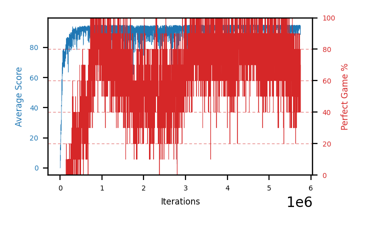

Step 5.75M · peak trailing 94.94 (at 4524k) · best 30-eval perfect 89.3% (at 4595k) · `strong_eval_fraction` 39.0% · final band 62.3%

**The best arm this project has measured**, and the arm that cost n=3 the primary. Its
`pooled_equal_effort` is **79.68%**, past `b14d`'s 77.55%, and its best checkpoint read **97/100** —
the highest selected measurement on record. Yet it reached pf30 ≥ 40% at **524k against `b14b`'s
227k**, the +297k that drives the batch mean. The slowest starter in the comparison finished on top,
which is why "steps to a milestone" and "final level" are separate questions.

**The 97/100 is really ~93%.** Re-measured over 200 fresh episodes it read 182/200 = 91.0%, pooling
to **279/300 = 93.0%** (CI 89.5-95.4) — the same haircut `b14a`'s 96/100 took. This arm also holds 8
of the batch's 9 rows at ≥95%, but its 94 full-length rows have **mean 90.7%**, and a population
centred at 90% throws ~5.4 readings of ≥95 per 94 rows by noise alone. The high count is a tail, not
a cluster of near-perfect policies.

Held 78% mean perfect across **four** consecutive bands from 3.0M to 5.0M (78.1 / 78.4 / 78.2 /
78.5), then dropped to 62.3% in its final band. Past peak when stopped.

### b15d-nstep3seed4 — n=3, disc 0.995 + shield 0.8, seed 4

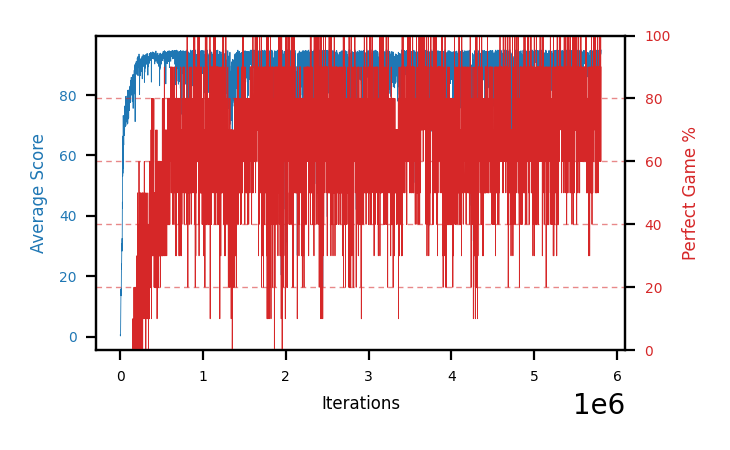

Step 5.81M · peak trailing 94.70 (at **5799k**) · best 30-eval perfect 86.3% (at 3687k) · `strong_eval_fraction` 33.8% · final band **75.8%**

**Its peak trailing score is at 5799k — the second-to-last eval it ever ran.** Also still gaining in
its final band (75.8% against a 72.8% previous best). This is the single clearest piece of evidence
in the project that stopping at a round number truncates arms: nothing about this curve suggests it
was finished.

### b15c-nstep3seed3 — n=3, disc 0.995 + shield 0.8, seed 3

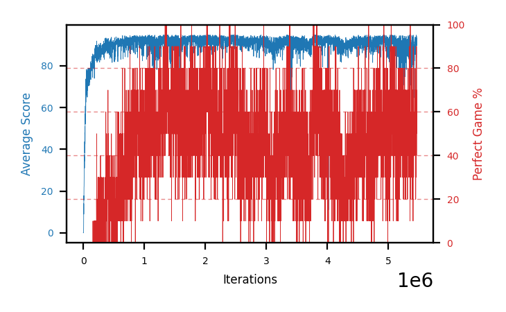

Step 5.46M · peak trailing 94.38 (at 3808k) · best 30-eval perfect 75.7% (at 2046k) · `strong_eval_fraction` **9.4%** · final band 53.7%

Weakest of the batch by a wide margin and the reason the batch spread is -9.7 to +22.9 pp. Its best
30-eval window is at 2046k, earlier than any sibling, and it never exceeded 60% mean perfect in any
band. **Same config as `b15a`'s 39.9%, adjacent seed, 30 pp apart on the primary metric** — which is
the seed-variance problem that has made five consecutive batches unreadable, stated as compactly as
it can be.

**The first arm in five batches with no full-length eval row at all.** Every 100-episode target was
abandoned by the 90% gate, so its best checkpoint is a truncated 69/80 and
`best_full_length_row`'s half-depth fallback ran in production for the first time. At the 95% gate
this becomes the normal case rather than the exception.

---

## Batch 14 — `DISCOUNT=0.9975` at `GUIDED_FRACTION=0.8`, and a third null

Four seeds run to 4.1-4.5M, the longest arms on the current vector. **Null against batch 13 on every
metric** — `pooled_equal_effort` 72.08% against 72.07%, best checkpoint +2.8 pp at p=1.000, and
`strong_eval_fraction` +2.1 pp with per-seed diffs from -16.2 to +24.8. Full write-up:
[`completedRuns.md`](batches12-15.md#batch-14--disc-09975-at-guided-08-and-the-widest-seed-spread-yet).

**The one result worth keeping is a chart-shape result, and it is about horizon.** Two arms produced
their best window past 3.5M and `b14c` was still climbing when stopped — which is why the step cap
moved 5M → 10M. Every earlier batch was killed by hand near 3.5M, so the long-standing "arms peak
between ~1M and ~3.4M" reading was partly describing the stopping habit.

| seed | b14 best30 | b13 best30 | diff | peak window |
|---|---|---|---|---|
| 1 | 79.7% | 78.0% | +1.7 | **3707k** |
| 2 | 76.3% | 82.3% | -6.0 | 2282k |
| 3 | 87.7% | 85.3% | +2.3 | **4135k** |
| 4 | **89.7%** | 83.3% | +6.3 | 2700k |
| **mean** | **83.3%** | **82.2%** | **+1.1** | |

**Do not read the graph-100% tier off these arms.** Batch 14 is the first batch measured under
`EVAL_MIN_ACHIEVABLE=90`, which censors that tier from below and inflates it by ~15 pp — see
[`hyperparamTuning.md`](../hyperparamTuning.md#taking-the-arm-level-pooled-rate).

### b14d-disc9975seed4 — disc 0.9975 + shield 0.8, seed 4

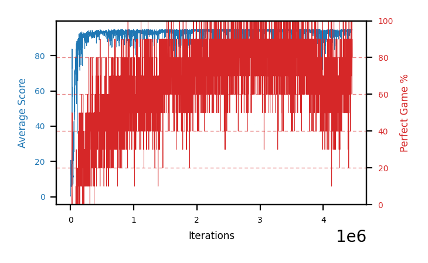

Step 4.46M · peak trailing **94.9** (at 2554k) · **best 30-eval perfect 89.7%** (at 2700k) · `strong_eval_fraction` **39.3%** · trailing-30 at stop 78.0%

**The strongest arm the project has recorded on the primary metric** — 39.3% of its evals at ≥80%,
against a previous best of 30.5% (`b11b`). It is also the flattest good arm here: its mean perfect
rate climbed monotonically through 2.5-3.0M (peaking at 81.1% per 500k band) and never fell below
67% afterwards, for only 11.7 pp of drawdown from peak to stop.

Its best checkpoint is 93% @2559k, below `b14a`'s 96%, which is the usual split between an arm that
holds a high level and an arm that spikes once.

### b14a-disc9975seed1 — disc 0.9975 + shield 0.8, seed 1

Step 4.17M · peak trailing 94.8 (at 3794k) · best 30-eval perfect 79.7% (at 3707k) · `strong_eval_fraction` 20.0% · trailing-30 at stop 54.7%

**Produced a 96/100 checkpoint at 3702000, tying `b11b` for the best selected measurement on
record** — and then gave back 25 pp by the time it stopped. Both facts are the arm: its peak window
is the *latest* of any arm on this vector, and it was already falling apart 400k later.

The 96% does not survive a second look at full strength. An independent 100-episode re-measurement
of the same checkpoint read **91/100**, so the honest pooled estimate is **187/200 = 93.5%** (CI
89.2-96.2). That gap is the winner's curse made visible — this checkpoint was the maximum over 176
attempted full-length measurements in this arm.

### b14c-disc9975seed3 — disc 0.9975 + shield 0.8, seed 3

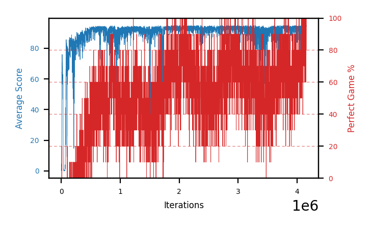

Step 4.16M · peak trailing 94.8 (at 2105k) · **best 30-eval perfect 87.7%** (at 4135k) · `strong_eval_fraction` 17.8% · trailing-30 at stop 82.0%

**The arm that moved the step cap.** Its best 30-eval window is at 4135k — the last one it ran — and
its final 4.0-4.5M band is its strongest of the whole run at 75.9% mean perfect against a 62.6%
previous best. It was still improving when it was stopped, and a 5M cap would have cut it mid-climb.

Only 5.7 pp of drawdown, the smallest in the batch, for the same reason: it never peaked.

### b14b-disc9975seed2 — disc 0.9975 + shield 0.8, seed 2

Step 4.12M · peak trailing 94.5 (at 2053k) · best 30-eval perfect 76.3% (at 2282k) · `strong_eval_fraction` **9.3%** · trailing-30 at stop 29.3%

Weakest of the batch and the clearest decay curve on the current vector: peaked at 2.05M, then lost
**47 pp** of perfect rate over the next 2M steps. Its epsilon reads 0.0064 at stop against its
siblings' 0.002-0.0036, which is the anti-ratchet buying exploration back in response — working as
designed, and not enough to arrest the slide.

It is also the arm that shows what the 90% gate costs: **one** full-length row survived the whole
close-out, so it has a best checkpoint (90%) and no meaningful top-3.

---

## Batch 13 — the lower handover plus the shield, and an exact null

Four seeds, handover 0.0125 and `GUIDED_FRACTION=0.5`, run to 3.4-3.7M. **The schedule works and
the outcome is unchanged.** Epsilon descended on skill to 0.0023-0.0050, all four passed the
pre-registered 350k check, and `best_perfect30` came out at a mean of **82.2% against batch 11's
82.2%** — an exact null, p = 1.000 on an exact paired permutation test.

Read these charts against batch 11's below and the difference is that there is no difference. What
*is* gone is batch 12's shape: no arm here peaks early and then decays to 55.

| seed | b13 best30 | b11 best30 | diff |
|---|---|---|---|
| 1 | 78.0% | 85.7% | -7.7 |
| 2 | 82.3% | 91.7% | -9.4 |
| 3 | 85.3% | 73.0% | +12.3 |
| 4 | 83.3% | 78.3% | +5.0 |
| **mean** | **82.2%** | **82.2%** | **+0.0** |

Per-seed swings of ±12 pp around a zero mean is what n=4 looks like on this metric, and it is the
clearest statement in this file of why seed count is the binding constraint.

### b13c-shieldseed3 — handover 0.0125 + shield, seed 3

Step 3.67M · peak trailing 94.8 (at 3185k) · **best 30-eval perfect 85.3%** (at 2864k) · `strong_eval_fraction` **26.5%** · trailing-30 at stop 72.3%

Best of the batch, and the arm that inverts batch 11's seed ordering: seed 3 was batch 11's weakest
at 73.0% and is batch 13's strongest at 85.3%. Same seed, same config but the schedule — a +12.3 pp
swing that means nothing on its own and is exactly why the batch mean is what gets reported.

Still near its peak at 3.19M when stopped, with the smallest gap in the batch between peak trailing
and where it ended.

### b13d-shieldseed4 — handover 0.0125 + shield, seed 4

Step 3.51M · peak trailing 94.5 (at 980k) · best 30-eval perfect 83.3% (at 1005k) · `strong_eval_fraction` 14.5% · trailing-30 at stop **39.0%**

Peaked earliest in the batch at ~1M and gave up **44.3 pp** by 3.5M — the largest drawdown here, and
the reason the shield cannot be credited with fixing the post-peak decline: batch 11's seed 4 was
its *most* stable arm at 5.6 pp. The paired drawdown comparison is -1.0 pp at p = 0.875, i.e.
nothing.

### b13b-shieldseed2 — handover 0.0125 + shield, seed 2

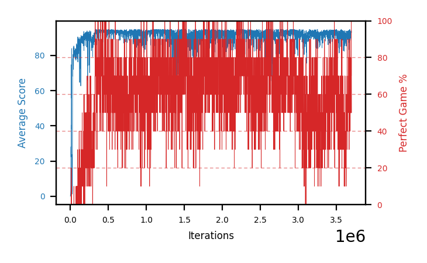

Step 3.70M · peak trailing 94.8 (at 1919k) · best 30-eval perfect 82.3% (at 1508k) · `strong_eval_fraction` 25.4% · trailing-30 at stop 67.0%

**The fastest start on record**: trailing 92.4 with a 72.3% perfect rate by step 350k, where batch
12's arms were at 0%. Whatever else the epsilon change did or did not do, that is the deadlock
being decisively absent.

### b13a-shieldseed1 — handover 0.0125 + shield, seed 1

Step 3.39M · peak trailing 94.5 (at 2661k) · best 30-eval perfect 78.0% (at 2679k) · `strong_eval_fraction` 11.5% · trailing-30 at stop 70.7%

Weakest of the batch and the slowest to get going — 2.0% perfect at 350k, the only arm that would
have looked marginal against the abandon condition. Its best work came latest of the four, at 2.68M,
and it held most of it: a 7.3 pp drawdown against its own seed's 42.4 pp in batch 11.

---

## Batch 12 — the epsilon rewrite, and the deadlock it found

Four seeds of batch 11's config plus the two-phase epsilon schedule, **stopped at ~1M of a
planned 2.5M** because all four failed the same way: epsilon pinned at the refinement ceiling
0.05 and the perfect rate never left 0. Read these four charts as one shape repeated four times —
a fast climb to 81-87 trailing between 214k and 479k, then a slow decay to 53-63 that never
recovers. Both numbers are greedy evals, so that decay is the learned policy getting worse, not
an exploration tax on the measurement.

**`strong_eval_fraction` is 0.0% in all four arms**, against 25.2 / 30.5 / 0.0 / 8.2% for batch 11
at the same 1M steps. The mechanism, the fix, and the two wrong turns taken diagnosing it are in
[`completedRuns.md`](batches12-15.md#-the-new-schedule-deadlocks-all-four-arms-are-failing-44-at-1m-steps). These
arms are kept as the measured cost of sitting at epsilon 0.05: not a wasted batch, a negative
result with four seeds behind it.

### b12s-shield05seed1 — the exploration shield at handover 0.05, seed 1

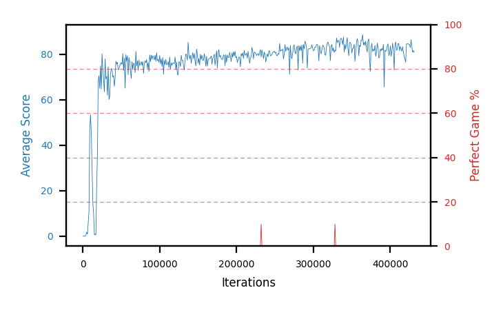

Step 0.43M (stopped) · trailing 83.1 at stop · best 30-eval perfect 0.3% · max single eval 10% · not measured

**The arm that moved the handover.** A verification run, `SEED=1` so it pairs with `b12a`, with the
one-step exploration shield on and the handover still at 0.05. It **fixed the decay** — `b12a` fell
83.8 → 74.2 between 200k and 400k while this one was still rising — and **did not fix perfect
games**: 2 perfect-game evals in 431, plateauing at trailing ~83 where the perfect rate is ~0,
improving at 4.7 points per 100k against `b11a`'s 11.1.

Kept because it is the whole argument for dropping the handover to 0.0125: a one-step mask prevents
blunders but not self-trapping, so the collect policy still never finishes a board and the buffer
never contains the last ten food. Read against `b12a` below and `b11a` above.

### b12a-eps002seed1 — two-phase epsilon, seed 1

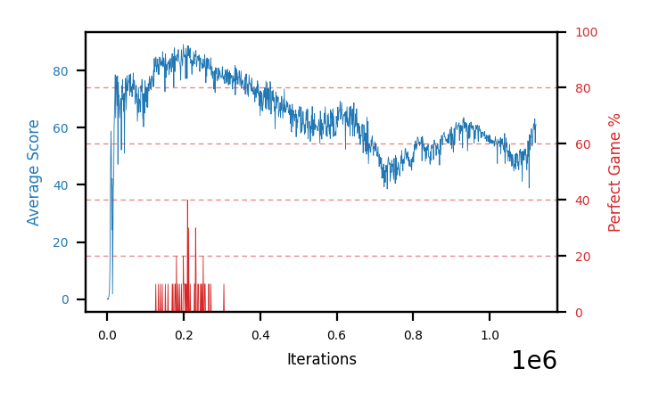

Step 1.12M (stopped) · peak score 89.1, peak trailing 87.02 (at 214k) · best 30-eval perfect **6.3%** (at 213k) · max single eval 40% · not measured

The best of a bad batch, and the arm that makes the decay unambiguous. It read trailing **87.0**
with 6.3% best-30 at 214k — a genuinely promising arm — then fell to 59.6 over the next 900k steps
**at exactly the same epsilon**. Same exploration rate, worse policy, so nothing about the
measurement explains it.

41 of its 1122 evals contained a perfect game, which was enough to nudge epsilon to 0.0388 at its
best and never enough to escape: the refinement phase needs 20-40% to reach the floor, and 0.05
makes that unreachable.

### b12d-eps002seed4 — two-phase epsilon, seed 4

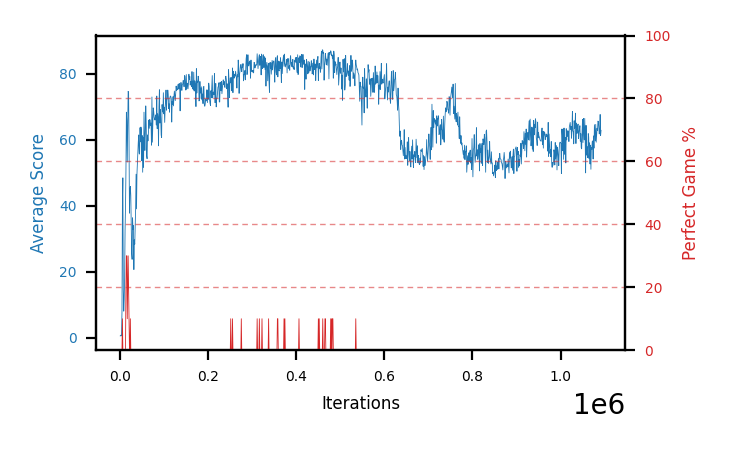

Step 1.09M (stopped) · peak score 87.2, peak trailing 86.36 (at 479k) · best 30-eval perfect 6.3% (at 29k) · max single eval 30% · not measured

The latest peak in the batch at 479k, and the only arm whose best-30 came in its first 30k steps —
during the bootstrap phase, before the ceiling took hold. Everything after is decline.

### b12c-eps002seed3 — two-phase epsilon, seed 3

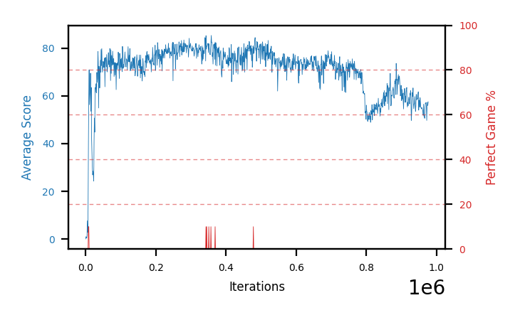

Step 0.98M (stopped) · peak score 85.3, peak trailing 82.46 (at 360k) · best 30-eval perfect 1.7% (at 369k) · max single eval 10% · not measured

8 perfect games in 977 evals, and a max single eval of 10% — it reached the endgame often enough
to prove the policy was not hopeless and never often enough for the schedule to notice.

### b12b-eps002seed2 — two-phase epsilon, seed 2

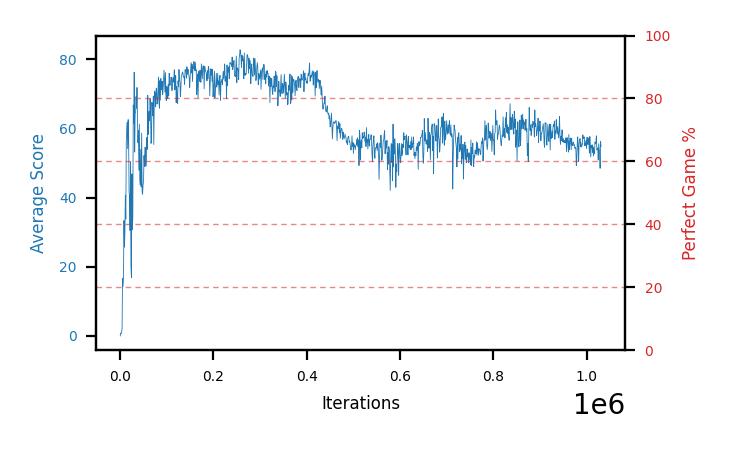

Step 1.03M (stopped) · peak score 82.8, peak trailing 81.4 (at 259k) · **best 30-eval perfect 0.0%** · max single eval **0%** · not measured

**The cleanest demonstration of the deadlock in the project: zero perfect games in 1032 evals.**
Epsilon reached 0.05 at step 11000 and sat there for the remaining 942k steps, because the signal
that would have lowered it requires finishing a game and 3.3% random actions never let it. An arm
that peaked at 81.4 trailing was never once measured completing the board.

---

## Batch 27 — potential-based chase-safe shaping, `c=0.10`, gate 85 (b24 config) — *done, close-out null*

The first arms to carry the new shaping term. `Snake.step` adds `c·(γΦ(s′) − Φ(s))` with **Φ = 1 iff the
head and tail share a free region that also holds the food, and the snake is ≥85 long**; potential-based,
so the optimal policy is untouched and only the gradient on the way there changes. Everything else is
b24's config — `fc 320`, IS off, `td_error`, target period 1000, discount 0.9975, `FORK_BRANCHES=4`,
seeds 1-4 — which makes **`b24a-d` the seed-matched control**. Cap **2M** (b24 ran 3M; its record
checkpoints land at 1.03-1.39M). Design and the Phase 0 calibration of `c`:
[the plan](../../plans/chase-safe-reward-shaping.md) and [`runs.md`](../runs.md).

**Done at the 2M cap, closed out on the desktop — and it is a null.** The close-out pools **85.6 / 84.2 /
83.2 / 88.0** (eq-effort, gate 95), **mean 85.2**, against the b24 control's **~87.9** — a shade *below*, not
above. And on the metric that matters, **no b27 seed produced a ≥98%/500 checkpoint**: the auto-chained
HOF-500 re-measure (gate 98, 500 episodes) found `b27e` empty, `b27f` a single 92.6% partial, `b27g` best
96.6%, `b27h` best **97.5%** (435 ep) — all short of the bar the control cleared **twice** (`b24b`, `b24d`
both 98.0%/500, the record). So `c=0.10` chase-safe shaping on `fc 320` did not reproduce the record, let
alone beat it. All four healthy throughout (trailing 93.6-94.1, no dead or zero stretch), so the term is
not destabilizing — it simply bought nothing. Close-out and HOF-500, shaped first, b24 control in
parentheses:

| arm | close-out pooled (control) | HOF-500 best (≥98% held) |
|---|---|---|
| `b27h-chase10g85seed4` | **88.0** (`b24d` 85.97) | 97.5% @1945k, 435 ep — **0 held** |
| `b27e-chase10g85seed1` | 85.6 (`b24a` 89.03) | none reached the gate |
| `b27f-chase10g85seed2` | 84.2 (`b24b` 88.84) | 92.6% @1431k (partial) — 0 held |
| `b27g-chase10g85seed3` | 83.2 (`b24c` ~87.8) | 96.6% @1975k — 0 held |
| **mean** | **85.2 (≈87.9)** | **0 of 4 ≥98%/500 (control: 2 of 4)** |

Read together with b30 (same `c=0.10`, other net, also a dead-heat-to-slightly-behind after the early edge
washed out), **both architectures agree that `c=0.10` chase-safe shaping does not help.** Whether that is
the idea or the dose is exactly what **b28** (`c=0.20`, above) is running to answer; **b29** (gate 75) is
queued behind it.

**b27e-chase10g85seed1**

**b27f-chase10g85seed2**

**b27g-chase10g85seed3**

**b27h-chase10g85seed4** — first filled board at step 8k, and the first arm whose epsilon left the 0.0125
ceiling.
